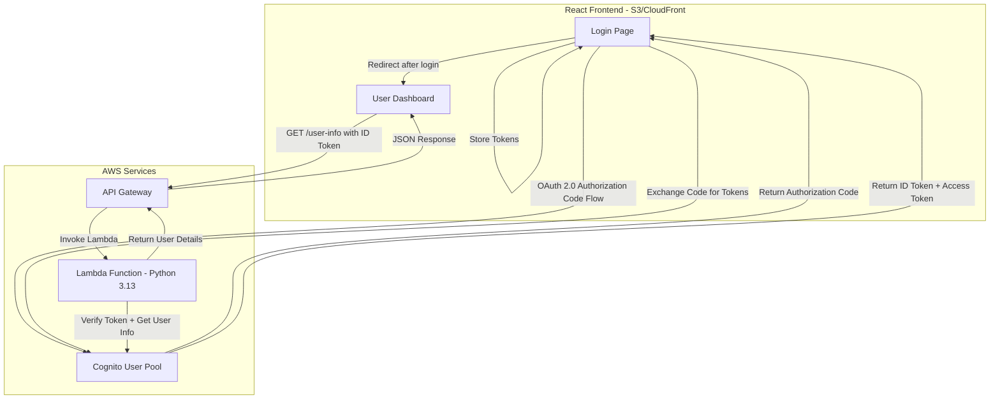
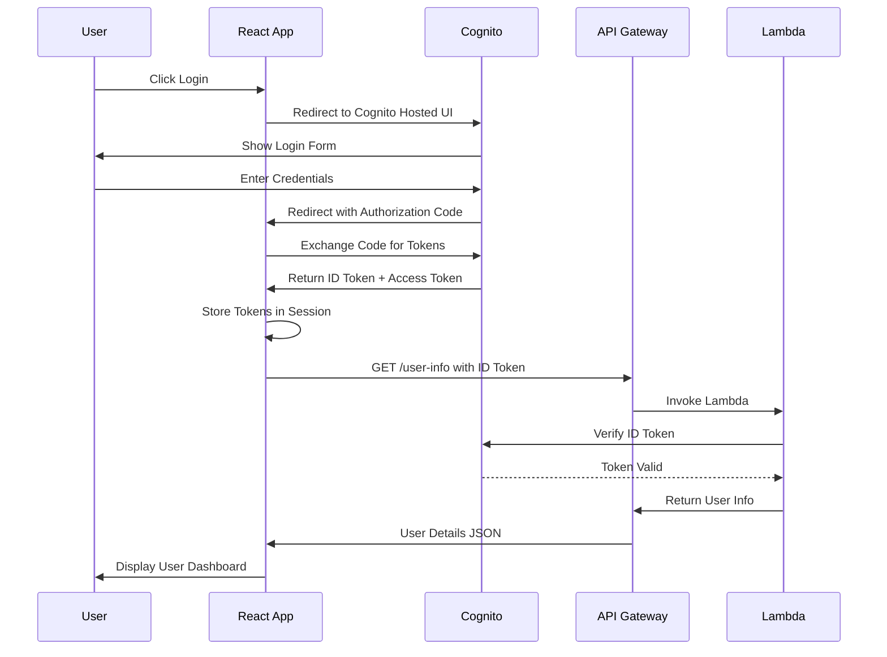

# Auth Login - Cognito Integration Test Page

## Overview

A simple login page to test AWS Cognito configuration. Built with React frontend and Python Lambda backend.

## Architecture



## Authentication Flow



## Project Structure

```
app/auth-login/
├── frontend/                    # React Frontend
│   ├── public/
│   │   └── index.html
│   ├── src/
│   │   ├── components/
│   │   │   ├── Login.jsx        # Login component
│   │   │   ├── Dashboard.jsx    # User dashboard component
│   │   │   └── UserInfo.jsx     # User info display component
│   │   ├── services/
│   │   │   └── authService.js   # Cognito auth service
│   │   ├── config/
│   │   │   └── cognitoConfig.js # Cognito configuration
│   │   ├── App.jsx
│   │   ├── App.css
│   │   └── index.jsx
│   ├── package.json
│   └── vite.config.js
├── lambda/                      # Python Lambda Backend
│   ├── user_info.py             # Lambda handler for user info
│   ├── requirements.txt
│   └── deploy.config
├── IaC/                         # Infrastructure as Code
│   ├── api-config.json          # API Gateway configuration
│   ├── deploy_api.py            # API Gateway deployment script
│   └── deploy_lambda.py         # Lambda deployment script
├── README.md                    # This file
└── deploy.sh                    # Deployment script
```

## Components

### 1. React Frontend

**Features:**
- Login button that redirects to Cognito Hosted UI
- OAuth 2.0 Authorization Code Flow with PKCE
- Token management in session storage
- User dashboard displaying email, name, and groups
- Logout functionality

**Tech Stack:**
- React 18+
- Vite for build tooling
- Axios for API calls
- No additional auth libraries - pure OAuth implementation

### 2. Python Lambda Backend

**Features:**
- Verify Cognito ID Token
- Extract user claims from token
- Return user information (email, name, groups)
- CORS enabled for frontend access

**Tech Stack:**
- Python 3.13
- boto3 for AWS SDK
- PyJWT for token verification
- requests for HTTP calls

### 3. API Gateway

**Endpoints:**
- `GET /user-info` - Returns authenticated user information

**Configuration:**
- CORS enabled
- No authentication at API Gateway level (token verified in Lambda)

## Cognito Configuration

Using existing Cognito User Pool:

| Setting | Value |
|---------|-------|
| User Pool Name | AdviceGenieUserPool |
| App Client Name | AdviceGenieSPA |
| Domain Prefix | advicegenie-auth-baportal-001 |
| Region | ap-southeast-2 |
| OAuth Flow | Authorization Code Flow |
| Scopes | openid, email, profile |

## Environment Variables

### Frontend (React)
```javascript
VITE_COGNITO_CLIENT_ID=<client-id>
VITE_COGNITO_DOMAIN=advicegenie-auth-baportal-001.auth.ap-southeast-2.amazoncognito.com
VITE_COGNITO_REDIRECT_URI=http://localhost:3000/
VITE_API_URL=https://<api-id>.execute-api.ap-southeast-2.amazonaws.com/prod
```

### Lambda
```python
COGNITO_USER_POOL_ID=<user-pool-id>
COGNITO_CLIENT_ID=<client-id>
AWS_REGION=ap-southeast-2
```

## Deployment Steps

1. **Deploy Lambda Function**
   ```bash
   cd app/auth-login/lambda
   python deploy_lambda.py
   ```

2. **Deploy API Gateway**
   ```bash
   cd app/auth-login/IaC
   python deploy_api.py
   ```

3. **Build and Deploy Frontend**
   ```bash
   cd app/auth-login/frontend
   npm install
   npm run build
   # Deploy to S3 or serve locally
   ```

## Local Development

1. Start React development server:
   ```bash
   cd app/auth-login/frontend
   npm run dev
   ```

2. Update Cognito callback URLs to include `http://localhost:5173/`

## Security Considerations

- ID Tokens are stored in session storage (cleared on browser close)
- Token verification happens server-side in Lambda
- CORS configured for specific origins in production
- No secrets stored in frontend code

## Quick Start

### Prerequisites

1. AWS CLI configured with appropriate credentials
2. Python 3.13+ installed
3. Node.js 18+ and npm installed
4. Existing Cognito User Pool (or create one using `utils/cognito-setup/cognito_setup.py`)

### Step-by-Step Deployment

#### 1. Get Cognito Configuration Values

First, retrieve your Cognito User Pool details:

```bash
# List User Pools to get the ID
aws cognito-idp list-user-pools --max-results 10 --region ap-southeast-2

# List App Clients to get the Client ID
aws cognito-idp list-user-pool-clients --user-pool-id <USER_POOL_ID> --region ap-southeast-2
```

#### 2. Update Configuration Files

**Lambda Configuration (`lambda/deploy.config`):**
```bash
COGNITO_USER_POOL_ID=ap-southeast-2_XXXXXXXXX
AWS_REGION=ap-southeast-2
```

**Frontend Configuration (`frontend/.env`):**
```bash
# Copy the example file
cp frontend/.env.example frontend/.env

# Edit with your values
VITE_COGNITO_CLIENT_ID=<your-client-id>
VITE_COGNITO_DOMAIN=advicegenie-auth-baportal-001.auth.ap-southeast-2.amazoncognito.com
VITE_COGNITO_REDIRECT_URI=http://localhost:3000/
VITE_API_URL=https://<api-id>.execute-api.ap-southeast-2.amazonaws.com/prod
```

#### 3. Deploy Backend (Lambda + API Gateway)

```bash
# Make the script executable
chmod +x deploy.sh

# Deploy everything
./deploy.sh

# Or deploy individually:
cd IaC
python deploy_lambda.py
python deploy_api.py
```

#### 4. Update Cognito Callback URLs

Add your frontend URL to Cognito callback URLs:

```bash
aws cognito-idp update-user-pool-client \
  --user-pool-id <USER_POOL_ID> \
  --client-id <CLIENT_ID> \
  --callback-urls "http://localhost:3000/" "https://your-domain.com/" \
  --logout-urls "http://localhost:3000/" "https://your-domain.com/" \
  --region ap-southeast-2
```

#### 5. Run Frontend Locally

```bash
cd frontend
npm install
npm run dev
```

The app will be available at `http://localhost:3000`

## Testing

### Manual Testing

1. Navigate to the frontend URL (e.g., `http://localhost:3000`)
2. Click "Login with Cognito"
3. Enter credentials in Cognito Hosted UI
4. Verify redirect back to dashboard
5. Confirm user information is displayed correctly:
   - Email
   - Name
   - Groups
   - Other Cognito attributes

### API Testing

Test the backend API directly:

```bash
# Get the API URL from deployment output
API_URL="https://<api-id>.execute-api.ap-southeast-2.amazonaws.com/prod"

# Test with a valid ID token (get from browser session storage after login)
curl -X GET "$API_URL/user-info" \
  -H "Authorization: Bearer <your-id-token>" \
  -H "Content-Type: application/json"
```

### Expected Response

```json
{
  "status": "success",
  "message": "User information retrieved successfully",
  "timestamp": "2024-01-15T10:30:00.000Z",
  "user": {
    "sub": "xxxxxxxx-xxxx-xxxx-xxxx-xxxxxxxxxxxx",
    "email": "user@example.com",
    "emailVerified": true,
    "name": "John Doe",
    "givenName": "John",
    "familyName": "Doe",
    "username": "john.doe",
    "groups": ["Users", "Admins"],
    "phoneNumber": "",
    "picture": "",
    "locale": ""
  }
}
```

## Troubleshooting

### Common Issues

1. **"Invalid token" error**
   - Check that `COGNITO_USER_POOL_ID` is correct in Lambda environment
   - Verify the token hasn't expired (check `exp` claim)
   - Ensure the token is an ID token, not an access token

2. **"Missing Authorization header"**
   - Ensure the frontend is sending the ID token in the Authorization header
   - Check browser console for CORS errors

3. **"Redirect mismatch" error**
   - Add the exact frontend URL to Cognito callback URLs
   - Include trailing slash if your app uses it

4. **CORS errors**
   - API Gateway CORS is configured for `*` by default
   - For production, update `api-config.json` with specific origins

### Debug Mode

Enable debug logging in Lambda:

```bash
aws lambda update-function-configuration \
  --function-name auth-login-user-info-lambda \
  --environment Variables="{LOG_LEVEL=DEBUG,COGNITO_USER_POOL_ID=<pool-id>,AWS_REGION=ap-southeast-2}" \
  --region ap-southeast-2
```

## Cleanup

To remove all deployed resources:

```bash
cd IaC
python teardown_api.py --delete-lambda
```

## Production Deployment

For production deployment:

1. **Update CORS origins** in `api-config.json`:
   ```json
   "cors": {
     "origins": ["https://your-domain.com"]
   }
   ```

2. **Use environment-specific configurations**:
   - Create separate `.env.production` file
   - Update API Gateway stage to `prod`

3. **Deploy frontend to S3/CloudFront**:
   ```bash
   cd frontend
   npm run build
   aws s3 sync dist/ s3://your-bucket-name/
   ```

4. **Enable CloudFront caching** for better performance

## License

MIT License - See LICENSE file for details
