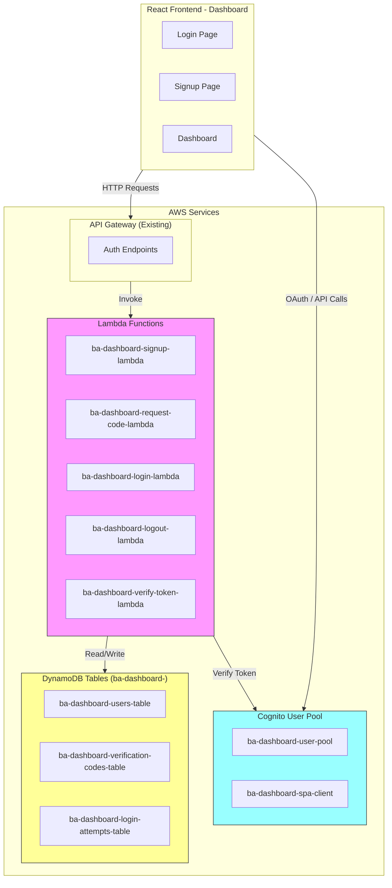
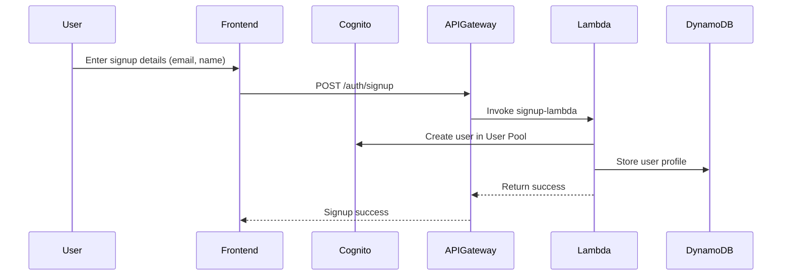
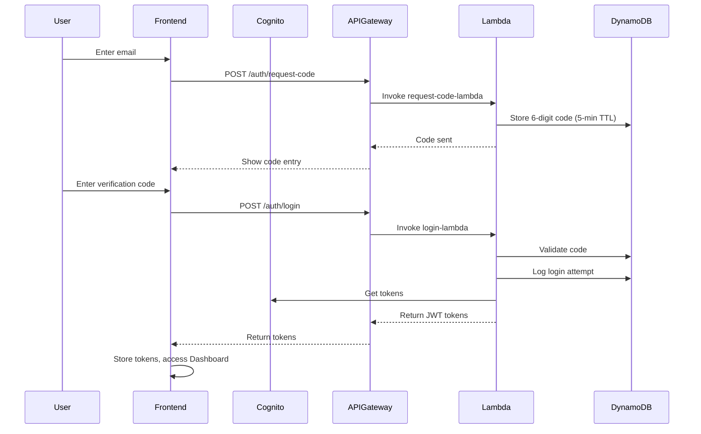

# BA Dashboard Login System - Simplified Architecture

## Overview

A simple, secure serverless login system for the BA Dashboard using AWS Cognito, API Gateway, Lambda, and DynamoDB.

### Key Points:
- **Prefix**: All resources use "ba-dashboard-" prefix
- **Authentication**: AWS Cognito with passwordless login (6-digit verification code)
- **Storage**: DynamoDB tables with "ba-dashboard-" prefix
- **API**: Existing API Gateway
- **advicer_name**: Unique identifier for each Buyer Agent, stored in users table (same as email)
- **Runtime**: Python 3.13 for all Lambda functions

---

## 1. System Architecture



---

## 2. Authentication Flow

### 2.1 Signup Flow


### 2.2 Login Flow (Passwordless)


---

## 3. Cognito User Pool Specification

### 3.1 User Pool: ba-dashboard-user-pool

| Setting | Value |
|---------|-------|
| Pool Name | ba-dashboard-user-pool |
| Region | ap-southeast-2 |
| Sign-in Options | Email (allow sign in with email) |
| Password Policy | Default (Cognito defaults) |
| User Account Recovery | Admin only (no self-service recovery) |
| Email | Send email with Cognito (or SES) |
| App Client | ba-dashboard-spa-client |

### 3.2 App Client: ba-dashboard-spa-client

| Setting | Value |
|---------|-------|
| Client Name | ba-dashboard-spa-client |
| Client Type | Public (SPA) |
| Auth Flows | ALLOW_USER_PASSWORD_AUTH, ALLOW_USER_SRP_AUTH, ALLOW_REFRESH_TOKEN_AUTH |
| OAuth 2.0 Grant Types | Authorization code grant |
| OAuth Scopes | email, openid, aws.cognito.signin.user.admin |
| Callback URLs | http://localhost:5173/callback, https://ba.advicegenie.com.au/callback |
| Logout URLs | http://localhost:5173/logout, https://ba.advicegenie.com.au/logout |

### 3.3 Lambda Triggers (Optional)

| Trigger | Purpose |
|---------|---------|
| Pre Sign-up | Validate email domain |
| Post Confirmation | Create user record in DynamoDB |

---

## 4. DynamoDB Tables

### 4.1 ba-dashboard-users-table

**Note**: user_id, email, advicer_name, and cognito_username are ALL THE SAME (email address).

| Attribute | Type | Key | Description |
|-----------|------|-----|-------------|
| user_id | String | PK | **Same as email** - User's email address |
| email | String | GSI1 | **Same as user_id** - User's email (indexed) |
| advicer_name | String | - | **Same as email** - Buyer Agent unique ID |
| cognito_username | String | - | **Same as email** - Cognito username |
| name | String | - | Full name |
| created_at | String | - | ISO timestamp |
| updated_at | String | - | ISO timestamp |
| last_login | String | - | ISO timestamp |
| status | String | - | **Active** or **Blocked** |

**Table Settings**:
- Billing Mode: PAY_PER_REQUEST
- Region: ap-southeast-2

### 4.2 ba-dashboard-verification-codes-table

| Attribute | Type | Key | Description |
|-----------|------|-----|-------------|
| email | String | PK | User email |
| code | String | - | 6-digit verification code |
| created_at | String | - | ISO timestamp |
| expires_at | Number | - | Unix timestamp (300 seconds TTL) |
| attempts | Number | - | Failed attempts counter |
| is_used | Boolean | - | Code used flag |

**Table Settings**:
- Billing Mode: PAY_PER_REQUEST
- Region: ap-southeast-2

### 4.3 ba-dashboard-login-attempts-table

| Attribute | Type | Key | Description |
|-----------|------|-----|-------------|
| attempt_id | String | PK | UUID |
| user_id | String | GSI1 | User ID |
| email | String | GSI2 | Email |
| ip_address | String | - | Client IP |
| user_agent | String | - | Browser info |
| status | String | - | success/failed |
| timestamp | String | - | ISO timestamp |

**Table Settings**:
- Billing Mode: PAY_PER_REQUEST
- Region: ap-southeast-2
- GSI1: user_id (partition key)
- GSI2: email (partition key)

---

## 5. Lambda Functions Specification

**All Lambda functions use Python 3.13**

### 5.1 ba-dashboard-signup-lambda

**Purpose**: Register new user (passwordless)

**Runtime**: Python 3.13

**Environment Variables**:
| Variable | Value |
|----------|-------|
| COGNITO_USER_POOL_ID | ap-southeast-2_xxxxxxxxx |
| COGNITO_CLIENT_ID | xxxxxxxxxxxxxxxxxxxxxxxxxx |
| REGION | ap-southeast-2 |
| DYNAMODB_USERS_TABLE | ba-dashboard-users-table |

**Input**:
```json
{
  "email": "johnsmith@company.com",
  "name": "John Smith"
}
```

**Output**:
```json
{
  "statusCode": 201,
  "body": {
    "user_id": "johnsmith@company.com",
    "email": "johnsmith@company.com",
    "advicer_name": "johnsmith@company.com",
    "name": "John Smith",
    "message": "User registered successfully"
  }
}
```


### 5.2 ba-dashboard-request-code-lambda

**Purpose**: Generate 6-digit verification code (5-min expiry)

**Runtime**: Python 3.13

**Environment Variables**:
| Variable | Value |
|----------|-------|
| REGION | ap-southeast-2 |
| DYNAMODB_CODES_TABLE | ba-dashboard-verification-codes-table |
| CODE_EXPIRY_SECONDS | 300 |

**Input**:
```json
{
  "email": "johnsmith@company.com"
}
```

**Output**:
```json
{
  "statusCode": 200,
  "body": {
    "message": "Verification code sent. Code expires in 5 minutes."
  }
}
```


### 5.3 ba-dashboard-login-lambda

**Purpose**: Authenticate with email + verification code

**Runtime**: Python 3.13

**Environment Variables**:
| Variable | Value |
|----------|-------|
| COGNITO_USER_POOL_ID | ap-southeast-2_xxxxxxxxx |
| COGNITO_CLIENT_ID | xxxxxxxxxxxxxxxxxxxxxxxxxx |
| REGION | ap-southeast-2 |
| DYNAMODB_USERS_TABLE | ba-dashboard-users-table |
| DYNAMODB_CODES_TABLE | ba-dashboard-verification-codes-table |
| DYNAMODB_ATTEMPTS_TABLE | ba-dashboard-login-attempts-table |
| CODE_EXPIRY_SECONDS | 300 |

**Input**:
```json
{
  "email": "johnsmith@company.com",
  "verification_code": "123456"
}
```

**Output**:
```json
{
  "statusCode": 200,
  "body": {
    "access_token": "eyJ...",
    "id_token": "eyJ...",
    "refresh_token": "eyJ...",
    "expires_in": 3600,
    "user_id": "johnsmith@company.com",
    "email": "johnsmith@company.com",
    "advicer_name": "johnsmith@company.com"
  }
}
```


### 5.4 ba-dashboard-logout-lambda

**Purpose**: Handle user logout

**Runtime**: Python 3.13

---

### 5.5 ba-dashboard-verify-token-lambda

**Purpose**: Verify JWT and return user info

**Runtime**: Python 3.13

---

## 6. IAM Roles and Policies

### 6.1 Lambda Execution Role: ba-dashboard-lambda-role

**Trust Policy**:
```json
{
  "Version": "2012-10-17",
  "Statement": [
    {
      "Effect": "Allow",
      "Principal": {
        "Service": "lambda.amazonaws.com"
      },
      "Action": "sts:AssumeRole"
    }
  ]
}
```

### 6.2 Inline Policy: ba-dashboard-lambda-policy

```json
{
  "Version": "2012-10-17",
  "Statement": [
    {
      "Effect": "Allow",
      "Action": [
        "dynamodb:PutItem",
        "dynamodb:GetItem",
        "dynamodb:UpdateItem",
        "dynamodb:Query",
        "dynamodb:Scan"
      ],
      "Resource": [
        "arn:aws:dynamodb:ap-southeast-2:ACCOUNT_ID:table/ba-dashboard-users-table",
        "arn:aws:dynamodb:ap-southeast-2:ACCOUNT_ID:table/ba-dashboard-verification-codes-table",
        "arn:aws:dynamodb:ap-southeast-2:ACCOUNT_ID:table/ba-dashboard-login-attempts-table"
      ]
    },
    {
      "Effect": "Allow",
      "Action": [
        "cognito-idp:AdminCreateUser",
        "cognito-idp:AdminGetUser",
        "cognito-idp:InitiateAuth",
        "cognito-idp:RespondToAuthChallenge"
      ],
      "Resource": "arn:aws:cognito-idp:ap-southeast-2:ACCOUNT_ID:userpool/ba-dashboard-user-pool"
    },
    {
      "Effect": "Allow",
      "Action": [
        "logs:CreateLogGroup",
        "logs:CreateLogStream",
        "logs:PutLogEvents"
      ],
      "Resource": "arn:aws:logs:ap-southeast-2:ACCOUNT_ID:log-group:/aws/lambda/ba-dashboard-*"
    }
  ]
}
```

### 6.3 API Gateway Invoke Permission

```json
{
  "Version": "2012-10-17",
  "Statement": [
    {
      "Effect": "Allow",
      "Principal": {
        "Service": "apigateway.amazonaws.com"
      },
      "Action": "lambda:InvokeFunction",
      "Resource": [
        "arn:aws:lambda:ap-southeast-2:ACCOUNT_ID:function:ba-dashboard-signup-lambda",
        "arn:aws:lambda:ap-southeast-2:ACCOUNT_ID:function:ba-dashboard-request-code-lambda",
        "arn:aws:lambda:ap-southeast-2:ACCOUNT_ID:function:ba-dashboard-login-lambda",
        "arn:aws:lambda:ap-southeast-2:ACCOUNT_ID:function:ba-dashboard-logout-lambda",
        "arn:aws:lambda:ap-southeast-2:ACCOUNT_ID:function:ba-dashboard-verify-token-lambda"
      ]
    }
  ]
}
```

---

## 7. API Gateway Endpoints

| Method | Path | Lambda | Auth | Description |
|--------|------|--------|------|-------------|
| POST | /auth/signup | ba-dashboard-signup-lambda | NONE | User registration |
| POST | /auth/request-code | ba-dashboard-request-code-lambda | NONE | Request verification code |
| POST | /auth/login | ba-dashboard-login-lambda | NONE | Login with code |
| POST | /auth/logout | ba-dashboard-logout-lambda | COGNITO | User logout |
| POST | /auth/verify-token | ba-dashboard-verify-token-lambda | NONE | Verify JWT |

---

## 8. Implementation Order

1. **Create Cognito User Pool** (ba-dashboard-user-pool)
2. **Create DynamoDB Tables**:
   - ba-dashboard-users-table
   - ba-dashboard-verification-codes-table
   - ba-dashboard-login-attempts-table
3. **Create IAM Role** (ba-dashboard-lambda-role)
4. **Deploy Lambda Functions**:
   - ba-dashboard-signup-lambda
   - ba-dashboard-request-code-lambda
   - ba-dashboard-login-lambda
   - ba-dashboard-logout-lambda
   - ba-dashboard-verify-token-lambda
5. **Configure API Gateway Endpoints**
6. **Update Frontend Authentication Code**

---

## 9. Files to Create

### IaC Files
- `app/ba-portal/IaC/cognito_setup.py` - Create Cognito User Pool
- `app/ba-portal/IaC/create_auth_tables.py` - Create DynamoDB tables
- `app/ba-portal/IaC/create_iam_role.py` - Create IAM role
- `app/ba-portal/IaC/deploy_auth_lambda.py` - Deploy Lambda functions

### Lambda Functions
- `app/ba-portal/lambda/auth_signup/signup.py`
- `app/ba-portal/lambda/auth_signup/requirements.txt`
- `app/ba-portal/lambda/auth_signup/deploy.config`
- `app/ba-portal/lambda/auth_request_code/request_code.py`
- `app/ba-portal/lambda/auth_request_code/requirements.txt`
- `app/ba-portal/lambda/auth_request_code/deploy.config`
- `app/ba-portal/lambda/auth_login/login.py`
- `app/ba-portal/lambda/auth_login/requirements.txt`
- `app/ba-portal/lambda/auth_login/deploy.config`
- `app/ba-portal/lambda/auth_logout/logout.py`
- `app/ba-portal/lambda/auth_logout/requirements.txt`
- `app/ba-portal/lambda/auth_logout/deploy.config`
- `app/ba-portal/lambda/auth_verify_token/verify_token.py`
- `app/ba-portal/lambda/auth_verify_token/requirements.txt`
- `app/ba-portal/lambda/auth_verify_token/deploy.config`

---

## 10. Configuration Summary

| Resource | Name |
|----------|------|
| Cognito User Pool | ba-dashboard-user-pool |
| Cognito App Client | ba-dashboard-spa-client |
| DynamoDB Users Table | ba-dashboard-users-table |
| DynamoDB Codes Table | ba-dashboard-verification-codes-table |
| DynamoDB Attempts Table | ba-dashboard-login-attempts-table |
| Lambda Functions | ba-dashboard-*-lambda |
| IAM Role | ba-dashboard-lambda-role |
| Region | ap-southeast-2 |
| Python Runtime | 3.13 |

---

This is a simplified login system that only handles authentication. The dashboard data access is handled separately by existing Lambda functions.
