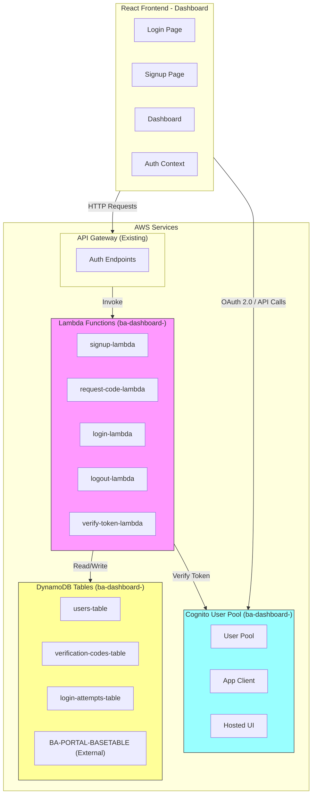
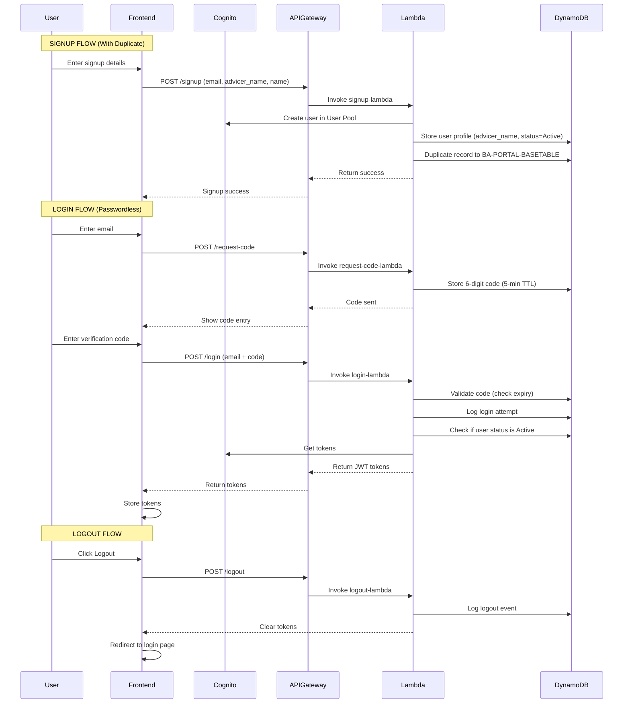
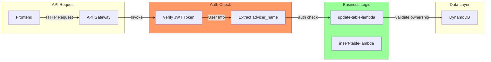

# BA Dashboard Login System - Architecture Plan (Refactored)

## Clarified Requirements (March 2026)

- **Authentication Type**: Passwordless login (no password required)
- **Login Code Expiry**: 5 minutes for verification code
- **Cognito User Pool**: NEW pool with "ba-dashboard-" prefix, redeployable Python script
- **advicer_name**: This IS the unique ID for the advisor
- **Duplicate Logic**: Entire user record duplicated to BA-PORTAL-BASETABLE on **registration** (not login)
- **User Status**: Active by default, with manual status field for activation/blocking
- **No Admin Features**: No block/unblock user functionality, no admin user list

---

## 1. System Overview

This document outlines the architecture for a secure, serverless login system integrated with AWS Cognito, API Gateway, Lambda, and DynamoDB. The system provides signup, login, and logout functionality with JWT token authentication.

### Key Requirements Summary:
- **Prefix**: All resources use "ba-dashboard-" prefix
- **Authentication**: AWS Cognito with JWT tokens
- **Storage**: DynamoDB for login details and attempt logging
- **API**: Existing API Gateway integration
- **Token Expiry**: 5 minutes for login codes
- **Registration Feature**: Duplicate ID "B57153AB-B66E-4085-A4C1-929EC158FC3E" to BA-PORTAL-BASETABLE on new user registration
- **User Status**: Active by default, manually toggleable status field

---

## 2. Architecture Diagram



---

## 3. Authentication Flow



---

## 4. DynamoDB Table Schemas

### 4.1 ba-dashboard-users-table

Stores user profiles with their unique advicer_name.

| Attribute | Type | Key | Description |
|-----------|------|-----|-------------|
| user_id | String | PK | Cognito sub (UUID) |
| email | String | GSI1 | User email (indexed) |
| advicer_name | String | - | Advisor unique ID |
| cognito_username | String | - | Cognito username |
| name | String | - | Full name |
| created_at | String | - | ISO timestamp |
| updated_at | String | - | ISO timestamp |
| last_login | String | - | ISO timestamp |
| status | String | - | **Active** or **Blocked** (manually toggleable) |

### 4.2 ba-dashboard-verification-codes-table

Stores verification codes with 5-minute TTL.

| Attribute | Type | Key | Description |
|-----------|------|-----|-------------|
| email | String | PK | User email |
| code | String | - | 6-digit verification code |
| created_at | String | - | ISO timestamp |
| expires_at | Number | - | Unix timestamp (5 min TTL) |
| attempts | Number | - | Failed attempts |
| is_used | Boolean | - | Code used flag |

### 4.3 ba-dashboard-login-attempts-table

Logs all login attempts for security and auditing.

| Attribute | Type | Key | Description |
|-----------|------|-----|-------------|
| attempt_id | String | PK | UUID for the attempt |
| user_id | String | GSI1 | User ID if exists |
| email | String | GSI2 | Email used (indexed) |
| ip_address | String | - | Client IP |
| user_agent | String | - | Browser/client info |
| status | String | - | success/failed/inactive |
| failure_reason | String | - | Reason for failure |
| timestamp | String | - | ISO timestamp |
| token_issued | Boolean | - | Whether token was issued |

---

## 5. Lambda Functions Specification

All Lambda functions use the prefix "ba-dashboard-" and are designed to be generic.

### 5.1 ba-dashboard-signup-lambda

**Purpose**: Register a new user (passwordless - no password required) + duplicate record to BA-PORTAL-BASETABLE

**Input**:
```json
{
  "email": "user@example.com",
  "advicer_name": "ADVISOR001",
  "name": "John Doe"
}
```

**Output**:
```json
{
  "statusCode": 201,
  "body": {
    "user_id": "uuid",
    "email": "user@example.com",
    "advicer_name": "ADVISOR001",
    "message": "User registered successfully. Please check email for verification code."
  }
}
```

**Features**:
- Creates user in Cognito User Pool
- Stores user profile in DynamoDB with status = "Active"
- **Duplicates entire record from BA-PORTAL-BASETABLE** (ID: B57153AB-B66E-4085-A4C1-929EC158FC3E) to the same table with user's identifier

**Environment Variables**:
- COGNITO_USER_POOL_ID
- COGNITO_CLIENT_ID
- REGION
- DYNAMODB_USERS_TABLE
- BA_PORTAL_BASE_TABLE
- SOURCE_RECORD_ID=B57153AB-B66E-4085-A4C1-929EC158FC3E

### 5.2 ba-dashboard-login-lambda

**Purpose**: Authenticate user via passwordless login (email + verification code)

**Input**:
```json
{
  "email": "user@example.com",
  "verification_code": "123456"  // 5-minute expiry
}
```

**Output**:
```json
{
  "statusCode": 200,
  "body": {
    "access_token": "eyJ...",
    "id_token": "eyJ...",
    "refresh_token": "eyJ...",
    "expires_in": 3600,
    "user_id": "uuid",
    "advicer_name": "ADVISOR001"
  }
}
```

**Features**:
- Validates verification code against stored code in DynamoDB
- Checks if user status is "Active" (not "Blocked")
- Logs attempt to DynamoDB
- Generates JWT tokens after verification
- Updates user's last_login timestamp
- **NOTE**: Duplicate logic moved to signup-lambda

**Environment Variables**:
- COGNITO_USER_POOL_ID
- COGNITO_CLIENT_ID
- REGION
- DYNAMODB_USERS_TABLE
- DYNAMODB_LOGIN_ATTEMPTS_TABLE
- JWT_SECRET_KEY
- VERIFICATION_CODE_EXPIRY_SECONDS=300

### 5.3 ba-dashboard-request-code-lambda

**Purpose**: Request a new verification code (passwordless flow)

**Input**:
```json
{
  "email": "user@example.com"
}
```

**Output**:
```json
{
  "statusCode": 200,
  "body": {
    "message": "Verification code sent. Code expires in 5 minutes."
  }
}
```

**Features**:
- Generates 6-digit verification code
- Stores code in DynamoDB with 5-minute TTL
- Logs the request

### 5.4 ba-dashboard-logout-lambda

**Purpose**: Handle user logout

**Input**:
```json
{
  "user_id": "uuid",
  "refresh_token": "token"
}
```

**Output**:
```json
{
  "statusCode": 200,
  "body": {
    "message": "Logged out successfully"
  }
}
```

### 5.5 ba-dashboard-verify-token-lambda

**Purpose**: Verify JWT token and return user info

**Input**:
```json
{
  "headers": {
    "Authorization": "Bearer token"
  }
}
```

**Output**:
```json
{
  "statusCode": 200,
  "body": {
    "user_id": "uuid",
    "email": "user@example.com",
    "advicer_name": "ADVISOR001",
    "status": "Active",
    "is_valid": true
  }
}
```

---

## 6. API Gateway Endpoints

All endpoints added to the existing API Gateway.

### 6.1 Endpoints Configuration (Passwordless Login)

| Method | Path | Lambda | Auth | Description |
|--------|------|--------|------|-------------|
| POST | /auth/signup | ba-dashboard-signup-lambda | NONE | User registration + duplicate to BA-PORTAL-BASETABLE |
| POST | /auth/request-code | ba-dashboard-request-code-lambda | NONE | Request 5-min verification code |
| POST | /auth/login | ba-dashboard-login-lambda | NONE | Login with email + verification code |
| POST | /auth/logout | ba-dashboard-logout-lambda | COGNITO | User logout |
| POST | /auth/verify-token | ba-dashboard-verify-token-lambda | NONE | Verify JWT |

---

## 7. JWT Token Configuration

### Passwordless Login Flow (5-minute code expiry)

1. User enters email → `/auth/request-code` → 6-digit code generated, stored in DynamoDB with 5-min TTL
2. User enters code → `/auth/login` → Code validated, JWT tokens issued
3. Tokens used for subsequent API calls

### Verification Code (stored in DynamoDB)
```json
{
  "email": "user@example.com",
  "code": "123456",
  "created_at": "2026-03-08T04:30:00Z",
  "expires_at": "2026-03-08T04:35:00Z",  // 5 minutes later
  "attempts": 0
}
```

### Standard Access Token (from Cognito)
- Expiry: 1 hour (from Cognito)
- Contains: user claims, groups, advicer_name

---

## 8. Registration Record Duplication Logic

When a new user registers successfully:

1. Check if user already exists in `ba-dashboard-users-table`
2. If new user:
   - Create user in Cognito User Pool
   - Store user profile in `ba-dashboard-users-table` with status = "Active"
   - **Read item with ID "B57153AB-B66E-4085-A4C1-929EC158FC3E" from `BA-PORTAL-BASETABLE`**
   - **Duplicate the ENTIRE RECORD** to the same table (BA-PORTAL-BASETABLE) with user's identifier
   - Return success response

### Implementation Steps in ba-dashboard-signup-lambda:
```python
def handle_new_registration(email, advicer_name, name):
    # Check if user already exists
    existing_user = get_user_by_email(email)
    if existing_user:
        return {"error": "User already exists"}
    
    # Create user in Cognito
    cognito_user = create_cognito_user(email, name)
    
    # Store user in users-table with Active status
    user_id = cognito_user['UserSub']
    user_item = {
        'user_id': user_id,
        'email': email,
        'advicer_name': advicer_name,
        'name': name,
        'status': 'Active',  # Default status
        'created_at': datetime.utcnow().isoformat(),
        'cognito_username': cognito_user['UserUsername']
    }
    put_item_to_dynamodb(
        table_name='ba-dashboard-users-table',
        item=user_item
    )
    
    # Duplicate record to BA-PORTAL-BASETABLE
    source_item = get_item_from_dynamodb(
        table_name='BA-PORTAL-BASETABLE',
        key={'id': 'B57153AB-B66E-4085-A4C1-929EC158FC3E'}
    )
    
    # Create new item with user's identifier
    new_item = source_item.copy()
    new_item['id'] = user_id
    new_item['advicer_name'] = advicer_name
    new_item['email'] = email
    
    # Write to BA-PORTAL-BASETABLE
    put_item_to_dynamodb(
        table_name='BA-PORTAL-BASETABLE',
        item=new_item
    )
    
    return {"user_id": user_id, "status": "Active"}
```

---

## 9. Manual User Status Management

The `status` field in `ba-dashboard-users-table` allows manual toggling between Active and Blocked states.

### Status Field Values:
- **Active**: User can login and access the system
- **Blocked**: User cannot login (status check during login)

### How to Toggle Status:
Users can be manually blocked/activated via:
1. Direct DynamoDB update (console or CLI)
2. Future admin panel (out of scope for now)

### Login Flow Status Check:
```python
def check_user_status(user_id):
    user = get_user_from_dynamodb(user_id)
    if user.get('status') == 'Blocked':
        return {
            'allowed': False,
            'reason': 'User account is blocked. Please contact support.'
        }
    return {'allowed': True}
```

---

## 10. Frontend Integration

### 10.1 Updated Auth Context Flow

```typescript
interface AuthState {
  isAuthenticated: boolean;
  user: UserProfile | null;
  tokens: Tokens | null;
  isLoading: boolean;
}

interface UserProfile {
  userId: string;
  email: string;
  name: string;
  advicerName: string;
  status: 'Active' | 'Blocked';
  groups: string[];
}
```

### 10.2 API Service Updates

```typescript
// Updated auth API calls (no admin functions)
authAPI.signup(data: SignupData): Promise<AuthResponse>
authAPI.login(credentials: LoginCredentials): Promise<LoginResponse>
authAPI.logout(): Promise<void>
authAPI.verifyToken(token: string): Promise<VerifyResponse>

interface SignupData {
  email: string;
  advicer_name: string;
  name: string;
}
```

---

## 11. Security Considerations

1. **Password Requirements**: N/A (passwordless)
2. **Rate Limiting**: Implement at API Gateway level (see Section 11.1)
3. **Token Storage**: Use httpOnly cookies for JWT, not localStorage
4. **HTTPS Only**: All traffic must be over HTTPS in production
5. **CORS**: Configure specific origins, not "*"
6. **Input Validation**: Validate all inputs in Lambda functions
7. **Logging**: All authentication events logged to CloudWatch

### 11.1 API Gateway Rate Limiting (Endpoint-Specific)

| Endpoint | Method | Rate Limit | Burst Limit | Description |
|----------|--------|------------|-------------|-------------|
| /auth/request-code | POST | 5 requests/min | 10 | Prevent code spam |
| /auth/login | POST | 10 requests/min | 20 | Prevent brute force |
| /auth/signup | POST | 5 requests/min | 10 | Prevent account enumeration |
| /auth/logout | POST | 60 requests/min | 100 | Normal usage |
| /auth/verify-token | POST | 60 requests/min | 100 | Normal usage |
| /update-table | POST | 60 requests/min | 100 | Data operations |
| /read-table | POST | 120 requests/min | 200 | Dashboard reads |

#### Implementation via API Gateway Usage Plans:

```python
# AWS CLI commands to set up rate limiting
# Create usage plan
aws apigateway create-usage-plan \
  --name ba-dashboard-auth-usage-plan \
  --api-stages apiId=YOUR_API_ID,stage=prod \
  --quota settings='{ "limit": 1000, "period": "DAY" }' \
  --throttle settings='{ "rateLimit": 10, "burstLimit": 20 }' \
  --region ap-southeast-2
```

---

## 12. Implementation Order

1. **Create Cognito User Pool** (Python script with "ba-dashboard-" prefix)
   - Script: `app/ba-portal/IaC/cognito_setup.py`
   - Should be redeployable (idempotent)
2. **Create DynamoDB Tables** (Python script)
   - Script: `app/ba-portal/IaC/create_auth_tables.py`
   - Tables: users, verification-codes, login-attempts (no blocked-users)
3. **Deploy Lambda Functions** (5 functions with "ba-dashboard-" prefix)
   - signup-lambda (with duplication logic)
   - request-code-lambda
   - login-lambda
   - logout-lambda
   - verify-token-lambda
4. **Configure API Gateway Endpoints**
   - Update `app/ba-portal/IaC/api-config.json`
5. **Update Frontend Authentication Code**
6. **Test End-to-End Flow**

---

## 13. Files to Create/Modify

### New Files - IaC Setup
- `app/ba-portal/IaC/cognito_setup.py` - Create/recreate Cognito User Pool with "ba-dashboard-" prefix (redeployable)
- `app/ba-portal/IaC/create_auth_tables.py` - Create all DynamoDB tables with "ba-dashboard-" prefix (users, verification-codes, login-attempts)

### New Files - Lambda Functions (prefix: ba-dashboard-)
- `app/ba-portal/lambda/auth_signup/signup.py` - User registration + duplicate to BA-PORTAL-BASETABLE
- `app/ba-portal/lambda/auth_request_code/request_code.py` - Generate 5-min verification code
- `app/ba-portal/lambda/auth_login/login.py` - Login with verification code + status check
- `app/ba-portal/lambda/auth_logout/logout.py` - User logout
- `app/ba-portal/lambda/auth_verify_token/verify_token.py` - Verify JWT token

### New Files - Lambda Deployment
- `app/ba-portal/lambda/auth_signup/deploy.config` - Lambda configuration
- `app/ba-portal/lambda/auth_signup/requirements.txt` - Python dependencies

### Modify Existing Files
- `app/ba-portal/dashboard-frontend/src/contexts/AuthContext.tsx` - Update for passwordless login
- `app/ba-portal/dashboard-frontend/src/services/authService.ts` - Add signup methods
- `app/ba-portal/dashboard-frontend/src/config/cognitoConfig.ts` - Update for new Cognito pool
- `app/ba-portal/IaC/api-config.json` - Add auth endpoints to existing API Gateway

### Files NO LONGER NEEDED (Removed)
- `app/ba-portal/lambda/auth_block_user/block_user.py` - REMOVED (no admin)
- `app/ba-portal/lambda/auth_unblock_user/unblock_user.py` - REMOVED (no admin)
- `app/ba-portal/lambda/auth_get_users/get_users.py` - REMOVED (no admin)
- blocked-users-table - REMOVED (using status field instead)

---

## 14. Configuration Summary

| Resource | Prefix | Example Name |
|----------|--------|--------------|
| Lambda Functions | ba-dashboard- | ba-dashboard-login-lambda |
| DynamoDB Tables | ba-dashboard- | ba-dashboard-users-table |
| Cognito User Pool | ba-dashboard- | ba-dashboard-user-pool |
| Cognito App Client | ba-dashboard- | ba-dashboard-spa-client |

---

## 15. Assumptions & Clarifications

The following assumptions were made during the design. Please verify:

### 15.1 Authentication & Verification

| Assumption | Description | Needs Clarification? |
|------------|-------------|---------------------|
| **Verification Code Delivery** | Currently stored in DynamoDB. Not sent via email/SMS yet - displayed in UI for testing | Yes - How should codes be delivered in production? |
| **No Password Required** | This is a passwordless login system using 6-digit codes | Verified |
| **5-Minute Code Expiry** | Verification codes expire after 5 minutes | Verified |

### 15.2 Cognito Integration

| Assumption | Description | Needs Clarification? |
|------------|-------------|---------------------|
| **New User Pool** | Create NEW Cognito User Pool with "ba-dashboard-" prefix | Verified |
| **User Pool Type** | Using Cognito User Pool for user management | What about federated identities? |
| **Token Exchange** | Lambda handles token exchange with Cognito | Is this correct? |

### 15.3 DynamoDB & Data

| Assumption | Description | Needs Clarification? |
|------------|-------------|---------------------|
| **advicer_name Source** | Provided during signup by user | Should this come from Cognito custom attribute? |
| **Base Table Access** | Lambda has read/write access to BA-PORTAL-BASETABLE | Verify IAM permissions |
| **Record Duplication** | Entire record from source ID is duplicated during signup | Which fields to update with user data? |
| **Status Field** | Status = "Active" by default, manually toggleable | Verified |

### 15.4 Frontend

| Assumption | Description | Needs Clarification? |
|------------|-------------|---------------------|
| **Existing Frontend** | Modifying existing dashboard frontend | Any new pages needed? |
| **Token Storage** | Using sessionStorage for tokens | Should use httpOnly cookies? |
| **Callback Handling** | Using code flow for verification | Is this the desired flow? |

### 15.5 Security

| Assumption | Description | Needs Clarification? |
|------------|-------------|---------------------|
| **Rate Limiting** | Not implemented yet | Add at API Gateway? |
| **Code Attempts** | Tracking failed verification attempts | Max attempts before lockout? |
| **HTTPS** | Assumed in production | Verify deployment environment |

### 15.6 Lambda Functions

| Assumption | Description | Needs Clarification? |
|------------|-------------|---------------------|
| **Generic Design** | Functions designed to be reusable | Verify environment variable configuration |
| **Python Runtime** | Using Python 3.13 | OK? |
| **Prefix** | All functions start with "ba-dashboard-" | Verified |

---

## 16. Integration with Existing Lambda Functions

### 16.1 New Requirement: Read-Only Before Login, Edit After Login

The ba-dashboard should work as follows:
- **Before Login**: Dashboard is READ-ONLY (can view data)
- **After Login**: User can EDIT their own data only

### 16.2 Existing Lambdas to Update

| Lambda Function | Current Behavior | Required Changes |
|----------------|------------------|------------------|
| ba-portal-update-table-lambda | Updates any data | Check auth + ownership by advicer_name |
| ba-portal-insert-table-lambda | Inserts any data | Check auth + ownership by advicer_name |
| ba-portal-read-table-lambda | Reads any data | Already works (read is allowed) |

### 16.3 Authorization Logic

```python
def authorize_edit(event, user_info):
    # Check if user is authenticated
    if not user_info or not user_info.get('is_authenticated'):
        return {
            'authorized': False,
            'reason': 'User not authenticated'
        }
    
    # Get user's advicer_name from token
    user_advicer_name = user_info.get('advicer_name')
    
    # Get the data being edited
    target_advicer_name = event.get('body', {}).get('advicer_name')
    
    # Check ownership - user can only edit their own data
    if user_advicer_name != target_advicer_name:
        return {
            'authorized': False,
            'reason': 'User can only edit their own data'
        }
    
    return {'authorized': True}
```

### 16.4 Lambda Integration Flow



### 16.5 Implementation Approach

1. **Create a Generic Auth Decorator/Library**:
   - Python module that can be imported into existing Lambdas
   - Validates JWT token from Authorization header
   - Extracts user info (user_id, email, advicer_name)
   
2. **Update Existing Lambdas**:
   - Add auth check at the beginning of handler
   - For write operations: verify ownership by comparing advicer_name
   
3. **Environment Variables for Existing Lambdas**:
   - COGNITO_USER_POOL_ID
   - JWT_SECRET_KEY (for custom token verification)

---

This plan provides a comprehensive architecture for the simplified login system. Once approved, I will proceed with implementation in Code mode.
