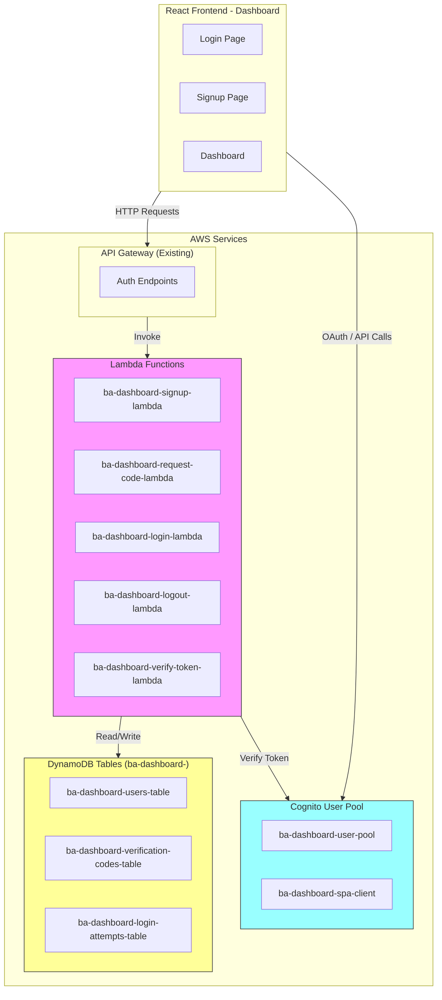
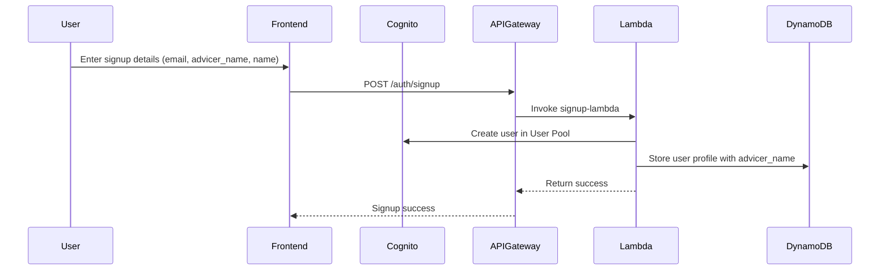
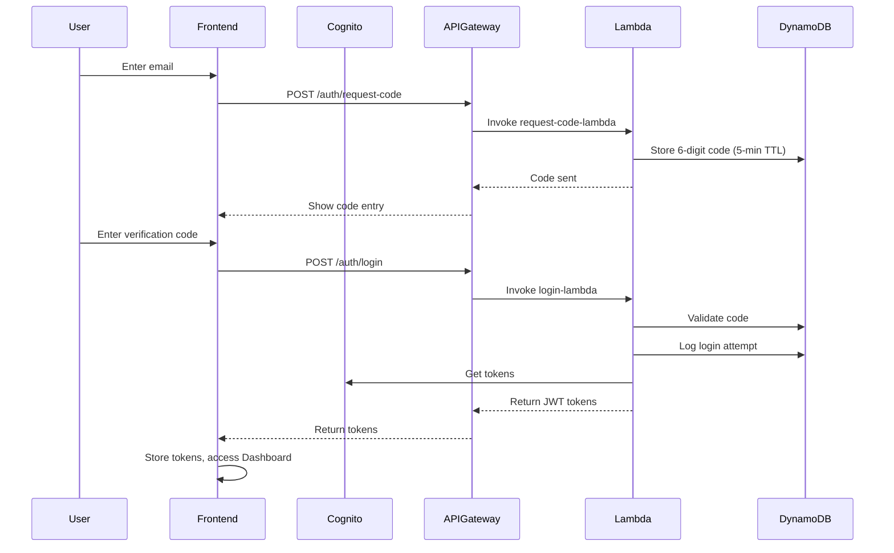

# BA Dashboard Login System - Simplified Architecture

## Overview

A simple, secure serverless login system for the BA Dashboard using AWS Cognito, API Gateway, Lambda, and DynamoDB.

### Key Points:
- **Prefix**: All resources use "ba-dashboard-" prefix
- **Authentication**: AWS Cognito with passwordless login (6-digit verification code)
- **Storage**: DynamoDB tables with "ba-dashboard-" prefix
- **API**: Existing API Gateway
- **advicer_name**: Unique identifier for each Buyer Agent, stored in users table

---

## 1. System Architecture



---

## 2. Authentication Flow

### 2.1 Signup Flow


### 2.2 Login Flow (Passwordless)


---

## 3. DynamoDB Tables

### 3.1 ba-dashboard-users-table

**Note**: user_id, email, advicer_name, and cognito_username are ALL THE SAME (email address). This simplifies the table design.

| Attribute | Type | Key | Description |
|-----------|------|-----|-------------|
| user_id | String | PK | **Same as email** - User's email address |
| email | String | GSI1 | **Same as user_id** - User's email (indexed) |
| advicer_name | String | - | **Same as email** - Buyer Agent unique ID |
| cognito_username | String | - | **Same as email** - Cognito username |
| name | String | - | Full name |
| created_at | String | - | ISO timestamp |
| updated_at | String | - | ISO timestamp |
| last_login | String | - | ISO timestamp |
| status | String | - | **Active** or **Blocked** |

### 3.2 ba-dashboard-verification-codes-table

| Attribute | Type | Key | Description |
|-----------|------|-----|-------------|
| email | String | PK | User email |
| code | String | - | 6-digit verification code |
| created_at | String | - | ISO timestamp |
| expires_at | Number | - | Unix timestamp (5 min TTL) |
| attempts | Number | - | Failed attempts |
| is_used | Boolean | - | Code used flag |

### 3.3 ba-dashboard-login-attempts-table

| Attribute | Type | Key | Description |
|-----------|------|-----|-------------|
| attempt_id | String | PK | UUID |
| user_id | String | GSI1 | User ID |
| email | String | GSI2 | Email |
| ip_address | String | - | Client IP |
| user_agent | String | - | Browser info |
| status | String | - | success/failed |
| timestamp | String | - | ISO timestamp |

---

## 4. Lambda Functions

### 4.1 ba-dashboard-signup-lambda

**Purpose**: Register new user (passwordless)

**Note**: user_id = email = advicer_name = cognito_username (all the same value)

**Input**:
```json
{
  "email": "johnsmith@company.com",
  "name": "John Smith"
}
```

**Output**:
```json
{
  "statusCode": 201,
  "body": {
    "user_id": "johnsmith@company.com",
    "email": "johnsmith@company.com",
    "advicer_name": "johnsmith@company.com",
    "name": "John Smith",
    "message": "User registered successfully"
  }
}
```

### 4.2 ba-dashboard-login-lambda

**Purpose**: Authenticate with email + verification code

**Note**: user_id = email = advicer_name = cognito_username (all the same value)

**Input**:
```json
{
  "email": "johnsmith@company.com",
  "verification_code": "123456"
}
```

**Output**:
```json
{
  "statusCode": 200,
  "body": {
    "access_token": "eyJ...",
    "id_token": "eyJ...",
    "refresh_token": "eyJ...",
    "expires_in": 3600,
    "user_id": "johnsmith@company.com",
    "email": "johnsmith@company.com",
    "advicer_name": "johnsmith@company.com"
  }
}
```

### 4.3 ba-dashboard-request-code-lambda

**Purpose**: Generate 6-digit verification code (5-min expiry)

**Input**: `{ "email": "user@example.com" }`

### 4.4 ba-dashboard-logout-lambda

**Purpose**: Handle user logout

### 4.5 ba-dashboard-verify-token-lambda

**Purpose**: Verify JWT and return user info

---

## 5. API Gateway Endpoints

| Method | Path | Lambda | Auth | Description |
|--------|------|--------|------|-------------|
| POST | /auth/signup | ba-dashboard-signup-lambda | NONE | User registration |
| POST | /auth/request-code | ba-dashboard-request-code-lambda | NONE | Request verification code |
| POST | /auth/login | ba-dashboard-login-lambda | NONE | Login with code |
| POST | /auth/logout | ba-dashboard-logout-lambda | COGNITO | User logout |
| POST | /auth/verify-token | ba-dashboard-verify-token-lambda | NONE | Verify JWT |

---

## 6. Implementation Order

1. **Create Cognito User Pool** (ba-dashboard-user-pool)
2. **Create DynamoDB Tables**:
   - ba-dashboard-users-table
   - ba-dashboard-verification-codes-table
   - ba-dashboard-login-attempts-table
3. **Deploy Lambda Functions**:
   - ba-dashboard-signup-lambda
   - ba-dashboard-request-code-lambda
   - ba-dashboard-login-lambda
   - ba-dashboard-logout-lambda
   - ba-dashboard-verify-token-lambda
4. **Configure API Gateway Endpoints**
5. **Update Frontend Authentication Code**

---

## 7. Files to Create/Modify

### New Files - IaC
- `app/ba-portal/IaC/cognito_setup.py` - Create Cognito User Pool
- `app/ba-portal/IaC/create_auth_tables.py` - Create DynamoDB tables

### New Files - Lambda
- `app/ba-portal/lambda/auth_signup/` - Signup Lambda
- `app/ba-portal/lambda/auth_request_code/` - Request code Lambda
- `app/ba-portal/lambda/auth_login/` - Login Lambda
- `app/ba-portal/lambda/auth_logout/` - Logout Lambda
- `app/ba-portal/lambda/auth_verify_token/` - Verify token Lambda

### Modify Existing Files
- `app/ba-portal/dashboard-frontend/src/contexts/AuthContext.tsx`
- `app/ba-portal/dashboard-frontend/src/services/authService.ts`
- `app/ba-portal/IaC/api-config.json`

---

## 8. Configuration Summary

| Resource | Name |
|----------|------|
| Cognito User Pool | ba-dashboard-user-pool |
| Cognito App Client | ba-dashboard-spa-client |
| DynamoDB Users Table | ba-dashboard-users-table |
| DynamoDB Codes Table | ba-dashboard-verification-codes-table |
| DynamoDB Attempts Table | ba-dashboard-login-attempts-table |
| Lambda Functions | ba-dashboard-*-lambda |

---

This is a simplified login system that only handles authentication. The dashboard data access is handled separately by existing Lambda functions.
