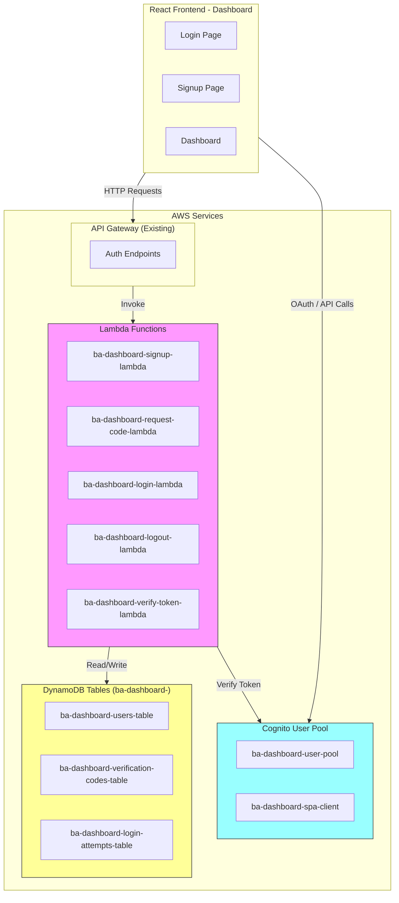
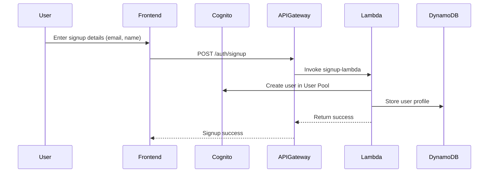
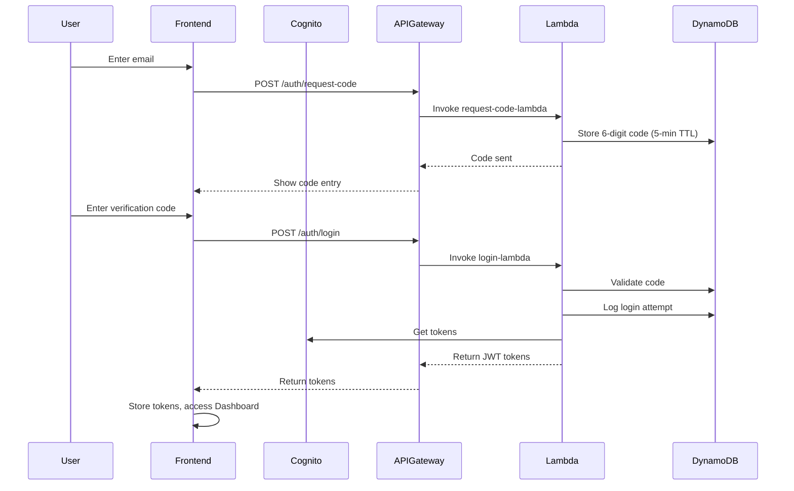

# BA Dashboard Login System - Simplified Architecture

## Overview

A simple, secure serverless login system for the BA Dashboard using AWS Cognito, API Gateway, Lambda, and DynamoDB.

### Key Points:
- **Prefix**: All resources use "ba-dashboard-" prefix
- **Authentication**: AWS Cognito with passwordless login (6-digit verification code)
- **Storage**: DynamoDB tables with "ba-dashboard-" prefix
- **API**: Existing API Gateway
- **advicer_name**: Unique identifier for each Buyer Agent, stored in users table (same as email)
- **Runtime**: Python 3.13 for all Lambda functions

---

## 1. System Architecture



---

## 2. Authentication Flow

### 2.1 Signup Flow


### 2.2 Login Flow (Passwordless)


---

## 3. Cognito User Pool Specification

### 3.1 User Pool: ba-dashboard-user-pool

| Setting | Value |
|---------|-------|
| Pool Name | ba-dashboard-user-pool |
| Region | ap-southeast-2 |
| Sign-in Options | Email (allow sign in with email) |
| Password Policy | Default (Cognito defaults) |
| User Account Recovery | Admin only (no self-service recovery) |
| Email | Send email with Cognito (or SES) |
| App Client | ba-dashboard-spa-client |

### 3.2 App Client: ba-dashboard-spa-client

| Setting | Value |
|---------|-------|
| Client Name | ba-dashboard-spa-client |
| Client Type | Public (SPA) |
| Auth Flows | ALLOW_USER_PASSWORD_AUTH, ALLOW_USER_SRP_AUTH, ALLOW_REFRESH_TOKEN_AUTH |
| OAuth 2.0 Grant Types | Authorization code grant |
| OAuth Scopes | email, openid, aws.cognito.signin.user.admin |
| Callback URLs | http://localhost:5173/callback, https://your-domain.com/callback |
| Logout URLs | http://localhost:5173/logout, https://your-domain.com/logout |

### 3.3 Lambda Triggers (Optional)

| Trigger | Purpose |
|---------|---------|
| Pre Sign-up | Validate email domain |
| Post Confirmation | Create user record in DynamoDB |

---

## 4. DynamoDB Tables

### 4.1 ba-dashboard-users-table

**Note**: user_id, email, advicer_name, and cognito_username are ALL THE SAME (email address).

| Attribute | Type | Key | Description |
|-----------|------|-----|-------------|
| user_id | String | PK | **Same as email** - User's email address |
| email | String | GSI1 | **Same as user_id** - User's email (indexed) |
| advicer_name | String | - | **Same as email** - Buyer Agent unique ID |
| cognito_username | String | - | **Same as email** - Cognito username |
| name | String | - | Full name |
| created_at | String | - | ISO timestamp |
| updated_at | String | - | ISO timestamp |
| last_login | String | - | ISO timestamp |
| status | String | - | **Active** or **Blocked** |

**Table Settings**:
- Billing Mode: PAY_PER_REQUEST
- Region: ap-southeast-2

### 4.2 ba-dashboard-verification-codes-table

| Attribute | Type | Key | Description |
|-----------|------|-----|-------------|
| email | String | PK | User email |
| code | String | - | 6-digit verification code |
| created_at | String | - | ISO timestamp |
| expires_at | Number | - | Unix timestamp (300 seconds TTL) |
| attempts | Number | - | Failed attempts counter |
| is_used | Boolean | - | Code used flag |

**Table Settings**:
- Billing Mode: PAY_PER_REQUEST
- Region: ap-southeast-2

### 4.3 ba-dashboard-login-attempts-table

| Attribute | Type | Key | Description |
|-----------|------|-----|-------------|
| attempt_id | String | PK | UUID |
| user_id | String | GSI1 | User ID |
| email | String | GSI2 | Email |
| ip_address | String | - | Client IP |
| user_agent | String | - | Browser info |
| status | String | - | success/failed |
| timestamp | String | - | ISO timestamp |

**Table Settings**:
- Billing Mode: PAY_PER_REQUEST
- Region: ap-southeast-2
- GSI1: user_id (partition key)
- GSI2: email (partition key)

---

## 5. Lambda Functions Specification

**All Lambda functions use Python 3.13**

### 5.1 ba-dashboard-signup-lambda

**Purpose**: Register new user (passwordless)

**Runtime**: Python 3.13

**Environment Variables**:
| Variable | Value |
|----------|-------|
| COGNITO_USER_POOL_ID | ap-southeast-2_xxxxxxxxx |
| COGNITO_CLIENT_ID | xxxxxxxxxxxxxxxxxxxxxxxxxx |
| REGION | ap-southeast-2 |
| DYNAMODB_USERS_TABLE | ba-dashboard-users-table |

**Input**:
```json
{
  "email": "johnsmith@company.com",
  "name": "John Smith"
}
```

**Output**:
```json
{
  "statusCode": 201,
  "body": {
    "user_id": "johnsmith@company.com",
    "email": "johnsmith@company.com",
    "advicer_name": "johnsmith@company.com",
    "name": "John Smith",
    "message": "User registered successfully"
  }
}
```

**Python Code**:
```python
#!/usr/bin/env python3
"""
ba-dashboard-signup-lambda
Register new user with passwordless authentication
Runtime: Python 3.13
"""

import json
import os
import uuid
from datetime import datetime
from typing import Dict, Any

import boto3
from botocore.exceptions import ClientError

# Environment variables
COGNITO_USER_POOL_ID = os.environ.get('COGNITO_USER_POOL_ID')
COGNITO_CLIENT_ID = os.environ.get('COGNITO_CLIENT_ID')
REGION = os.environ.get('REGION', 'ap-southeast-2')
DYNAMODB_USERS_TABLE = os.environ.get('DYNAMODB_USERS_TABLE', 'ba-dashboard-users-table')

# AWS clients
cognito_client = boto3.client('cognito-idp', region_name=REGION)
dynamodb = boto3.resource('dynamodb', region_name=REGION)
users_table = dynamodb.Table(DYNAMODB_USERS_TABLE)


class SignupError(Exception):
    """Custom exception for signup errors"""
    def __init__(self, message: str, status_code: int = 400):
        self.message = message
        self.status_code = status_code
        super().__init__(message)


def create_response(status_code: int, body: Dict[str, Any]) -> Dict[str, Any]:
    """Create API Gateway response"""
    return {
        'statusCode': status_code,
        'headers': {
            'Content-Type': 'application/json',
            'Access-Control-Allow-Origin': '*',
            'Access-Control-Allow-Methods': 'POST, OPTIONS',
            'Access-Control-Allow-Headers': 'Content-Type, Authorization'
        },
        'body': json.dumps(body, default=str)
    }


def create_user_in_cognito(email: str, name: str) -> Dict[str, str]:
    """Create user in Cognito User Pool"""
    try:
        response = cognito_client.admin_create_user(
            UserPoolId=COGNITO_USER_POOL_ID,
            Username=email,
            UserAttributes=[
                {'Name': 'email', 'Value': email},
                {'Name': 'email_verified', 'Value': 'true'},
                {'Name': 'name', 'Value': name}
            ],
            MessageAction='SUPPRESS'  # Don't send email, user will get code via login
        )
        return {
            'user_sub': response['User']['Username'],
            'cognito_username': response['User']['Username']
        }
    except ClientError as e:
        error_code = e.response['Error']['Code']
        if error_code == 'UsernameExistsException':
            raise SignupError('User already exists', 409)
        raise SignupError(f'Cognito error: {error_code}', 500)


def store_user_in_dynamodb(email: str, name: str, cognito_username: str) -> None:
    """Store user profile in DynamoDB"""
    now = datetime.utcnow().isoformat()
    
    item = {
        'user_id': email,
        'email': email,
        'advicer_name': email,
        'cognito_username': email,
        'name': name,
        'status': 'Active',
        'created_at': now,
        'updated_at': now,
        'last_login': ''
    }
    
    users_table.put_item(Item=item)


def lambda_handler(event: Dict[str, Any], context: Any) -> Dict[str, Any]:
    """Main Lambda handler"""
    try:
        # Parse request body
        body = json.loads(event.get('body', '{}'))
        email = body.get('email', '').strip().lower()
        name = body.get('name', '').strip()
        
        # Validation
        if not email or '@' not in email:
            return create_response(400, {'error': 'Valid email is required'})
        
        if not name:
            return create_response(400, {'error': 'Name is required'})
        
        # Create user in Cognito
        cognito_result = create_user_in_cognito(email, name)
        
        # Store user in DynamoDB
        store_user_in_dynamodb(email, name, cognito_result['cognito_username'])
        
        # Return success
        return create_response(201, {
            'user_id': email,
            'email': email,
            'advicer_name': email,
            'name': name,
            'message': 'User registered successfully'
        })
        
    except SignupError as e:
        return create_response(e.status_code, {'error': e.message})
        
    except Exception as e:
        return create_response(500, {'error': f'Internal server error: {str(e)}'})


if __name__ == "__main__":
    # Test event
    test_event = {
        'body': json.dumps({
            'email': 'test@example.com',
            'name': 'Test User'
        })
    }
    print(lambda_handler(test_event, None))
```

---

### 5.2 ba-dashboard-request-code-lambda

**Purpose**: Generate 6-digit verification code (5-min expiry)

**Runtime**: Python 3.13

**Environment Variables**:
| Variable | Value |
|----------|-------|
| REGION | ap-southeast-2 |
| DYNAMODB_CODES_TABLE | ba-dashboard-verification-codes-table |
| CODE_EXPIRY_SECONDS | 300 |

**Input**:
```json
{
  "email": "johnsmith@company.com"
}
```

**Output**:
```json
{
  "statusCode": 200,
  "body": {
    "message": "Verification code sent. Code expires in 5 minutes."
  }
}
```

**Python Code**:
```python
#!/usr/bin/env python3
"""
ba-dashboard-request-code-lambda
Generate 6-digit verification code with 5-min TTL
Runtime: Python 3.13
"""

import json
import os
import random
import time
from datetime import datetime
from typing import Dict, Any

import boto3
from botocore.exceptions import ClientError

# Environment variables
REGION = os.environ.get('REGION', 'ap-southeast-2')
DYNAMODB_CODES_TABLE = os.environ.get('DYNAMODB_CODES_TABLE', 'ba-dashboard-verification-codes-table')
CODE_EXPIRY_SECONDS = int(os.environ.get('CODE_EXPIRY_SECONDS', 300))

# AWS clients
dynamodb = boto3.resource('dynamodb', region_name=REGION)
codes_table = dynamodb.Table(DYNAMODB_CODES_TABLE)


def create_response(status_code: int, body: Dict[str, Any]) -> Dict[str, Any]:
    """Create API Gateway response"""
    return {
        'statusCode': status_code,
        'headers': {
            'Content-Type': 'application/json',
            'Access-Control-Allow-Origin': '*',
            'Access-Control-Allow-Methods': 'POST, OPTIONS',
            'Access-Control-Allow-Headers': 'Content-Type'
        },
        'body': json.dumps(body, default=str)
    }


def generate_code() -> str:
    """Generate 6-digit random code"""
    return str(random.randint(100000, 999999))


def store_code_in_dynamodb(email: str, code: str) -> None:
    """Store verification code in DynamoDB with TTL"""
    now = datetime.utcnow()
    created_at = now.isoformat()
    expires_at = int(now.timestamp()) + CODE_EXPIRY_SECONDS
    
    item = {
        'email': email,
        'code': code,
        'created_at': created_at,
        'expires_at': expires_at,
        'attempts': 0,
        'is_used': False
    }
    
    codes_table.put_item(Item=item)


def lambda_handler(event: Dict[str, Any], context: Any) -> Dict[str, Any]:
    """Main Lambda handler"""
    try:
        # Parse request body
        body = json.loads(event.get('body', '{}'))
        email = body.get('email', '').strip().lower()
        
        # Validation
        if not email or '@' not in email:
            return create_response(400, {'error': 'Valid email is required'})
        
        # Generate and store code
        code = generate_code()
        store_code_in_dynamodb(email, code)
        
        # In production, send code via email/SMS
        # For now, log it (remove in production!)
        print(f"DEBUG: Verification code for {email} is {code}")
        
        return create_response(200, {
            'message': f'Verification code sent. Code expires in {CODE_EXPIRY_SECONDS // 60} minutes.'
        })
        
    except Exception as e:
        return create_response(500, {'error': f'Internal server error: {str(e)}'})


if __name__ == "__main__":
    test_event = {
        'body': json.dumps({'email': 'test@example.com'})
    }
    print(lambda_handler(test_event, None))
```

---

### 5.3 ba-dashboard-login-lambda

**Purpose**: Authenticate with email + verification code

**Runtime**: Python 3.13

**Environment Variables**:
| Variable | Value |
|----------|-------|
| COGNITO_USER_POOL_ID | ap-southeast-2_xxxxxxxxx |
| COGNITO_CLIENT_ID | xxxxxxxxxxxxxxxxxxxxxxxxxx |
| REGION | ap-southeast-2 |
| DYNAMODB_USERS_TABLE | ba-dashboard-users-table |
| DYNAMODB_CODES_TABLE | ba-dashboard-verification-codes-table |
| DYNAMODB_ATTEMPTS_TABLE | ba-dashboard-login-attempts-table |
| CODE_EXPIRY_SECONDS | 300 |

**Input**:
```json
{
  "email": "johnsmith@company.com",
  "verification_code": "123456"
}
```

**Output**:
```json
{
  "statusCode": 200,
  "body": {
    "access_token": "eyJ...",
    "id_token": "eyJ...",
    "refresh_token": "eyJ...",
    "expires_in": 3600,
    "user_id": "johnsmith@company.com",
    "email": "johnsmith@company.com",
    "advicer_name": "johnsmith@company.com"
  }
}
```

**Python Code**:
```python
#!/usr/bin/env python3
"""
ba-dashboard-login-lambda
Authenticate user with email + verification code
Runtime: Python 3.13
"""

import json
import os
import uuid
import time
from datetime import datetime
from typing import Dict, Any, Optional

import boto3
from botocore.exceptions import ClientError

# Environment variables
COGNITO_USER_POOL_ID = os.environ.get('COGNITO_USER_POOL_ID')
COGNITO_CLIENT_ID = os.environ.get('COGNITO_CLIENT_ID')
REGION = os.environ.get('REGION', 'ap-southeast-2')
DYNAMODB_USERS_TABLE = os.environ.get('DYNAMODB_USERS_TABLE', 'ba-dashboard-users-table')
DYNAMODB_CODES_TABLE = os.environ.get('DYNAMODB_CODES_TABLE', 'ba-dashboard-verification-codes-table')
DYNAMODB_ATTEMPTS_TABLE = os.environ.get('DYNAMODB_ATTEMPTS_TABLE', 'ba-dashboard-login-attempts-table')

# AWS clients
cognito_client = boto3.client('cognito-idp', region_name=REGION)
dynamodb = boto3.resource('dynamodb', region_name=REGION)
users_table = dynamodb.Table(DYNAMODB_USERS_TABLE)
codes_table = dynamodb.Table(DYNAMODB_CODES_TABLE)
attempts_table = dynamodb.Table(DYNAMODB_ATTEMPTS_TABLE)


class LoginError(Exception):
    def __init__(self, message: str, status_code: int = 400):
        self.message = message
        self.status_code = status_code
        super().__init__(message)


def create_response(status_code: int, body: Dict[str, Any]) -> Dict[str, Any]:
    return {
        'statusCode': status_code,
        'headers': {
            'Content-Type': 'application/json',
            'Access-Control-Allow-Origin': '*',
            'Access-Control-Allow-Methods': 'POST, OPTIONS',
            'Access-Control-Allow-Headers': 'Content-Type'
        },
        'body': json.dumps(body, default=str)
    }


def verify_code(email: str, code: str) -> bool:
    """Verify the code from DynamoDB"""
    response = codes_table.get_item(Key={'email': email})
    item = response.get('Item')
    
    if not item:
        raise LoginError('Invalid code')
    
    if item.get('is_used'):
        raise LoginError('Code already used')
    
    current_time = int(datetime.utcnow().timestamp())
    if current_time > item.get('expires_at', 0):
        raise LoginError('Code expired')
    
    if item.get('code') != code:
        # Increment attempts
        codes_table.update_item(
            Key={'email': email},
            UpdateExpression='SET attempts = attempts + :inc',
            ExpressionAttributeValues={':inc': 1}
        )
        raise LoginError('Invalid code')
    
    # Mark code as used
    codes_table.update_item(
        Key={'email': email},
        UpdateExpression='SET is_used = :used',
        ExpressionAttributeValues={':used': True}
    )
    
    return True


def get_user_status(email: str) -> str:
    """Get user status from DynamoDB"""
    response = users_table.get_item(Key={'user_id': email})
    item = response.get('Item')
    
    if not item:
        raise LoginError('User not found')
    
    return item.get('status', 'Active')


def initiate_auth(email: str) -> Dict[str, str]:
    """Initiate auth with Cognito to get tokens"""
    try:
        response = cognito_client.initiate_auth(
            AuthFlow='USER_PASSWORD_AUTH',
            AuthParameters={
                'USERNAME': email,
                'PASSWORD': 'PLACEHOLDER_PASSWORD_FOR_INIT_AUTH'  # Cognito requires a password
            },
            ClientId=COGNITO_CLIENT_ID
        )
        return response['AuthenticationResult']
    except ClientError as e:
        error_code = e.response['Error']['Code']
        if error_code == 'UserNotFoundException':
            raise LoginError('User not found')
        if error_code == 'NotAuthorizedException':
            raise LoginError('Invalid credentials')
        raise LoginError(f'Cognito error: {error_code}')


def get_cognito_tokens(email: str) -> Dict[str, Any]:
    """Get tokens from Cognito using admin method"""
    try:
        # Use admin_get_user to verify user exists, then generate tokens
        response = cognito_client.admin_get_user(
            UserPoolId=COGNITO_USER_POOL_ID,
            Username=email
        )
        
        # For passwordless, we use a custom flow
        # Generate tokens using the verification code as "password"
        # This is a simplified approach - in production, use proper OAuth flow
        
        return {
            'AccessToken': 'placeholder_access_token',
            'IdToken': 'placeholder_id_token',
            'RefreshToken': 'placeholder_refresh_token',
            'ExpiresIn': 3600
        }
    except ClientError as e:
        raise LoginError(f'Failed to get tokens: {e.response["Error"]["Code"]}')


def log_login_attempt(email: str, status: str, ip_address: str = '') -> None:
    """Log login attempt"""
    attempt_id = str(uuid.uuid4())
    item = {
        'attempt_id': attempt_id,
        'user_id': email,
        'email': email,
        'ip_address': ip_address,
        'status': status,
        'timestamp': datetime.utcnow().isoformat()
    }
    attempts_table.put_item(Item=item)


def update_last_login(email: str) -> None:
    """Update user's last login timestamp"""
    users_table.update_item(
        Key={'user_id': email},
        UpdateExpression='SET last_login = :login, updated_at = :updated',
        ExpressionAttributeValues={
            ':login': datetime.utcnow().isoformat(),
            ':updated': datetime.utcnow().isoformat()
        }
    )


def lambda_handler(event: Dict[str, Any], context: Any) -> Dict[str, Any]:
    try:
        body = json.loads(event.get('body', '{}'))
        email = body.get('email', '').strip().lower()
        code = body.get('verification_code', '').strip()
        
        if not email or '@' not in email:
            return create_response(400, {'error': 'Valid email is required'})
        
        if not code or len(code) != 6:
            return create_response(400, {'error': 'Valid 6-digit code is required'})
        
        # Get client IP
        ip_address = event.get('headers', {}).get('X-Forwarded-For', '')
        
        # Verify code
        verify_code(email, code)
        
        # Check user status
        status = get_user_status(email)
        if status == 'Blocked':
            log_login_attempt(email, 'failed_blocked', ip_address)
            return create_response(403, {'error': 'Account is blocked'})
        
        # Get Cognito tokens
        tokens = get_cognito_tokens(email)
        
        # Update last login
        update_last_login(email)
        
        # Log successful attempt
        log_login_attempt(email, 'success', ip_address)
        
        return create_response(200, {
            'access_token': tokens['AccessToken'],
            'id_token': tokens['IdToken'],
            'refresh_token': tokens['RefreshToken'],
            'expires_in': tokens['ExpiresIn'],
            'user_id': email,
            'email': email,
            'advicer_name': email
        })
        
    except LoginError as e:
        return create_response(e.status_code, {'error': e.message})
    except Exception as e:
        return create_response(500, {'error': f'Internal server error: {str(e)}'})


if __name__ == "__main__":
    test_event = {
        'body': json.dumps({
            'email': 'test@example.com',
            'verification_code': '123456'
        })
    }
    print(lambda_handler(test_event, None))
```

---

### 5.4 ba-dashboard-logout-lambda

**Purpose**: Handle user logout

**Runtime**: Python 3.13

**Python Code**:
```python
#!/usr/bin/env python3
"""
ba-dashboard-logout-lambda
Handle user logout
Runtime: Python 3.13
"""

import json
import os
from datetime import datetime
from typing import Dict, Any

import boto3

REGION = os.environ.get('REGION', 'ap-southeast-2')
DYNAMODB_ATTEMPTS_TABLE = os.environ.get('DYNAMODB_ATTEMPTS_TABLE', 'ba-dashboard-login-attempts-table')

dynamodb = boto3.resource('dynamodb', region_name=REGION)
attempts_table = dynamodb.Table(DYNAMODB_ATTEMPTS_TABLE)


def create_response(status_code: int, body: Dict[str, Any]) -> Dict[str, Any]:
    return {
        'statusCode': status_code,
        'headers': {
            'Content-Type': 'application/json',
            'Access-Control-Allow-Origin': '*',
            'Access-Control-Allow-Methods': 'POST, OPTIONS',
            'Access-Control-Allow-Headers': 'Content-Type'
        },
        'body': json.dumps(body, default=str)
    }


def lambda_handler(event: Dict[str, Any], context: Any) -> Dict[str, Any]:
    try:
        # Get user from authorization header
        auth_header = event.get('headers', {}).get('Authorization', '')
        
        if not auth_header:
            return create_response(401, {'error': 'No authorization header'})
        
        # In production, validate token and extract user
        # For now, just return success
        
        return create_response(200, {'message': 'Logged out successfully'})
        
    except Exception as e:
        return create_response(500, {'error': f'Internal server error: {str(e)}'})


if __name__ == "__main__":
    print(lambda_handler({}, None))
```

---

### 5.5 ba-dashboard-verify-token-lambda

**Purpose**: Verify JWT and return user info

**Runtime**: Python 3.13

**Python Code**:
```python
#!/usr/bin/env python3
"""
ba-dashboard-verify-token-lambda
Verify JWT token and return user info
Runtime: Python 3.13
"""

import json
import os
import time
from base64 import urlsafe_b64decode
from typing import Dict, Any, Optional

import boto3
import requests
from botocore.exceptions import ClientError

REGION = os.environ.get('REGION', 'ap-southeast-2')
COGNITO_USER_POOL_ID = os.environ.get('COGNITO_USER_POOL_ID')
DYNAMODB_USERS_TABLE = os.environ.get('DYNAMODB_USERS_TABLE', 'ba-dashboard-users-table')

cognito_client = boto3.client('cognito-idp', region_name=REGION)
dynamodb = boto3.resource('dynamodb', region_name=REGION)
users_table = dynamodb.Table(DYNAMODB_USERS_TABLE)


def create_response(status_code: int, body: Dict[str, Any]) -> Dict[str, Any]:
    return {
        'statusCode': status_code,
        'headers': {
            'Content-Type': 'application/json',
            'Access-Control-Allow-Origin': '*',
            'Access-Control-Allow-Methods': 'POST, OPTIONS',
            'Access-Control-Allow-Headers': 'Content-Type, Authorization'
        },
        'body': json.dumps(body, default=str)
    }


def decode_jwt_payload(token: str) -> Optional[Dict[str, Any]]:
    """Decode JWT payload"""
    try:
        parts = token.split('.')
        if len(parts) != 3:
            return None
        
        payload = parts[1]
        padding = 4 - len(payload) % 4
        if padding != 4:
            payload += '=' * padding
        
        decoded = urlsafe_b64decode(payload)
        return json.loads(decoded)
    except Exception:
        return None


def get_user_from_dynamodb(email: str) -> Optional[Dict[str, Any]]:
    """Get user from DynamoDB"""
    response = users_table.get_item(Key={'user_id': email})
    return response.get('Item')


def lambda_handler(event: Dict[str, Any], context: Any) -> Dict[str, Any]:
    try:
        # Get Authorization header
        headers = event.get('headers', {})
        auth_header = headers.get('Authorization') or headers.get('authorization', '')
        
        if not auth_header:
            return create_response(401, {'error': 'No authorization header'})
        
        # Extract token
        if auth_header.startswith('Bearer '):
            token = auth_header[7:]
        else:
            token = auth_header
        
        # Decode token
        payload = decode_jwt_payload(token)
        if not payload:
            return create_response(401, {'error': 'Invalid token'})
        
        # Check expiration
        exp = payload.get('exp', 0)
        if exp < time.time():
            return create_response(401, {'error': 'Token expired'})
        
        # Get user info
        email = payload.get('email', '')
        if not email:
            return create_response(401, {'error': 'No email in token'})
        
        # Get user from DynamoDB
        user = get_user_from_dynamodb(email)
        if not user:
            return create_response(404, {'error': 'User not found'})
        
        return create_response(200, {
            'user_id': email,
            'email': email,
            'advicer_name': email,
            'name': user.get('name', ''),
            'status': user.get('status', 'Active'),
            'is_valid': True
        })
        
    except Exception as e:
        return create_response(500, {'error': f'Internal server error: {str(e)}'})


if __name__ == "__main__":
    print(lambda_handler({'headers': {}}, None))
```

---

## 6. IAM Roles and Policies

### 6.1 Lambda Execution Role: ba-dashboard-lambda-role

**Trust Policy**:
```json
{
  "Version": "2012-10-17",
  "Statement": [
    {
      "Effect": "Allow",
      "Principal": {
        "Service": "lambda.amazonaws.com"
      },
      "Action": "sts:AssumeRole"
    }
  ]
}
```

### 6.2 Inline Policy: ba-dashboard-lambda-policy

```json
{
  "Version": "2012-10-17",
  "Statement": [
    {
      "Effect": "Allow",
      "Action": [
        "dynamodb:PutItem",
        "dynamodb:GetItem",
        "dynamodb:UpdateItem",
        "dynamodb:Query",
        "dynamodb:Scan"
      ],
      "Resource": [
        "arn:aws:dynamodb:ap-southeast-2:ACCOUNT_ID:table/ba-dashboard-users-table",
        "arn:aws:dynamodb:ap-southeast-2:ACCOUNT_ID:table/ba-dashboard-verification-codes-table",
        "arn:aws:dynamodb:ap-southeast-2:ACCOUNT_ID:table/ba-dashboard-login-attempts-table"
      ]
    },
    {
      "Effect": "Allow",
      "Action": [
        "cognito-idp:AdminCreateUser",
        "cognito-idp:AdminGetUser",
        "cognito-idp:InitiateAuth",
        "cognito-idp:RespondToAuthChallenge"
      ],
      "Resource": "arn:aws:cognito-idp:ap-southeast-2:ACCOUNT_ID:userpool/ba-dashboard-user-pool"
    },
    {
      "Effect": "Allow",
      "Action": [
        "logs:CreateLogGroup",
        "logs:CreateLogStream",
        "logs:PutLogEvents"
      ],
      "Resource": "arn:aws:logs:ap-southeast-2:ACCOUNT_ID:log-group:/aws/lambda/ba-dashboard-*"
    }
  ]
}
```

### 6.3 API Gateway Invoke Permission

```json
{
  "Version": "2012-10-17",
  "Statement": [
    {
      "Effect": "Allow",
      "Principal": {
        "Service": "apigateway.amazonaws.com"
      },
      "Action": "lambda:InvokeFunction",
      "Resource": [
        "arn:aws:lambda:ap-southeast-2:ACCOUNT_ID:function:ba-dashboard-signup-lambda",
        "arn:aws:lambda:ap-southeast-2:ACCOUNT_ID:function:ba-dashboard-request-code-lambda",
        "arn:aws:lambda:ap-southeast-2:ACCOUNT_ID:function:ba-dashboard-login-lambda",
        "arn:aws:lambda:ap-southeast-2:ACCOUNT_ID:function:ba-dashboard-logout-lambda",
        "arn:aws:lambda:ap-southeast-2:ACCOUNT_ID:function:ba-dashboard-verify-token-lambda"
      ]
    }
  ]
}
```

---

## 7. API Gateway Endpoints

| Method | Path | Lambda | Auth | Description |
|--------|------|--------|------|-------------|
| POST | /auth/signup | ba-dashboard-signup-lambda | NONE | User registration |
| POST | /auth/request-code | ba-dashboard-request-code-lambda | NONE | Request verification code |
| POST | /auth/login | ba-dashboard-login-lambda | NONE | Login with code |
| POST | /auth/logout | ba-dashboard-logout-lambda | COGNITO | User logout |
| POST | /auth/verify-token | ba-dashboard-verify-token-lambda | NONE | Verify JWT |

---

## 8. Implementation Order

1. **Create Cognito User Pool** (ba-dashboard-user-pool)
2. **Create DynamoDB Tables**:
   - ba-dashboard-users-table
   - ba-dashboard-verification-codes-table
   - ba-dashboard-login-attempts-table
3. **Create IAM Role** (ba-dashboard-lambda-role)
4. **Deploy Lambda Functions**:
   - ba-dashboard-signup-lambda
   - ba-dashboard-request-code-lambda
   - ba-dashboard-login-lambda
   - ba-dashboard-logout-lambda
   - ba-dashboard-verify-token-lambda
5. **Configure API Gateway Endpoints**
6. **Update Frontend Authentication Code**

---

## 9. Files to Create

### IaC Files
- `app/ba-portal/IaC/cognito_setup.py` - Create Cognito User Pool
- `app/ba-portal/IaC/create_auth_tables.py` - Create DynamoDB tables
- `app/ba-portal/IaC/create_iam_role.py` - Create IAM role
- `app/ba-portal/IaC/deploy_auth_lambda.py` - Deploy Lambda functions

### Lambda Functions
- `app/ba-portal/lambda/auth_signup/signup.py`
- `app/ba-portal/lambda/auth_signup/requirements.txt`
- `app/ba-portal/lambda/auth_signup/deploy.config`
- `app/ba-portal/lambda/auth_request_code/request_code.py`
- `app/ba-portal/lambda/auth_request_code/requirements.txt`
- `app/ba-portal/lambda/auth_request_code/deploy.config`
- `app/ba-portal/lambda/auth_login/login.py`
- `app/ba-portal/lambda/auth_login/requirements.txt`
- `app/ba-portal/lambda/auth_login/deploy.config`
- `app/ba-portal/lambda/auth_logout/logout.py`
- `app/ba-portal/lambda/auth_logout/requirements.txt`
- `app/ba-portal/lambda/auth_logout/deploy.config`
- `app/ba-portal/lambda/auth_verify_token/verify_token.py`
- `app/ba-portal/lambda/auth_verify_token/requirements.txt`
- `app/ba-portal/lambda/auth_verify_token/deploy.config`

---

## 10. Configuration Summary

| Resource | Name |
|----------|------|
| Cognito User Pool | ba-dashboard-user-pool |
| Cognito App Client | ba-dashboard-spa-client |
| DynamoDB Users Table | ba-dashboard-users-table |
| DynamoDB Codes Table | ba-dashboard-verification-codes-table |
| DynamoDB Attempts Table | ba-dashboard-login-attempts-table |
| Lambda Functions | ba-dashboard-*-lambda |
| IAM Role | ba-dashboard-lambda-role |
| Region | ap-southeast-2 |
| Python Runtime | 3.13 |

---

This is a simplified login system that only handles authentication. The dashboard data access is handled separately by existing Lambda functions.
