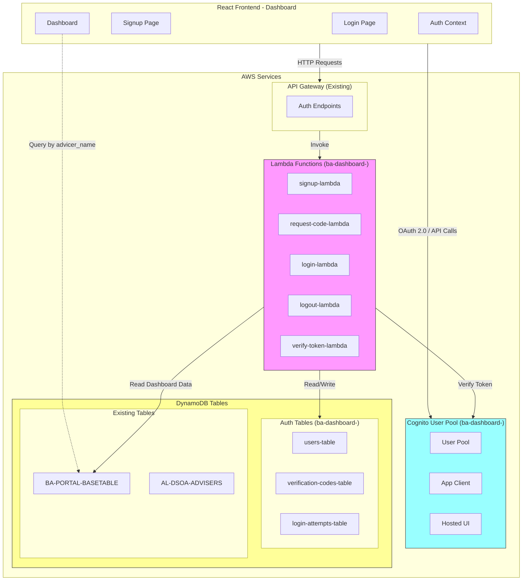
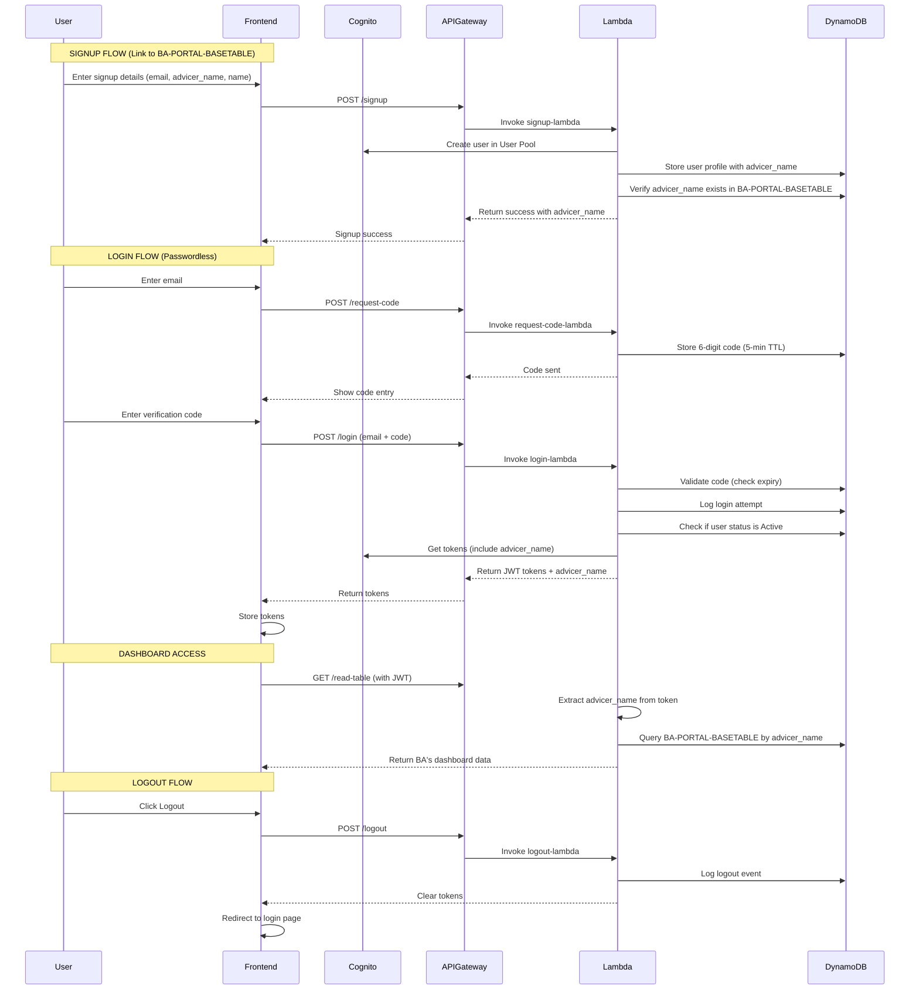
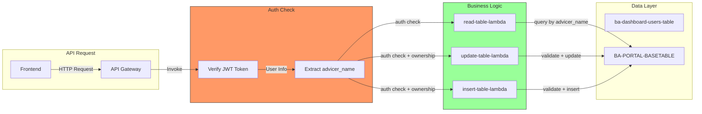

# BA Dashboard Login System - Architecture Plan (Refactored)

## Clarified Requirements (March 2026)

- **Authentication Type**: Passwordless login (no password required)
- **Login Code Expiry**: 5 minutes for verification code
- **Cognito User Pool**: NEW pool with "ba-dashboard-" prefix, redeployable Python script
- **advicer_name**: This IS the unique ID for the Buyer Agent (BA) - links login to BA-PORTAL-BASETABLE
- **BA-PORTAL-BASETABLE**: Already exists and contains dashboard data - linked via advicer_name (NOT duplicated)
- **User Status**: Active by default, with manual status field for activation/blocking
- **No Admin Features**: No block/unblock user functionality, no admin user list

---

## 1. System Overview

This document outlines the architecture for a secure, serverless login system integrated with AWS Cognito, API Gateway, Lambda, and DynamoDB. The system provides signup, login, and logout functionality with JWT token authentication.

**Key Understanding**: BA-PORTAL-BASETABLE already exists and contains the dashboard data for each Buyer Agent. Each BA is uniquely identified by `advicer_name`. The login system links to this table via `advicer_name` - NOT by duplicating records.

### Key Requirements Summary:
- **Prefix**: All resources use "ba-dashboard-" prefix
- **Authentication**: AWS Cognito with JWT tokens
- **Storage**: DynamoDB for login details and attempt logging
- **Dashboard Data**: BA-PORTAL-BASETABLE (already exists) - linked via advicer_name
- **API**: Existing API Gateway integration
- **Token Expiry**: 5 minutes for login codes
- **User Status**: Active by default, manually toggleable status field
- **Linkage**: advicer_name is the key that links login users to their dashboard data in BA-PORTAL-BASETABLE

---

## 2. Architecture Diagram



---

## 3. Authentication Flow



---

## 4. DynamoDB Table Schemas

### 4.1 BA-PORTAL-BASETABLE (EXISTING - Already Contains Dashboard Data)

**This table already exists and should NOT be duplicated. It is linked via advicer_name.**

| Attribute | Type | Key | Description |
|-----------|------|-----|-------------|
| id | String | PK | Unique record ID |
| advicer_name | String | - | **Buyer Agent unique ID - the link to login** |
| status | String | - | active/inactive |
| creation_date | String | - | ISO timestamp |
| last_updated_date | String | - | ISO timestamp |
| investment_years | Number | - | Number of investment years |
| cpi_rate | Number | - | CPI rate |
| borrowing_power_multiplier_base | Number | - | Base borrowing multiplier |
| borrowing_power_multiplier_min | Number | - | Minimum borrowing multiplier |
| medicare_levy_rate | Number | - | Medicare levy rate |
| investors | List | - | List of investors with details |
| properties | List | - | List of properties |
| chart1 | List | - | Yearly projections (25 years) |

### 4.2 ba-dashboard-users-table

Stores user profiles with their unique advicer_name that links to BA-PORTAL-BASETABLE.

| Attribute | Type | Key | Description |
|-----------|------|-----|-------------|
| user_id | String | PK | Cognito sub (UUID) |
| email | String | GSI1 | User email (indexed) |
| advicer_name | String | GSI2 | **Buyer Agent unique ID - links to BA-PORTAL-BASETABLE** |
| cognito_username | String | - | Cognito username |
| name | String | - | Full name |
| created_at | String | - | ISO timestamp |
| updated_at | String | - | ISO timestamp |
| last_login | String | - | ISO timestamp |
| status | String | - | **Active** or **Blocked** (manually toggleable) |

### 4.3 ba-dashboard-verification-codes-table

Stores verification codes with 5-minute TTL.

| Attribute | Type | Key | Description |
|-----------|------|-----|-------------|
| email | String | PK | User email |
| code | String | - | 6-digit verification code |
| created_at | String | - | ISO timestamp |
| expires_at | Number | - | Unix timestamp (5 min TTL) |
| attempts | Number | - | Failed attempts |
| is_used | Boolean | - | Code used flag |

### 4.4 ba-dashboard-login-attempts-table

Logs all login attempts for security and auditing.

| Attribute | Type | Key | Description |
|-----------|------|-----|-------------|
| attempt_id | String | PK | UUID for the attempt |
| user_id | String | GSI1 | User ID if exists |
| email | String | GSI2 | Email used (indexed) |
| ip_address | String | - | Client IP |
| user_agent | String | - | Browser/client info |
| status | String | - | success/failed/inactive |
| failure_reason | String | - | Reason for failure |
| timestamp | String | - | ISO timestamp |
| token_issued | Boolean | - | Whether token was issued |

---

## 5. Lambda Functions Specification

All Lambda functions use the prefix "ba-dashboard-" and are designed to be generic.

### 5.1 ba-dashboard-signup-lambda

**Purpose**: Register a new user (passwordless - no password required) + link to BA-PORTAL-BASETABLE via advicer_name

**Input**:
```json
{
  "email": "user@example.com",
  "advicer_name": "ADVISOR001",
  "name": "John Doe"
}
```

**Output**:
```json
{
  "statusCode": 201,
  "body": {
    "user_id": "uuid",
    "email": "user@example.com",
    "advicer_name": "ADVISOR001",
    "message": "User registered successfully. Please check email for verification code."
  }
}
```

**Features**:
- Creates user in Cognito User Pool
- Stores user profile in DynamoDB with status = "Active"
- **Verifies advicer_name exists in BA-PORTAL-BASETABLE** (links, does NOT duplicate)
- Returns advicer_name in response for dashboard access

**Environment Variables**:
- COGNITO_USER_POOL_ID
- COGNITO_CLIENT_ID
- REGION
- DYNAMODB_USERS_TABLE
- BA_PORTAL_BASE_TABLE

### 5.2 ba-dashboard-login-lambda

**Purpose**: Authenticate user via passwordless login (email + verification code)

**Input**:
```json
{
  "email": "user@example.com",
  "verification_code": "123456"
}
```

**Output**:
```json
{
  "statusCode": 200,
  "body": {
    "access_token": "eyJ...",
    "id_token": "eyJ...",
    "refresh_token": "eyJ...",
    "expires_in": 3600,
    "user_id": "uuid",
    "advicer_name": "ADVISOR001"
  }
}
```

**Features**:
- Validates verification code against stored code in DynamoDB
- Checks if user status is "Active" (not "Blocked")
- Logs attempt to DynamoDB
- Generates JWT tokens after verification
- Updates user's last_login timestamp
- **Includes advicer_name in token for dashboard access**

**Environment Variables**:
- COGNITO_USER_POOL_ID
- COGNITO_CLIENT_ID
- REGION
- DYNAMODB_USERS_TABLE
- DYNAMODB_LOGIN_ATTEMPTS_TABLE
- JWT_SECRET_KEY
- VERIFICATION_CODE_EXPIRY_SECONDS=300

### 5.3 ba-dashboard-request-code-lambda

**Purpose**: Request a new verification code (passwordless flow)

**Input**:
```json
{
  "email": "user@example.com"
}
```

**Output**:
```json
{
  "statusCode": 200,
  "body": {
    "message": "Verification code sent. Code expires in 5 minutes."
  }
}
```

**Features**:
- Generates 6-digit verification code
- Stores code in DynamoDB with 5-min TTL
- Logs the request

### 5.4 ba-dashboard-logout-lambda

**Purpose**: Handle user logout

**Input**:
```json
{
  "user_id": "uuid",
  "refresh_token": "token"
}
```

**Output**:
```json
{
  "statusCode": 200,
  "body": {
    "message": "Logged out successfully"
  }
}
```

### 5.5 ba-dashboard-verify-token-lambda

**Purpose**: Verify JWT token and return user info

**Input**:
```json
{
  "headers": {
    "Authorization": "Bearer token"
  }
}
```

**Output**:
```json
{
  "statusCode": 200,
  "body": {
    "user_id": "uuid",
    "email": "user@example.com",
    "advicer_name": "ADVISOR001",
    "status": "Active",
    "is_valid": true
  }
}
```

---

## 6. API Gateway Endpoints

All endpoints added to the existing API Gateway.

### 6.1 Endpoints Configuration (Passwordless Login)

| Method | Path | Lambda | Auth | Description |
|--------|------|--------|------|-------------|
| POST | /auth/signup | ba-dashboard-signup-lambda | NONE | User registration + link to BA-PORTAL-BASETABLE |
| POST | /auth/request-code | ba-dashboard-request-code-lambda | NONE | Request 5-min verification code |
| POST | /auth/login | ba-dashboard-login-lambda | NONE | Login with email + verification code |
| POST | /auth/logout | ba-dashboard-logout-lambda | COGNITO | User logout |
| POST | /auth/verify-token | ba-dashboard-verify-token-lambda | NONE | Verify JWT |

---

## 7. JWT Token Configuration

### Passwordless Login Flow (5-minute code expiry)

1. User enters email → `/auth/request-code` → 6-digit code generated, stored in DynamoDB with 5-min TTL
2. User enters code → `/auth/login` → Code validated, JWT tokens issued
3. Tokens used for subsequent API calls

### Verification Code (stored in DynamoDB)
```json
{
  "email": "user@example.com",
  "code": "123456",
  "created_at": "2026-03-08T04:30:00Z",
  "expires_at": "2026-03-08T04:35:00Z",
  "attempts": 0
}
```

### Standard Access Token (from Cognito)
- Expiry: 1 hour (from Cognito)
- Contains: user claims, groups, **advicer_name** (for dashboard access)

---

## 8. Linkage Logic (NOT Duplication)

**Key Change**: The login system LINKS to BA-PORTAL-BASETABLE via advicer_name, NOT by duplicating records.

### How Linkage Works:

1. **Signup**: User provides their advicer_name (must exist in BA-PORTAL-BASETABLE)
2. **Verification**: Signup Lambda verifies advicer_name exists in BA-PORTAL-BASETABLE
3. **Storage**: User profile stored in ba-dashboard-users-table with advicer_name
4. **Login**: JWT token includes advicer_name
5. **Dashboard Access**: All dashboard queries use advicer_name from token to fetch data from BA-PORTAL-BASETABLE

### Implementation:
```python
def handle_new_registration(email, advicer_name, name):
    # Check if user already exists
    existing_user = get_user_by_email(email)
    if existing_user:
        return {"error": "User already exists"}
    
    # Verify advicer_name exists in BA-PORTAL-BASETABLE
    ba_record = get_item_from_dynamodb(
        table_name='BA-PORTAL-BASETABLE',
        key={'advicer_name': advicer_name}
    )
    if not ba_record:
        return {"error": "Invalid advicer_name - not found in BA-PORTAL-BASETABLE"}
    
    # Create user in Cognito
    cognito_user = create_cognito_user(email, name)
    
    # Store user in users-table with Active status and advicer_name
    user_id = cognito_user['UserSub']
    user_item = {
        'user_id': user_id,
        'email': email,
        'advicer_name': advicer_name,  # Links to BA-PORTAL-BASETABLE
        'name': name,
        'status': 'Active',
        'created_at': datetime.utcnow().isoformat(),
        'cognito_username': cognito_user['UserUsername']
    }
    put_item_to_dynamodb(
        table_name='ba-dashboard-users-table',
        item=user_item
    )
    
    return {"user_id": user_id, "advicer_name": advicer_name, "status": "Active"}
```

---

## 9. Manual User Status Management

The `status` field in `ba-dashboard-users-table` allows manual toggling between Active and Blocked states.

### Status Field Values:
- **Active**: User can login and access the system
- **Blocked**: User cannot login (status check during login)

### How to Toggle Status:
Users can be manually blocked/activated via:
1. Direct DynamoDB update (console or CLI)
2. Future admin panel (out of scope for now)

### Login Flow Status Check:
```python
def check_user_status(user_id):
    user = get_user_from_dynamodb(user_id)
    if user.get('status') == 'Blocked':
        return {
            'allowed': False,
            'reason': 'User account is blocked. Please contact support.'
        }
    return {'allowed': True}
```

---

## 10. Frontend Integration

### 10.1 Updated Auth Context Flow

```typescript
interface AuthState {
  isAuthenticated: boolean;
  user: UserProfile | null;
  tokens: Tokens | null;
  isLoading: boolean;
}

interface UserProfile {
  userId: string;
  email: string;
  name: string;
  advicerName: string;  // Links to BA-PORTAL-BASETABLE
  status: 'Active' | 'Blocked';
  groups: string[];
}
```

### 10.2 API Service Updates

```typescript
// Updated auth API calls (no admin functions)
authAPI.signup(data: SignupData): Promise<AuthResponse>
authAPI.login(credentials: LoginCredentials): Promise<LoginResponse>
authAPI.logout(): Promise<void>
authAPI.verifyToken(token: string): Promise<VerifyResponse>

interface SignupData {
  email: string;
  advicer_name: string;  // Must exist in BA-PORTAL-BASETABLE
  name: string;
}
```

### 10.3 Dashboard Data Access

```typescript
// When accessing dashboard data, use advicer_name from user profile
const getDashboardData = async (advicerName: string) => {
  const response = await api.get(`/read-table`, {
    params: { advicer_name: advicerName }
  });
  return response.data;
};
```

---

## 11. Security Considerations

1. **Password Requirements**: N/A (passwordless)
2. **Rate Limiting**: Implement at API Gateway level (see Section 11.1)
3. **Token Storage**: Use httpOnly cookies for JWT, not localStorage
4. **HTTPS Only**: All traffic must be over HTTPS in production
5. **CORS**: Configure specific origins, not "*"
6. **Input Validation**: Validate all inputs in Lambda functions
7. **Logging**: All authentication events logged to CloudWatch
8. **advicer_name Validation**: Verify advicer_name exists in BA-PORTAL-BASETABLE before allowing registration

### 11.1 API Gateway Rate Limiting (Endpoint-Specific)

| Endpoint | Method | Rate Limit | Burst Limit | Description |
|----------|--------|------------|-------------|-------------|
| /auth/request-code | POST | 5 requests/min | 10 | Prevent code spam |
| /auth/login | POST | 10 requests/min | 20 | Prevent brute force |
| /auth/signup | POST | 5 requests/min | 10 | Prevent account enumeration |
| /auth/logout | POST | 60 requests/min | 100 | Normal usage |
| /auth/verify-token | POST | 60 requests/min | 100 | Normal usage |
| /update-table | POST | 60 requests/min | 100 | Data operations |
| /read-table | POST | 120 requests/min | 200 | Dashboard reads |

---

## 12. Implementation Order

1. **Create Cognito User Pool** (Python script with "ba-dashboard-" prefix)
   - Script: `app/ba-portal/IaC/cognito_setup.py`
   - Should be redeployable (idempotent)
2. **Create DynamoDB Tables** (Python script)
   - Script: `app/ba-portal/IaC/create_auth_tables.py`
   - Tables: users, verification-codes, login-attempts (no blocked-users)
3. **Deploy Lambda Functions** (5 functions with "ba-dashboard-" prefix)
   - signup-lambda (with linkage logic - NOT duplication)
   - request-code-lambda
   - login-lambda
   - logout-lambda
   - verify-token-lambda
4. **Configure API Gateway Endpoints**
   - Update `app/ba-portal/IaC/api-config.json`
5. **Update Frontend Authentication Code**
6. **Test End-to-End Flow**

---

## 13. Files to Create/Modify

### New Files - IaC Setup
- `app/ba-portal/IaC/cognito_setup.py` - Create/recreate Cognito User Pool with "ba-dashboard-" prefix (redeployable)
- `app/ba-portal/IaC/create_auth_tables.py` - Create all DynamoDB tables with "ba-dashboard-" prefix (users, verification-codes, login-attempts)

### New Files - Lambda Functions (prefix: ba-dashboard-)
- `app/ba-portal/lambda/auth_signup/signup.py` - User registration + link to BA-PORTAL-BASETABLE (verify advicer_name)
- `app/ba-portal/lambda/auth_request_code/request_code.py` - Generate 5-min verification code
- `app/ba-portal/lambda/auth_login/login.py` - Login with verification code + status check
- `app/ba-portal/lambda/auth_logout/logout.py` - User logout
- `app/ba-portal/lambda/auth_verify_token/verify_token.py` - Verify JWT token

### New Files - Lambda Deployment
- `app/ba-portal/lambda/auth_signup/deploy.config` - Lambda configuration
- `app/ba-portal/lambda/auth_signup/requirements.txt` - Python dependencies

### Modify Existing Files
- `app/ba-portal/dashboard-frontend/src/contexts/AuthContext.tsx` - Update for passwordless login
- `app/ba-portal/dashboard-frontend/src/services/authService.ts` - Add signup methods
- `app/ba-portal/dashboard-frontend/src/config/cognitoConfig.ts` - Update for new Cognito pool
- `app/ba-portal/IaC/api-config.json` - Add auth endpoints to existing API Gateway
- `app/ba-portal/lambda/read_table/read_table.py` - Add advicer_name query support
- `app/ba-portal/lambda/update_table/update_table.py` - Add advicer_name ownership check

### Files NO LONGER NEEDED (Removed)
- ~~Duplicate logic for BA-PORTAL-BASETABLE~~ - REMOVED (now uses linkage)
- ~~Record duplication code in signup-lambda~~ - REMOVED

---

## 14. Configuration Summary

| Resource | Prefix | Example Name |
|----------|--------|--------------|
| Lambda Functions | ba-dashboard- | ba-dashboard-login-lambda |
| DynamoDB Tables (Auth) | ba-dashboard- | ba-dashboard-users-table |
| DynamoDB Tables (Data) | Existing | BA-PORTAL-BASETABLE |
| Cognito User Pool | ba-dashboard- | ba-dashboard-user-pool |
| Cognito App Client | ba-dashboard- | ba-dashboard-spa-client |

---

## 15. Key Differences: Old vs New

| Aspect | Old (Duplication) | New (Linkage) |
|--------|-------------------|---------------|
| Signup | Duplicates entire BA-PORTAL-BASETABLE record | Verifies advicer_name exists in BA-PORTAL-BASETABLE |
| Data Storage | Multiple copies of BA data | Single source of truth in BA-PORTAL-BASETABLE |
| Updates | Complex - update all copies | Simple - update one record |
| Integrity | Risk of data drift | Strong integrity via advicer_name |
| User ID | Uses UUID | Uses advicer_name from BA-PORTAL-BASETABLE |

---

## 16. Integration with Existing Lambda Functions

### 16.1 New Requirement: Read-Only Before Login, Edit After Login

The ba-dashboard should work as follows:
- **Before Login**: Dashboard is READ-ONLY (can view data)
- **After Login**: User can EDIT their own data only (by advicer_name)

### 16.2 Existing Lambdas to Update

| Lambda Function | Current Behavior | Required Changes |
|----------------|------------------|------------------|
| ba-portal-update-table-lambda | Updates any data | Check auth + ownership by advicer_name |
| ba-portal-insert-table-lambda | Inserts any data | Check auth + ownership by advicer_name |
| ba-portal-read-table-lambda | Reads any data | Already works (read is allowed) |

### 16.3 Authorization Logic

```python
def authorize_edit(event, user_info):
    # Check if user is authenticated
    if not user_info or not user_info.get('is_authenticated'):
        return {
            'authorized': False,
            'reason': 'User not authenticated'
        }
    
    # Get user's advicer_name from token
    user_advicer_name = user_info.get('advicer_name')
    
    # Get the data being edited
    target_advicer_name = event.get('body', {}).get('advicer_name')
    
    # Check ownership - user can only edit their own data
    if user_advicer_name != target_advicer_name:
        return {
            'authorized': False,
            'reason': 'User can only edit their own data'
        }
    
    return {'authorized': True}
```

### 16.4 Lambda Integration Flow



### 16.5 Implementation Approach

1. **Create a Generic Auth Decorator/Library**:
   - Python module that can be imported into existing Lambdas
   - Validates JWT token from Authorization header
   - Extracts user info (user_id, email, advicer_name)
   
2. **Update Existing Lambdas**:
   - Add auth check at the beginning of handler
   - For write operations: verify ownership by comparing advicer_name
   
3. **Environment Variables for Existing Lambdas**:
   - COGNITO_USER_POOL_ID
   - JWT_SECRET_KEY (for custom token verification)

---

This plan provides a comprehensive architecture for the simplified login system with proper linkage to BA-PORTAL-BASETABLE via advicer_name. Once approved, proceed with implementation in Code mode.
