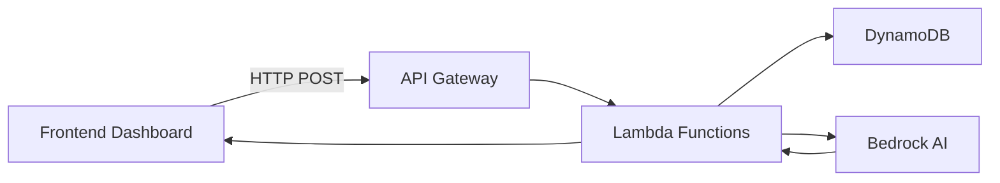

# BA Portal - Business Analytics Dashboard

A comprehensive financial analytics platform for property investment advisors, built with React, TypeScript, and AWS serverless architecture. The platform enables financial advisors to analyze investment portfolios, calculate borrowing capacities, and generate property recommendations using AI.

## Table of Contents

- [Generate AI Recommendations](#generate-ai-recommendations)
- [Purpose](#purpose)
- [Architecture](#architecture)
- [Features](#features)
- [Technology Stack](#technology-stack)
- [Project Structure](#project-structure)
- [Getting Started](#getting-started)
- [Configuration](#configuration)
- [API Reference](#api-reference)
- [Authentication](#authentication)
- [Deployment](#deployment)
- [Development](#development)
- [Troubleshooting](#troubleshooting)

---

## Generate AI Recommendations

The **Generate AI Recommendations** feature allows users to analyze their Property Portfolio and receive AI-powered insights on bottlenecks, optimization opportunities, and strategies to maximize portfolio performance using the **optimize** property action.

This feature **replaces the existing "Executive Summary of the Portfolio"** section in the main dashboard's ChartSection component.

### How It Works

1. **Click the Button** - Users click the "Generate AI Recommendations" button on the dashboard (in the Executive Summary card)
2. **Connect to BA Agent** - The button triggers a call to the [`ba_agent`](app/ba-portal/lambda/ba_agent/main.py) Lambda function with `property_action: "optimize"`
3. **Portfolio Analysis** - The system analyzes the current portfolio's Chart1 financial data including:
   - Debt-to-Income (DTI) ratio
   - Borrowing capacity
   - Accessible equity
   - Property cashflow
   - Loan-to-Value Ratio (LVR)
4. **AI Processing** - AWS Bedrock (Claude) processes the data and generates recommendations
5. **Recommendations Displayed** - Results are shown to the user with actionable insights

### Implementation Steps

Building the "Generate AI Recommendations" feature requires modifying the **ChartSection.tsx** component in the main dashboard (NOT the RightSidebar).

#### Step 1: Add API Function in dashboardService.ts

Add a new function to call the `/ba-agent` endpoint with the "optimize" action.

**File:** [`dashboardService.ts`](app/ba-portal/dashboard-frontend/src/services/dashboardService.ts)

```typescript
export async function generateAiRecommendations(
  portfolioId: string,
  tableName: string = "BA-PORTAL-BASETABLE",
  region: string = "ap-southeast-2"
): Promise<any> {
  const apiUrl = import.meta.env.VITE_API_URL;
  
  const response = await axios.post(`${apiUrl}/ba-agent`, {
    table_name: tableName,
    id: portfolioId,
    property_action: "optimize",
    region: region
  });
  
  return response.data;
}
```

#### Step 2: Modify ChartSection.tsx - Replace Executive Summary Button

The button should replace the existing "Generate Summary" button in the Executive Summary card.

**File:** [`ChartSection.tsx`](app/ba-portal/dashboard-frontend/src/components/ChartSection.tsx:546)

**Current location (lines 546-563):**
```tsx
{/* Executive Summary Card */}
<div className="rounded-xl p-6 border shadow-lg" style={{ backgroundColor: cardBg, borderColor: cardBorder }}>
  <div className="flex justify-between items-center mb-4">
    <h2 className="text-xl font-bold" style={{ color: cardText }}>Executive Summary of the Portfolio</h2>
    <button
      onClick={generateSummary}
      className="px-4 py-2 rounded-lg font-medium transition-colors"
      style={{ backgroundColor: '#06b6d4', color: 'white' }}
    >
      Generate Summary
    </button>
  </div>
  {executiveSummary && (
    <div style={{ color: cardTextSecondary, whiteSpace: 'pre-line' }}>
      {executiveSummary}
    </div>
  )}
</div>
```

**Replace with:**
```tsx
// Add state for AI recommendations
const [aiRecommendations, setAiRecommendations] = useState<any>(null);
const [isGeneratingAI, setIsGeneratingAI] = useState(false);

// Add handler function
const generateAIRecommendations = async () => {
  setIsGeneratingAI(true);
  try {
    const result = await generateAiRecommendations(id);
    setAiRecommendations(result.analysis);
  } catch (error) {
    console.error("Failed to generate AI recommendations:", error);
  } finally {
    setIsGeneratingAI(false);
  }
};

// Replace the button in the Executive Summary card
<button
  onClick={generateAIRecommendations}
  disabled={isGeneratingAI}
  className="px-4 py-2 rounded-lg font-medium transition-colors"
  style={{ backgroundColor: '#8b5cf6', color: 'white' }}
>
  {isGeneratingAI ? 'Generating...' : 'Generate AI Recommendations'}
</button>
```

#### Step 3: Add Recommendations Display Section

Add a section to display the AI-generated recommendations in the same card.

**File:** [`ChartSection.tsx`](app/ba-portal/dashboard-frontend/src/components/ChartSection.tsx)

```tsx
{aiRecommendations && (
  <div className="mt-4 space-y-3">
    <div>
      <h4 className="text-sm font-semibold" style={{ color: cardText }}>Bottlenecks</h4>
      <p className="text-sm" style={{ color: cardTextSecondary }}>{aiRecommendations.bottlenecks}</p>
    </div>
    <div>
      <h4 className="text-sm font-semibold" style={{ color: cardText }}>Recommendations</h4>
      <ul className="list-disc list-inside text-sm" style={{ color: cardTextSecondary }}>
        {aiRecommendations.recommendations?.map((rec: string, i: number) => (
          <li key={i}>{rec}</li>
        ))}
      </ul>
    </div>
    <div>
      <h4 className="text-sm font-semibold" style={{ color: cardText }}>Optimal Timing</h4>
      <p className="text-sm" style={{ color: cardTextSecondary }}>{aiRecommendations.optimal_timing}</p>
    </div>
    <div>
      <h4 className="text-sm font-semibold" style={{ color: cardText }}>Max Purchase Price</h4>
      <p className="text-sm" style={{ color: cardTextSecondary }}>{aiRecommendations.max_purchase_price}</p>
    </div>
  </div>
)}
```

#### Step 4: BA Agent Lambda (Already Implemented)

The backend Lambda function is already implemented. It handles the "optimize" action:

**File:** [`ba_agent/main.py`](app/ba-portal/lambda/ba_agent/main.py)

- [`build_property_prompt()`](app/ba-portal/lambda/ba_agent/main.py:293) - Creates AI prompt with action="optimize"
- [`extract_metrics_from_chart1()`](app/ba-portal/lambda/ba_agent/main.py:96) - Extracts portfolio metrics
- [`invoke_bedrock()`](app/ba-portal/lambda/ba_agent/lib/bedrock_client.py:30) - Calls AWS Bedrock

#### Step 5: API Endpoint (Already Configured)

The `/ba-agent` endpoint is already configured in API Gateway.

**File:** [`IaC/api-config.json`](app/ba-portal/IaC/api-config.json)

No changes needed - the endpoint accepts `property_action: "optimize"`.

### Implementation Checklist

| Step | Component | Status |
|------|-----------|--------|
| 1 | Add `generateAiRecommendations()` to dashboardService.ts | ⬜ Not Started |
| 2 | Replace "Generate Summary" button in ChartSection.tsx | ⬜ Not Started |
| 3 | Add recommendations display section in ChartSection.tsx | ⬜ Not Started |
| 4 | BA Agent Lambda (optimize action) | ✅ Already Implemented |
| 5 | API Gateway endpoint | ✅ Already Configured |

### Frontend Dashboard Layout

```
┌─────────────────────────────────────────────────────────────────────────────┐
│  HEADER                                                                        │
├────────────┬─────────────────────────────────────────────────┬───────────────┤
│  LEFT      │  MAIN CONTENT AREA (ChartSection.tsx)         │  RIGHT        │
│  SIDEBAR   │                                                 │  SIDEBAR      │
│            │  ┌─────────────────────────────────────────────┐ │               │
│            │  │         EXECUTIVE SUMMARY CARD             │ │               │
│            │  │  - Title: Executive Summary of Portfolio  │ │               │
│            │  │  - Button: Generate AI Recommendations    │ │               │
│            │  │  - AI Recommendations Display             │ │               │
│            │  └─────────────────────────────────────────────┘ │               │
│            │                                                 │               │
│            │  ┌─────────────────────────────────────────────┐ │               │
│            │  │           30-Year Financial Projection     │ │               │
│            │  └─────────────────────────────────────────────┘ │               │
└────────────┴─────────────────────────────────────────────────┴───────────────┘
```

### BA Agent Integration

The "Generate AI Recommendations" button calls the [`ba_agent`](app/ba-portal/lambda/ba_agent/main.py) Lambda with the **`optimize`** property action:

| Property Action | Function Called | Purpose |
|-----------------|-----------------|---------|
| **`optimize`** | [`build_property_prompt()`](app/ba-portal/lambda/ba_agent/main.py:293) with action="optimize" | Analyzes EXISTING properties for bottlenecks and optimization opportunities |

#### Request Payload

```json
{
  "table_name": "BA-PORTAL-BASETABLE",
  "id": "B57153AB-B66E-4085-A4C1-929EC158FC3E",
  "property_action": "optimize"
}
```

#### Response

```json
{
  "status": "success",
  "action": "optimize",
  "analysis": {
    "bottlenecks": "High DTI ratio of 45% limits borrowing capacity",
    "recommendations": [
      "Consider paying down debt to reduce DTI below 30%",
      "Accessible equity of $150,000 available for next purchase",
      "Property cashflow is negative, consider increasing rent"
    ],
    "optimal_timing": "Year 3 - when DTI drops below 30%",
    "max_purchase_price": "$600,000 based on accessible equity"
  }
}
```

### What It Analyzes

The AI recommendations analyze your portfolio to identify:

| Metric | Description |
|--------|-------------|
| **Bottlenecks** | Areas limiting portfolio growth (high DTI, low equity, negative cashflow) |
| **Borrowing Capacity** | How much additional debt the portfolio can sustain |
| **LVR Analysis** | Loan-to-Value ratios and LMI implications |
| **Cashflow Health** | Rental income vs expenses and surplus projections |
| **Equity Position** | Total and accessible equity for future purchases |
| **Optimization Opportunities** | Adjustments to align with market benchmarks |

### Recommended Actions

Based on the analysis, the BA Agent provides recommendations for:

1. **Property Acquisition** - When and what property to buy next based on financial capacity
2. **Portfolio Optimization** - Adjust rent, expenses, and interest rates to align with market benchmarks:
   - Rent should be 4-6% of property value annually
   - Expenses should be 1-2% of property value annually
   - Growth rates should align with historical averages (3-7%)
   - Interest rates should reflect current market (5-7%)
3. **Sell/Hold Strategy** - Recommendations on existing properties
4. **Timing Decisions** - Best time to make moves based on financial projections

### API Integration

The "Generate AI Recommendations" feature uses the `/ba-agent` endpoint with the **`optimize`** action:

| Action | Description |
|--------|-------------|
| `optimize` | Analyze and optimize existing properties with market benchmarks - identifies bottlenecks, provides recommendations to maximize portfolio performance |

#### Example Request

```json
{
  "table_name": "BA-PORTAL-BASETABLE",
  "id": "B57153AB-B66E-4085-A4C1-929EC158FC3E",
  "property_action": "optimize"
}
```

#### Example Response

```json
{
  "status": "success",
  "action": "optimize",
  "analysis": {
    "bottlenecks": "High DTI ratio of 45% limits borrowing capacity",
    "recommendations": [
      "Consider paying down debt to reduce DTI below 30%",
      "Accessible equity of $150,000 available for next purchase",
      "Property cashflow is negative, consider increasing rent"
    ],
    "optimal_timing": "Year 3 - when DTI drops below 30%",
    "max_purchase_price": "$600,000 based on accessible equity"
  }
}
```

### Frontend Integration

The "Generate AI Recommendations" button is integrated into the dashboard interface. When clicked, it:

1. Shows a loading state while processing
2. Calls the BA Agent API endpoint
3. Displays the AI-generated recommendations in a user-friendly format
4. Allows users to apply recommendations directly to their portfolio

---

## Purpose

The BA Portal is designed for **Buyer Agents** (property investment advisors) to:

1. **Manage Client Portfolios** - Track multiple investors and their property investments
2. **Analyze Financial Capacity** - Calculate borrowing power, DTI ratios, and accessible equity
3. **Visualize Projections** - Display 30-year financial forecasts with interactive charts
4. **AI-Powered Recommendations** - Generate property acquisition suggestions using AWS Bedrock
5. **Configure Parameters** - Adjust financial assumptions like CPI rates, borrowing multipliers

The platform uses a serverless AWS backend with DynamoDB for data storage and Lambda functions for business logic, while the frontend provides an intuitive dashboard interface.

---

## Frontend Wireframe

```
┌──────────────────────────────────────────────────────────────────────────────────────────────────────┐
│  HEADER (Fixed Top)                                                                                    │
│  ┌──────────────────────────────────────────────────────────────────────────────────────────────────┐  │
│  │ [Logo] Dashboard                    [User Menu ▼] [Settings] [Config] [☀/🌙]                │  │
│  │        Financial Analytics Platform                                                              │  │
│  └──────────────────────────────────────────────────────────────────────────────────────────────────┘  │
├────────────┬─────────────────────────────────────────────────────────────┬───────────────────────────┤
│ LEFT       │  MAIN CONTENT AREA                                         │ RIGHT SIDEBAR             │
│ SIDEBAR    │                                                             │ (Properties Panel)        │
│            │  ┌─────────────────────────────────────────────────────────┐ │                           │
│ ▼ Dashboard│  │                    CHART SECTION                         │ │ ┌───────────────────────┐ │
│   Overview │  │                                                         │ │ │ Properties    [►]      │ │
│            │  │     ┌───────────────────────────────────────────────┐    │ │ ├───────────────────────┤ │
│ ▼ Analytics│  │     │                                               │    │ │ │ [+ Add Property]      │ │
│   Reports  │  │     │           30-Year Financial Projection       │    │ │ │                       │ │
│            │  │     │              (Interactive Chart)             │    │ │ │ ┌───────────────────┐ │ │
│ ▼ Settings │  │     │                                               │    │ │ │ │ Property A         │ │ │
│            │  │     │   DTI   Borrowing   Equity   Cashflow        │    │ │ │ │ $1,200,000         │ │ │
│ ▼ Users    │  │     │   Line   Bar       Area      Line            │    │ │ │ │ Purchase Year: 1   │ │ │
│            │  │     │                                               │    │ │ │ │ Loan: $600,000     │ │ │
│            │  │     └───────────────────────────────────────────────┘    │ │ │ │ Rent: $30,000/yr   │ │ │
│            │  │                                                         │    │ │ │                     │ │ │
│            │  └─────────────────────────────────────────────────────────┘    │ │ │ │ Investor Splits ▼   │ │ │
│            │                                                             │    │ │ │   Bob: 50%         │ │ │
│            │  ┌─────────────────────────────────────────────────────────┐    │ │ │   Alice: 50%        │ │ │
│            │  │              INVESTORS SECTION                        │    │ │ └───────────────────┘ │ │
│            │  │                                                         │    │ │                       │ │
│            │  │  ┌──────────────┐  ┌──────────────┐  ┌──────────────┐ │    │ │ ┌───────────────────┐ │ │
│            │  │  │   BOB         │  │   ALICE      │  │    + Add    │ │    │ │ │ [+ Add Property]  │ │ │
│            │  │  │  $120,000/yr  │  │  $100,000/yr │  │   Investor   │ │    │ │ └───────────────────┘ │ │
│            │  │  │  Borrowing:   │  │  Borrowing:   │  │              │ │    │ │                       │ │
│            │  │  │    $450,000   │  │    $375,000   │  │              │ │    │ │ [Update Data]        │ │
│            │  │  │  DTI: 28.5%   │  │  DTI: 32.0%   │  │              │ │    │ └───────────────────────┘ │
│            │  │  └──────────────┘  └──────────────┘  └──────────────┘ │    │                           │
│            │  └─────────────────────────────────────────────────────────┘    │                           │
├────────────┴─────────────────────────────────────────────────────────────┴───────────────────────────┤
│  FOOTER                                                                                               │
│  © 2024 BA Portal | Financial Analytics Platform | Version 1.0.0                                    │
└──────────────────────────────────────────────────────────────────────────────────────────────────────┘

Legend:
[Logo]       - Company logo/branding
[User Menu]  - User dropdown (profile, logout)
[Settings]   - Application settings
[Config]     - Configuration panel (CPI, borrowing multipliers)
[☀/🌙]      - Dark/Light mode toggle

LEFT SIDEBAR - Navigation menu
MAIN CONTENT - Chart visualization + Investors cards
RIGHT SIDEBAR - Properties panel with Add Property (AI) and Update buttons
```

---

## Architecture

### High-Level System Architecture

```
┌─────────────────────────────────────────────────────────────────────────────┐
│                           BA PORTAL SYSTEM                                  │
├─────────────────────────────────────────────────────────────────────────────┤
│                                                                             │
│  ┌──────────────────────┐      ┌──────────────────────────────────────┐   │
│  │   React Frontend     │      │         AWS Cloud Services            │   │
│  │   (Vite + TypeScript)│◄────►│                                       │   │
│  └──────────────────────┘      │  ┌─────────────────────────────────┐  │   │
│                                │  │      API Gateway                 │  │   │
│  ┌──────────────────────┐      │  │  (ba-portal-api-gateway)         │  │   │
│  │   Cognito            │      │  └────────────┬────────────────────┘  │   │
│  │   (Authentication)   │      │               │                       │   │
│  └──────────────────────┘      │  ┌────────────┴────────────────────┐  │   │
│                                │  │                                  │  │   │
│                                │  │  ┌──────────────┐ ┌───────────┐ │  │   │
│                                │  │  │ Update Table │ │ Read Table │ │  │   │
│                                │  │  │   Lambda     │ │  Lambda   │ │  │   │
│                                │  │  └──────────────┘ └───────────┘ │  │   │
│                                │  │                                  │  │   │
│                                │  │  ┌────────────────────────────┐ │  │   │
│                                │  │  │      BA Agent Lambda       │ │  │   │
│                                │  │  │  (AI Property Generation) │ │  │   │
│                                │  │  └────────────────────────────┘ │  │   │
│                                │  └──────────────────────────────────┘  │   │
│                                │               │                          │   │
│                                │  ┌────────────┴────────────────────┐    │   │
│                                │  │       DynamoDB                  │    │   │
│                                │  │  • BA-PORTAL-BASETABLE          │    │   │
│                                │  │  • ba-dashboard-users-table     │    │   │
│                                │  │  • ba-dashboard-verification-codes-table  │   │
│                                │  └─────────────────────────────────┘    │   │
│                                │                                           │   │
│                                │  ┌─────────────────────────────────┐    │   │
│                                │  │        Amazon Bedrock            │    │   │
│                                │  │  (Claude for AI Recommendations)│    │   │
│                                │  └─────────────────────────────────┘    │   │
│                                └──────────────────────────────────────────┘   │
│                                                                             │
└─────────────────────────────────────────────────────────────────────────────┘
```

### Data Flow



---

## Features

### Core Features

| Feature | Description |
|---------|-------------|
| **Dashboard Analytics** | Interactive charts showing 30-year financial projections |
| **Investor Management** | Add, edit, and manage multiple investors per portfolio |
| **Property Tracking** | Track property investments with purchase details, loans, and rental income |
| **Chart1 Calculations** | Automatic calculation of borrowing capacity, DTI, LVR, and cashflow projections |
| **AI Recommendations** | Generate property acquisition recommendations using AWS Bedrock |
| **Portfolio Optimization** | Optimize existing properties based on market benchmarks |
| **Configuration Parameters** | Adjust financial assumptions (CPI, borrowing multipliers, equity rates) |
| **Dark/Light Mode** | Toggle between dark and light themes |
| **Secure Authentication** | Passwordless login with email verification via AWS Cognito |

### API Endpoints

| Endpoint | Method | Description |
|----------|--------|-------------|
| `/update-table` | POST | Update DynamoDB items with automatic Chart1 calculation |
| `/read-table` | POST | Read active portfolio data including Chart1, investors, properties |
| `/ba-agent` | POST | AI-powered property recommendations via Bedrock |

### Adding Properties

The Right Sidebar panel in the dashboard provides an **"Add Property"** button that uses the BA Agent endpoint to generate AI-powered property recommendations.

#### How It Works

1. **Click "Add Property"** - The button triggers a call to the BA Agent Lambda
2. **AI Analysis** - The system reads the current portfolio's Chart1 data (DTI, borrowing capacity, accessible equity)
3. **Bedrock Processing** - AWS Bedrock (Claude) analyzes financial metrics and generates optimal property attributes
4. **Recommendation Returned** - The AI returns a recommended property with:
   - Optimal purchase year based on financial capacity
   - Loan amount within sustainable DTI limits
   - Property value within borrowing power + equity
   - Rental income estimates for positive cashflow
   - Appropriate LVR to avoid LMI
5. **User Review** - The recommended property is displayed for user approval
6. **Save to Portfolio** - User can modify and save the property to their portfolio

#### Property Fields

| Field | Description |
|-------|-------------|
| Name | Property identifier (e.g., "Property A") |
| Purchase Year | Year to acquire the property (1-30) |
| Initial Value | Starting property value |
| Loan Amount | Initial loan principal |
| Interest Rate | Annual interest rate (decimal, e.g., 0.06 for 6%) |
| Annual Rent | Rental income per year |
| Growth Rate | Annual appreciation rate (decimal) |
| Other Expenses | Annual expenses excluding interest |
| Annual Principal Change | Annual loan repayment amount |
| Investor Splits | Ownership percentages per investor |

---

## Technology Stack

### Frontend

| Technology | Version | Purpose |
|------------|---------|---------|
| [React](https://react.dev/) | 19.2.0 | UI framework |
| [TypeScript](https://www.typescriptlang.org/) | 5.9.x | Type-safe JavaScript |
| [Vite](https://vitejs.dev/) | 7.2.4 | Build tool and dev server |
| [Tailwind CSS](https://tailwindcss.com/) | 4.1.x | Utility-first CSS framework |
| [Recharts](https://recharts.org/) | 3.6.0 | Charting library |
| [ECharts](https://echarts.apache.org/) | 6.0.0 | Advanced charting |
| [Lucide React](https://lucide.dev/) | 0.562.0 | Icon library |
| [Axios](https://axios-http.com/) | 1.13.x | HTTP client |
| [AWS Amplify](https://aws.amazon.com/amplify/) | 6.19.x | AWS authentication |

### Backend (AWS)

| Service | Purpose |
|---------|---------|
| **API Gateway** | REST API endpoints |
| **Lambda (Python 3.13)** | Serverless compute |
| **DynamoDB** | NoSQL database |
| **Cognito** | User authentication |
| **Bedrock (Claude)** | AI-powered recommendations |
| **CloudWatch** | Logging and monitoring |

---

## Project Structure

```
app/ba-portal/
├── dashboard-frontend/          # React TypeScript frontend
│   ├── src/
│   │   ├── components/          # React components
│   │   │   ├── ChartSection.tsx     # Chart visualization
│   │   │   ├── Dashboard.tsx        # Main dashboard
│   │   │   ├── Footer.tsx           # Footer component
│   │   │   ├── Header.tsx           # Header with auth & config
│   │   │   ├── LeftSidebar.tsx      # Navigation sidebar
│   │   │   └── RightSidebar.tsx     # Details panel
│   │   ├── config/
│   │   │   └── cognitoConfig.ts     # Cognito configuration
│   │   ├── contexts/
│   │   │   └── AuthContext.tsx      # Authentication context
│   │   ├── hooks/
│   │   │   └── useFinancialData.ts  # Data fetching hook
│   │   ├── pages/
│   │   │   ├── Analytics.tsx        # Analytics page
│   │   │   ├── Reports.tsx           # Reports page
│   │   │   ├── Settings.tsx         # Settings page
│   │   │   └── Users.tsx            # Users page
│   │   └── services/
│   │       ├── authService.ts       # Authentication service
│   │       ├── dashboardService.ts  # Dashboard API service
│   │       └── financialApi.ts       # Financial data API
│   ├── package.json
│   ├── tsconfig.json
│   ├── vite.config.ts
│   └── tailwind.config.js
│
├── IaC/                         # Infrastructure as Code
│   ├── api-config.json         # API Gateway configuration
│   ├── deploy_api.py           # API deployment script
│   └── teardown_api.py        # API teardown script
│
└── lambda/                     # AWS Lambda functions
    ├── ba_agent/               # AI property generation
    │   ├── main.py             # Main handler
    │   ├── lib/
    │   │   └── bedrock_client.py
    │   └── README.md
    │
    ├── update_table/           # DynamoDB update with Chart1 calculation
    │   ├── update_table.py     # Main handler
    │   ├── libs/
    │   │   └── superchart1.py # Chart calculation library
    │   ├── deploy_lambda.py    # Deployment script
    │   └── README.md
    │
    ├── read_table/             # DynamoDB read operations
    │   ├── read_table.py
    │   ├── deploy_lambda.py
    │   └── README.md
    │
    └── insert_table/           # Insert new records
        ├── insert_table.py
        └── README.md
```

---

## Getting Started

### Prerequisites

Before setting up the project, ensure you have:

- **Node.js** 18+ and npm
- **Python** 3.13+
- **AWS CLI** configured with appropriate credentials
- **AWS Account** with access to DynamoDB, Lambda, API Gateway, Cognito, and Bedrock

### Environment Variables

Create a `.env` file in `app/ba-portal/dashboard-frontend/`:

```env
# Cognito Configuration
VITE_COGNITO_CLIENT_ID=your_client_id
VITE_COGNITO_DOMAIN=advicegenie-auth-baportal-001.auth.ap-southeast-2.amazoncognito.com
VITE_COGNITO_REDIRECT_URI=http://localhost:3000/
VITE_COGNITO_LOGOUT_URI=http://localhost:3000/
VITE_COGNITO_USER_POOL_ID=ap-southeast-2_XXXXXXXXX

# AWS Configuration
VITE_AWS_REGION=ap-southeast-2

# API Gateway
VITE_API_URL=https://YOUR_API_ID.execute-api.ap-southeast-2.amazonaws.com/prod
```

### Installation

1. **Install Frontend Dependencies**:
   ```bash
   cd app/ba-portal/dashboard-frontend
   npm install
   ```

2. **Configure Environment**:
   Copy `.env.example` to `.env` and update with your values.

3. **Start Development Server**:
   ```bash
   npm run dev
   ```

   The application will be available at `http://localhost:3000/`

### Building for Production

```bash
npm run build
```

Production files will be generated in the `dist/` directory.

---

## Financial Formulas

This section documents all the financial formulas used in the BA Portal's Chart1 calculations.

### Configuration Parameters

The following parameters can be configured in the dashboard header and affect the calculations below:

| Parameter | Default | Description |
|-----------|---------|-------------|
| Medicare Levy Rate | 2% | Australian Medicare levy percentage |
| CPI Rate | 3% | Consumer Price Index growth rate |
| Accessible Equity Rate | 80% | Percentage of equity accessible for new purchases |
| Borrowing Power Min | 3.5 | Minimum income multiple for borrowing capacity |
| Borrowing Power Base | 5.0 | Base income multiple before dependants reduction |
| Dependant Reduction | 0.25 | Borrowing power reduction per dependant |

---

### 1. Borrowing Multiple

Determines the income multiple used to calculate borrowing capacity based on the number of dependants.

**Formula:**
```
Borrowing Multiple = max(3.5, 5.0 - (dependants × 0.25))
```

**Example:**
- 0 dependants: `max(3.5, 5.0 - 0) = 5.0`
- 1 dependant: `max(3.5, 5.0 - 0.25) = 4.75`
- 2 dependants: `max(3.5, 5.0 - 0.50) = 4.5`
- 5 dependants: `max(3.5, 5.0 - 1.25) = 3.75`
- 6+ dependants: `max(3.5, 5.0 - 1.5) = 3.5` (capped at minimum)

**Source:** [`superchart1.py:82-99`](app/ba-portal/lambda/update_table/libs/superchart1.py:82)

---

### 2. Debt-to-Income (DTI) Ratio

Measures the ratio of total debt to annual gross income (expressed as a decimal, not percentage).

**Formula:**
```
DTI Ratio = Total Debt / Annual Gross Income
```

**Components:**
- **Total Debt:** Sum of all property loan balances (`total_debt`)
- **Annual Gross Income:** Combined **gross** income of all investors (before tax)

**Important Note:** The DTI ratio is calculated using **GROSS INCOME** (before taxes), not net income. This is consistent with how lenders typically assess borrowing capacity.

The DTI ratio is stored as a **decimal** (e.g., 5.0 for 500%), not as a percentage. The frontend displays the raw decimal value.

**Example:**
- Total Debt: $600,000
- Annual Gross Income: $120,000
- DTI = 600,000 / 120,000 = 5.0 (stored as 5.0, displayed as 500%)

**Source Code (superchart1.py:392-398):**
```python
# Calculate DTI using gross income
gross_income = sum(investor_income_snapshot.values())
dti_result = calculate_dti(
    total_debt=total_debt,
    annual_income=gross_income
)
```

**Frontend Display (ChartSection.tsx):**
```typescript
// Displays the raw decimal DTI ratio (e.g., 5.0 = 500%)
data: transformedData.map((d: any) => d.dti_ratio || 0),
```

**Note:** A lower DTI indicates healthier borrowing capacity. Typically, lenders prefer DTI below 0.30-0.40 (30-40%). A DTI above 1.0 (100%) means debt exceeds annual income.

**Source:** [`superchart1.py:102-130`](app/ba-portal/lambda/update_table/libs/superchart1.py:102)

---

### 3. Net Income Calculation

Calculates net income after Australian taxes and Medicare levy.

**Tax Brackets (Australia):**

| Income Range | Tax Rate |
|--------------|----------|
| $0 - $18,200 | 0% |
| $18,201 - $45,000 | 16% |
| $45,001 - $135,000 | 30% |
| $135,001 - $190,000 | 37% |
| $190,001+ | 45% |

**Formulas:**
```
Income Tax = Sum of (taxable_amount × bracket_rate) for each bracket
Medicare Levy = Gross Income × Medicare Levy Rate (default 2%)
Total Tax = Income Tax + Medicare Levy
Net Income = Gross Income - Total Tax
```

**Example:**
- Gross Income: $120,000
- Tax on first $18,200: $0
- Tax on $18,200-$45,000 (26,800 × 16%): $4,288
- Tax on $45,000-$120,000 (75,000 × 30%): $22,500
- Total Income Tax: $26,788
- Medicare Levy: $120,000 × 2% = $2,400
- Total Tax: $29,188
- Net Income: $120,000 - $29,188 = $90,812

**Source:** [`superchart1.py:132-170`](app/ba-portal/lambda/update_table/libs/superchart1.py:132)

---

### 4. Raw Equity

The total equity in a property (property value minus loan balance).

**Formula:**
```
Raw Equity = Property Value - Loan Amount
```

**Example:**
- Property Value: $1,000,000
- Loan Amount: $600,000
- Raw Equity: $1,000,000 - $600,000 = $400,000

**Source:** [`superchart1.py:174-202`](app/ba-portal/lambda/update_table/libs/superchart1.py:174)

---

### 5. Accessible Equity

The portion of equity that can be accessed for new property purchases (after deducting the existing loan from 80% of property value).

**Formula:**
```
Accessible Equity = max(0, (Property Value × 0.80) - Loan Amount)
```

**Example:**
- Property Value: $1,000,000
- Loan Amount: $600,000
- 80% of Property Value: $800,000
- Accessible Equity: max(0, $800,000 - $600,000) = $200,000

**Note:** If the loan exceeds 80% of the property value, accessible equity is $0.

**Source:** [`superchart1.py:174-202`](app/ba-portal/lambda/update_table/libs/superchart1.py:174)

---

### 6. Maximum Purchase Price

The maximum price that can be paid for a new property based on accessible equity, assuming a 25% deposit.

**Formula:**
```
Max Purchase Price = Accessible Equity / 0.25
```

**Example:**
- Accessible Equity: $200,000
- Max Purchase Price: $200,000 / 0.25 = $800,000

**Logic:** The accessible equity represents a 25% deposit, so dividing by 0.25 gives the maximum property purchase price that can be supported.

**Source:** [`superchart1.py:174-202`](app/ba-portal/lambda/update_table/libs/superchart1.py:174)

---

### 7. Loan-to-Value Ratio (LVR)

Measures the loan amount as a percentage of the property value.

**Formula:**
```
LVR = (Loan Amount / Property Value) × 100
```

**Example:**
- Property Value: $1,000,000
- Loan Amount: $600,000
- LVR: ($600,000 / $1,000,000) × 100 = 60%

**Note:** 
- LVR above 80% typically requires Lenders Mortgage Insurance (LMI)
- Lower LVR means lower risk for lenders

**Source:** [`superchart1.py:400-408`](app/ba-portal/lambda/update_table/libs/superchart1.py:400)

---

### 8. Property Cashflow

The net cashflow generated by all properties (rental income minus costs).

**Formula:**
```
Property Cashflow = Total Rent - Total Interest Cost - Total Other Expenses
```

**Components:**
- **Total Rent:** Sum of all rental income from properties
- **Total Interest Cost:** Sum of all interest payments on loans
- **Total Other Expenses:** Sum of all other property expenses

**Example:**
- Total Rent: $30,000
- Total Interest Cost: $36,000
- Total Other Expenses: $10,000
- Property Cashflow: $30,000 - $36,000 - $10,000 = -$16,000 (negative cashflow)

**Source:** [`superchart1.py:441-447`](app/ba-portal/lambda/update_table/libs/superchart1.py:441)

---

### 9. Household Surplus

The remaining funds after all expenses from the combined investor net incomes.

**Formula:**
```
Household Surplus = Combined Net Income - Essential Expenses - Nonessential Expenses + Property Cashflow
```

**Components:**
- **Combined Net Income:** Sum of all investors' net incomes after tax
- **Essential Expenses:** Total essential expenditure from all investors
- **Nonessential Expenses:** Total non-essential expenditure from all investors
- **Property Cashflow:** Net cashflow from properties (can be positive or negative)

**Example:**
- Combined Net Income: $170,000
- Essential Expenses: $60,000
- Nonessential Expenses: $30,000
- Property Cashflow: $20,000
- Household Surplus: $170,000 - $60,000 - $30,000 + $20,000 = $100,000

**Source:** [`superchart1.py:447-448`](app/ba-portal/lambda/update_table/libs/superchart1.py:447)

---

### 10. Borrowing Capacity

The maximum amount an investor can borrow based on their net income and existing debt.

**Formula:**
```
Borrowing Capacity = max(0, Net Income × Borrowing Multiple - Existing Debt)
```

**Components:**
- **Net Income:** Investor's net income after tax and expenses
- **Borrowing Multiple:** Calculated based on number of dependants (see Section 1)
- **Existing Debt:** Current total debt owed by the investor

**Example:**
- Net Income: $90,000
- Borrowing Multiple: 5.0
- Existing Debt: $0
- Borrowing Capacity: max(0, $90,000 × 5.0 - $0) = $450,000

With existing debt:
- Existing Debt: $100,000
- Borrowing Capacity: max(0, $90,000 × 5.0 - $100,000) = $350,000

**Source:** [`superchart1.py:451-464`](app/ba-portal/lambda/update_table/libs/superchart1.py:451)

---

### 11. Investor Net Income

The net income for each investor after all deductions, including property-related income and expenses.

**Formula:**
```
Investor Net Income = Net Income After Tax - Essential Expenditure - Nonessential Expenditure 
                    + Rental Income Share - Interest Cost Share - Other Expenses Share
```

**Components:**
- **Net Income After Tax:** Gross income minus income tax and Medicare levy
- **Essential Expenditure:** Personal essential living costs
- **Nonessential Expenditure:** Personal discretionary spending
- **Rental Income Share:** Proportional rental income from properties (based on investor splits)
- **Interest Cost Share:** Proportional interest costs from loans (based on investor splits)
- **Other Expenses Share:** Proportional other property expenses (based on investor splits)

**Source:** [`superchart1.py:426-439`](app/ba-portal/lambda/update_table/libs/superchart1.py:426)

---

### 12. Annual Growth Calculations

Both investor income and property values grow annually based on configured rates.

**Income Growth:**
```
Year N Income = Year (N-1) Income × (1 + Annual Growth Rate)
```

**Property Value Growth:**
```
Year N Property Value = Year (N-1) Property Value × (1 + Growth Rate)
```

**CPI-Adjusted Expenses:**
```
Year N Expense = Year (N-1) Expense × (1 + CPI Rate)
```

**Source:** [`superchart1.py:333-371`](app/ba-portal/lambda/update_table/libs/superchart1.py:333)

---

### 13. Yearly Forecast Data Structure

Each year in the 30-year forecast contains the following calculated fields:

| Field | Description |
|-------|-------------|
| year | Forecast year (1-30) |
| investor_net_incomes | Net income per investor |
| combined_income | Combined net income of all investors |
| investor_borrowing_capacities | Borrowing capacity per investor |
| investor_borrowing_multiples | Borrowing multiple per investor |
| investor_dependants | Number of dependants per investor |
| investor_debts | Total debt per investor |
| total_debt | Combined total debt across all properties |
| total_rent | Total rental income |
| total_interest_cost | Total interest payments |
| total_other_expenses | Total other property expenses |
| total_essential_expenses | Total essential household expenses |
| total_nonessential_expenses | Total nonessential household expenses |
| property_cashflow | Net cashflow from properties |
| household_surplus | Remaining funds after all expenses |
| property_loan_balances | Loan balance per property |
| property_lvrs | LVR percentage per property |
| property_values | Current value per property |
| max_purchase_price | Maximum purchase price based on accessible equity |
| accessible_equity | Total accessible equity |
| raw_equity | Total raw equity |
| dti_ratio | Debt-to-Income ratio |

---

## Configuration

### Cognito Setup

The application uses AWS Cognito for authentication with the following configuration:

| Setting | Value |
|---------|-------|
| User Pool | `ba-dashboard-user-pool` |
| App Client | `ba-dashboard-spa-client` |
| Region | `ap-southeast-2` |
| Auth Flow | Authorization Code Grant |
| Scopes | `openid`, `email`, `profile` |

### Dashboard Configuration Parameters

The following parameters can be configured in the dashboard header:

| Parameter | Default | Description |
|-----------|---------|-------------|
| Medicare Levy Rate | 0.02 (2%) | Australian Medicare levy percentage |
| CPI Rate | 0.03 (3%) | Consumer Price Index growth rate |
| Accessible Equity Rate | 0.80 (80%) | Percentage of equity accessible for new purchases |
| Borrowing Power Min | 3.5 | Minimum income multiple for borrowing capacity |
| Borrowing Power Base | 5.0 | Base income multiple for borrowing capacity |
| Dependant Reduction | 0.25 | Borrowing power reduction per dependant |
| Investment Years | 30 | Number of years to forecast |

---

## API Reference

### Update Table Endpoint

**POST** `/update-table`

Updates a DynamoDB item and automatically calculates Chart1 financial projections.

#### Request

```json
{
  "table_name": "BA-PORTAL-BASETABLE",
  "id": "B57153AB-B66E-4085-A4C1-929EC158FC3E",
  "attributes": {
    "status": "active",
    "adviser_name": "John Doe",
    "investors": [
      {
        "name": "Bob",
        "base_income": 120000,
        "annual_growth_rate": 0.03,
        "essential_expenditure": 30000,
        "nonessential_expenditure": 15000,
        "dependants": 0
      }
    ],
    "properties": [
      {
        "name": "Property A",
        "purchase_year": 1,
        "loan_amount": 600000,
        "annual_principal_change": 0,
        "rent": 30000,
        "interest_rate": 0.06,
        "other_expenses": 10000,
        "initial_value": 750000,
        "growth_rate": 0.06,
        "investor_splits": [
          {"name": "Bob", "percentage": 100}
        ]
      }
    ]
  },
  "region": "ap-southeast-2"
}
```

#### Response

```json
{
  "status": "success",
  "message": "Update successful",
  "item_id": "B57153AB-B66E-4085-A4C1-929EC158FC3E",
  "updated_attributes": ["status", "adviser_name", "investors", "properties", "chart1"],
  "result": {
    "id": "B57153AB-B66E-4085-A4C1-929EC158FC3E",
    "status": "active",
    "chart1": {
      "yearly_forecast": [
        {
          "year": 1,
          "investor_net_incomes": {"Bob": 85000},
          "combined_income": 85000,
          "investor_borrowing_capacities": {"Bob": 475000},
          "total_debt": 600000,
          "dti_ratio": 35.3,
          "accessible_equity": 150000,
          "household_surplus": 40000,
          "property_cashflow": 20000
        }
      ]
    }
  }
}
```

### Read Table Endpoint

**POST** `/read-table`

Reads active portfolio data from DynamoDB.

#### Request

```json
{
  "table_name": "BA-PORTAL-BASETABLE",
  "id": "B57153AB-B66E-4085-A4C1-929EC158FC3E",
  "region": "ap-southeast-2"
}
```

#### Response

```json
{
  "status": "success",
  "message": "Active item retrieval successful",
  "item_id": "B57153AB-B66E-4085-A4C1-929EC158FC3E",
  "result": {
    "id": "B57153AB-B66E-4085-A4C1-929EC158FC3E",
    "chart1": {...},
    "investors": [...],
    "properties": [...]
  }
}
```

### BA Agent Endpoint

**POST** `/ba-agent`

Generates AI-powered property recommendations using AWS Bedrock (Claude). This endpoint is called when users click the "Add Property" button in the Right Sidebar.

#### Request

```json
{
  "table_name": "BA-PORTAL-BASETABLE",
  "id": "B57153AB-B66E-4085-A4C1-929EC158FC3E",
  "property_action": "add"
}
```

#### Actions

| Action | Description |
|--------|-------------|
| `add` | Generate ONE new property recommendation based on current portfolio financial analysis |
| `optimize` | Analyze and optimize existing properties with market benchmarks |

#### Response for `add` Action

```json
{
  "status": "success",
  "action": "add",
  "property": {
    "name": "Property D",
    "purchase_year": 8,
    "loan_amount": 800000,
    "annual_principal_change": 0,
    "rent": 40000,
    "interest_rate": 5.5,
    "other_expenses": 10000,
    "property_value": 1000000,
    "initial_value": 950000,
    "growth_rate": 5,
    "investor_splits": [
      {"name": "Bob", "percentage": 50},
      {"name": "Alice", "percentage": 50}
    ]
  }
}
```

#### Response for `optimize` Action

```json
{
  "status": "success",
  "action": "optimize",
  "properties": [
    {
      "name": "Property A",
      "purchase_year": 1,
      "loan_amount": 1600000,
      "rent": 30000,
      "interest_rate": 5.5,
      ...
    }
  ],
  "analysis": {
    "recommended_changes": "Reduced interest rate from 6% to 5.5%, adjusted rent to market rate",
    "rationale": "Properties now more aligned with market benchmarks"
  }
}
```

#### AI Recommendation Logic

The BA Agent analyzes the following financial metrics from Chart1:

| Metric | Source | Description |
|--------|--------|-------------|
| Current DTI | `chart1[0].dti_ratio` | Latest year Debt-to-Income ratio |
| Min DTI | `min(chart1[].dti_ratio)` | Lowest DTI over timeline |
| Max Accessible Equity | `max(chart1[].accessible_equity)` | Peak accessible equity |
| Borrowing Capacity | `chart1[0].investor_borrowing_capacities` | Current borrowing power |
| Property Count | `len(properties)` | Number of existing properties |
| Total Property Values | Sum of `property_values` | Current portfolio value |
| Total Loan Balances | Sum of `property_loan_balances` | Current total debt |

The AI uses these metrics to recommend properties that:
- Keep DTI ≤ 30% for sustainable borrowing
- Maintain LVR ≤ 80% to avoid LMI
- Generate positive cashflow from rental income
- Align with purchase timing based on financial capacity

---

## Authentication

### Passwordless Login Flow

The BA Portal uses a secure passwordless authentication system:

1. **User enters email** on login page
2. **System generates 6-digit verification code** (valid for 5 minutes)
3. **Code sent to user's email** via DynamoDB
4. **User enters code** to complete login
5. **System issues JWT tokens** for session management

### DynamoDB Tables for Auth

| Table | Purpose |
|-------|---------|
| `ba-dashboard-users-table` | User profiles and adviser information |
| `ba-dashboard-verification-codes-table` | Temporary verification codes with TTL |
| `ba-dashboard-login-attempts-table` | Audit log of login attempts |

---

## Deployment

### Deploy API Gateway

```bash
cd app/ba-portal/IaC
python deploy_api.py
```

### Deploy Lambda Functions

```bash
# Update Table Lambda
cd app/ba-portal/lambda/update_table
python deploy_lambda.py

# Read Table Lambda
cd app/ba-portal/lambda/read_table
python deploy_lambda.py
```

### Deploy Frontend

Build and deploy the frontend to your hosting provider:

```bash
cd app/ba-portal/dashboard-frontend
npm run build
# Upload dist/ folder to S3, CloudFront, or other hosting
```

---

## Development

### Running Tests

```bash
# Frontend
cd app/ba-portal/dashboard-frontend
npm run lint

# Backend Lambda (if tests exist)
cd app/ba-portal/lambda/update_table
python test_update_table.py
```

### Adding New Features

1. **Frontend Components**: Add to `src/components/`
2. **API Endpoints**: Add Lambda function in `lambda/` and configure in `IaC/`
3. **Database Fields**: Update DynamoDB item structure and update_table Lambda

---

## Troubleshooting

### Common Issues

| Issue | Solution |
|-------|----------|
| CORS errors | Check API Gateway CORS configuration |
| Authentication failures | Verify Cognito client ID and domain |
| Lambda timeout | Increase timeout in deploy.config |
| Chart not rendering | Check Chart1 data structure in DynamoDB |
| Environment variables not loading | Ensure `.env` file is in correct location |
| Error calculating chart1 value: unsupported operand type(s) for += | Ensure all investor and property fields have valid numeric values (not null). Check that base_income, loan_amount, annual_principal_change, rent, interest_rate, growth_rate, etc. are all defined with numeric values in DynamoDB. |

### Checking Logs

```bash
# CloudWatch Logs
aws logs tail /aws/lambda/ba-portal-update-table-lambda-function --follow
```

---

## License

This project is part of the BA Portal system. All rights reserved.

---

## Support

For issues and questions:
- Check the [Lambda README files](./lambda/) for backend documentation
- Review the [Plan Document](./PLAN-login-system.md) for architecture details
- Examine the [API Configuration](./IaC/api-config.json) for endpoint specifications
