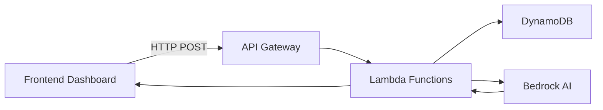

# BA Portal - Business Analytics Dashboard

A comprehensive financial analytics platform for property investment advisors, built with React, TypeScript, and AWS serverless architecture. The platform enables financial advisors to analyze investment portfolios, calculate borrowing capacities, and generate property recommendations using AI.

## Table of Contents

- [Purpose](#purpose)
- [Architecture](#architecture)
- [Features](#features)
- [Technology Stack](#technology-stack)
- [Project Structure](#project-structure)
- [Getting Started](#getting-started)
- [Financial Formulas](#financial-formulas)
- [Configuration](#configuration)
- [API Reference](#api-reference)
- [Authentication](#authentication)
- [Deployment](#deployment)
- [Development](#development)
- [Troubleshooting](#troubleshooting)

---

## Purpose

The BA Portal is designed for **Buyer Agents** (property investment advisors) to:

1. **Manage Client Portfolios** - Track multiple investors and their property investments
2. **Analyze Financial Capacity** - Calculate borrowing power, DTI ratios, and accessible equity
3. **Visualize Projections** - Display configurable-year financial forecasts with interactive charts
4. **AI-Powered Insights** - Generate portfolio summaries and tailored advice using AWS Bedrock
5. **Add AI-Recommended Properties** - Use AI to suggest the next optimal property to acquire
6. **Configure Parameters** - Adjust financial assumptions like CPI rates, borrowing multipliers, and investment horizon

The platform uses a serverless AWS backend with DynamoDB for data storage and Lambda functions for business logic, while the frontend provides an intuitive dashboard interface.

---

## Frontend Layout

```
┌──────────────────────────────────────────────────────────────────────────────────────────────────────┐
│  HEADER (Fixed Top)                                                                                    │
│  ┌──────────────────────────────────────────────────────────────────────────────────────────────────┐  │
│  │ [Logo] Dashboard  [Portfolio ▼]  [Switch Portfolio] [Expenses] [Investor Details]  [☀/🌙] [User]│  │
│  └──────────────────────────────────────────────────────────────────────────────────────────────────┘  │
├──────────────────────────────────────────────────────────────────────────────────────────────────────┤
│  MAIN CONTENT (scrollable)                                                                             │
│                                                                                                        │
│  ┌────────────────────────────────────────────────────┐   ┌─────────────────────────────────────────┐ │
│  │                 CHART SECTION                       │   │     SIDEBAR (collapsible right panel)   │ │
│  │                                                     │   │                                         │ │
│  │  ┌───────────────────────────────────────────────┐  │   │  ┌─────────────────────────────────┐   │ │
│  │  │  Summary Cards (DTI, Equity, Surplus, etc.)   │  │   │  │  Properties Panel               │   │ │
│  │  └───────────────────────────────────────────────┘  │   │  │  [+ Add Property (AI)]          │   │ │
│  │                                                     │   │  │  Property A, Property B...      │   │ │
│  │  ┌───────────────────────────────────────────────┐  │   │  └─────────────────────────────────┘   │ │
│  │  │  30-Year Financial Projection (main chart)    │  │   │                                         │ │
│  │  └───────────────────────────────────────────────┘  │   │  ┌─────────────────────────────────┐   │ │
│  │                                                     │   │  │  Investors Panel                │   │ │
│  │  ┌───────────────────────────────────────────────┐  │   │  └─────────────────────────────────┘   │ │
│  │  │  Executive Summary Card                       │  │   │                                         │ │
│  │  │  [🤖 Summarise]                               │  │   │  ┌─────────────────────────────────┐   │ │
│  │  └───────────────────────────────────────────────┘  │   │  │  Configuration Panel            │   │ │
│  │                                                     │   │  │  Investment Years slider        │   │ │
│  │  ┌───────────────────────────────────────────────┐  │   │  │  CPI, Equity Rate, etc.         │   │ │
│  │  │  Our Advice Card                              │  │   │  │  Investment Goals & Risk        │   │ │
│  │  │  [💡 Get Advice]                              │  │   │  └─────────────────────────────────┘   │ │
│  │  └───────────────────────────────────────────────┘  │   │                                         │ │
│  │                                                     │   │  [Update Data]                          │ │
│  │  ┌───────────────────────────────────────────────┐  │   └─────────────────────────────────────────┘ │
│  │  │  LVR Over Time Chart                          │  │                                               │
│  │  └───────────────────────────────────────────────┘  │                                               │
│  └────────────────────────────────────────────────────┘                                               │
├──────────────────────────────────────────────────────────────────────────────────────────────────────┤
│  FOOTER                                                                                                │
│  © 2024 BA Portal | Financial Analytics Platform                                                       │
└──────────────────────────────────────────────────────────────────────────────────────────────────────┘
```

---

## Architecture

### High-Level System Architecture

```
┌─────────────────────────────────────────────────────────────────────────────┐
│                           BA PORTAL SYSTEM                                  │
├─────────────────────────────────────────────────────────────────────────────┤
│                                                                             │
│  ┌──────────────────────┐      ┌──────────────────────────────────────┐   │
│  │   React Frontend     │      │         AWS Cloud Services            │   │
│  │   (Vite + TypeScript)│◄────►│                                       │   │
│  └──────────────────────┘      │  ┌─────────────────────────────────┐  │   │
│                                │  │      API Gateway                 │  │   │
│  ┌──────────────────────┐      │  │  (ba-portal-api-gateway)         │  │   │
│  │   Cognito            │      │  └────────────┬────────────────────┘  │   │
│  │   (Authentication)   │      │               │                       │   │
│  └──────────────────────┘      │  ┌────────────┴────────────────────┐  │   │
│                                │  │                                  │  │   │
│                                │  │  ┌──────────────┐ ┌───────────┐ │  │   │
│                                │  │  │ Update Table │ │ Read Table │ │  │   │
│                                │  │  │   Lambda     │ │  Lambda   │ │  │   │
│                                │  │  └──────────────┘ └───────────┘ │  │   │
│                                │  │                                  │  │   │
│                                │  │  ┌─────────────┐ ┌────────────┐ │  │   │
│                                │  │  │ Insert Table│ │Update Chart│ │  │   │
│                                │  │  │   Lambda    │ │  Lambda   │ │  │   │
│                                │  │  └─────────────┘ └────────────┘ │  │   │
│                                │  │                                  │  │   │
│                                │  │  ┌────────────────────────────┐ │  │   │
│                                │  │  │      BA Agent Lambda       │ │  │   │
│                                │  │  │  add / optimize /          │ │  │   │
│                                │  │  │  summary / advice          │ │  │   │
│                                │  │  └────────────────────────────┘ │  │   │
│                                │  └──────────────────────────────────┘  │   │
│                                │               │                          │   │
│                                │  ┌────────────┴────────────────────┐    │   │
│                                │  │       DynamoDB                  │    │   │
│                                │  │  • BA-PORTAL-BASETABLE          │    │   │
│                                │  └─────────────────────────────────┘    │   │
│                                │                                           │   │
│                                │  ┌─────────────────────────────────┐    │   │
│                                │  │        Amazon Bedrock            │    │   │
│                                │  │  (Claude for AI features)        │    │   │
│                                │  └─────────────────────────────────┘    │   │
│                                └──────────────────────────────────────────┘   │
│                                                                             │
└─────────────────────────────────────────────────────────────────────────────┘
```

### Data Flow



---

## Features

### Core Features

| Feature | Description |
|---------|-------------|
| **Dashboard Analytics** | Interactive charts showing configurable-year financial projections (default 30 years) |
| **LVR Chart** | Dedicated Loan-to-Value Ratio over time chart with risk zone annotations |
| **Investor Management** | Add, edit, and manage multiple investors per portfolio |
| **Property Tracking** | Track property investments with purchase details, loans, rental income, and investor splits |
| **Chart1 Calculations** | Automatic calculation of borrowing capacity, DTI, LVR, accessible equity, and cashflow projections |
| **AI Property Suggestions** | AI-generated property recommendations via the "Add Property" button in the Sidebar |
| **Portfolio Optimization** | Analyze and optimize existing properties against market benchmarks |
| **Executive Summary** | AI-generated plain-English summary of the portfolio's current financial position |
| **Our Advice** | AI-generated actionable recommendations with reasoning, personalized to investment goals |
| **Investment Goals** | Set investment goals and risk tolerance in the Sidebar for personalized AI advice |
| **Investment Years Slider** | Adjust the forecast horizon (1–30 years) via a slider in the Sidebar |
| **Configuration Parameters** | Adjust financial assumptions (CPI, borrowing multipliers, accessible equity rate) |
| **Dark/Light Mode** | Toggle between dark and light themes |
| **Secure Authentication** | Passwordless login with email verification codes |
| **Portfolio Selector** | Switch between multiple client portfolios |
| **Household Expenses Form** | Dedicated form for entering essential and non-essential expenditure |
| **Investor Details Form** | Dedicated form for managing investor income, dependants, and growth rate |

### API Endpoints

| Endpoint | Method | Description |
|----------|--------|-------------|
| `/update-table` | POST | Update DynamoDB items with automatic Chart1 calculation |
| `/read-table` | POST | Read active portfolio data including Chart1, investors, properties |
| `/insert-table` | POST | Insert a new portfolio record |
| `/ba-agent` | POST | AI-powered actions via Bedrock (add, optimize, summary, advice) |

### AI Features

The BA Portal uses AWS Bedrock (Claude) for four AI-powered actions, all accessible via the `/ba-agent` endpoint:

| `property_action` | Triggered By | Description |
|-------------------|-------------|-------------|
| `add` | "Add Property" button in Sidebar | Generates ONE new property recommendation based on current portfolio financials |
| `optimize` | (internal analysis use) | Analyzes and optimizes existing properties against market benchmarks |
| `summary` | "🤖 Summarise" button in Executive Summary card | Generates a plain-English portfolio summary incorporating investment goals |
| `advice` | "💡 Get Advice" button in Our Advice card | Generates 3 actionable recommendations with reasoning based on forecast, risk profile, and goals |

#### Add Property

The **"Add Property"** button in the Sidebar calls the BA Agent with `property_action: "add"`. The AI analyzes the current portfolio's Chart1 data (DTI, borrowing capacity, accessible equity) and returns a recommended property ready to be added to the portfolio.

**Request:**
```json
{
  "table_name": "BA-PORTAL-BASETABLE",
  "id": "B57153AB-B66E-4085-A4C1-929EC158FC3E",
  "property_action": "add"
}
```

**Response:**
```json
{
  "status": "success",
  "action": "add",
  "property": {
    "name": "Property D",
    "purchase_year": 8,
    "loan_amount": 800000,
    "annual_principal_change": 0,
    "rent": 40000,
    "interest_rate": 5.5,
    "other_expenses": 10000,
    "property_value": 1000000,
    "initial_value": 950000,
    "growth_rate": 5,
    "investor_splits": [
      {"name": "Bob", "percentage": 50},
      {"name": "Alice", "percentage": 50}
    ]
  }
}
```

#### Executive Summary

The **"🤖 Summarise"** button in the Executive Summary card calls the BA Agent with `property_action: "summary"`. It reads the portfolio's Chart1 data and investment goals, then returns a markdown-formatted plain-English summary.

**Request:**
```json
{
  "table_name": "BA-PORTAL-BASETABLE",
  "id": "B57153AB-B66E-4085-A4C1-929EC158FC3E",
  "property_action": "summary"
}
```

**Response:**
```json
{
  "status": "success",
  "action": "summary",
  "summary": "Your portfolio currently holds 2 properties with a combined value of $1,750,000..."
}
```

#### Our Advice

The **"💡 Get Advice"** button in the Our Advice card calls the BA Agent with `property_action: "advice"`. It incorporates the portfolio's investment goals and risk tolerance to generate 3 tailored recommendations.

**Request:**
```json
{
  "table_name": "BA-PORTAL-BASETABLE",
  "id": "B57153AB-B66E-4085-A4C1-929EC158FC3E",
  "property_action": "advice"
}
```

**Response:**
```json
{
  "status": "success",
  "action": "advice",
  "advice": "## Recommendation 1: Refinance Property A\n\nRefinancing from 6% to 5.5% would save $8,000 annually..."
}
```

---

## Technology Stack

### Frontend

| Technology | Version | Purpose |
|------------|---------|---------|
| [React](https://react.dev/) | 19.2.0 | UI framework |
| [TypeScript](https://www.typescriptlang.org/) | 5.9.x | Type-safe JavaScript |
| [Vite](https://vitejs.dev/) | 7.2.4 | Build tool and dev server |
| [Tailwind CSS](https://tailwindcss.com/) | 4.1.x | Utility-first CSS framework |
| [Recharts](https://recharts.org/) | 3.6.0 | Charting library |
| [ECharts](https://echarts.apache.org/) | 6.0.0 | Advanced charting (LVR chart) |
| [Lucide React](https://lucide.dev/) | 0.562.0 | Icon library |
| [Axios](https://axios-http.com/) | 1.13.x | HTTP client |
| [AWS Amplify](https://aws.amazon.com/amplify/) | 6.19.x | AWS authentication |

### Backend (AWS)

| Service | Purpose |
|---------|---------|
| **API Gateway** | REST API endpoints |
| **Lambda (Python 3.13)** | Serverless compute |
| **DynamoDB** | NoSQL database |
| **Cognito** | User authentication |
| **Bedrock (Claude)** | AI-powered recommendations |
| **CloudWatch** | Logging and monitoring |

---

## Project Structure

```
app/ba-portal/
├── dashboard-frontend/          # React TypeScript frontend
│   ├── src/
│   │   ├── components/          # React components
│   │   │   ├── ChartSection.tsx       # Chart visualization and AI summary/advice cards
│   │   │   ├── Dashboard.tsx          # Main dashboard orchestrator
│   │   │   ├── EmptyPortfolioState.tsx # UI shown when no portfolios exist
│   │   │   ├── Footer.tsx             # Footer component
│   │   │   ├── Header.tsx             # Header with portfolio selector and auth
│   │   │   ├── HouseholdExpensesForm.tsx # Form for entering household expenses
│   │   │   ├── InvestorDetailsForm.tsx   # Form for managing investor details
│   │   │   ├── PortfolioSelector.tsx     # Portfolio selection screen
│   │   │   └── Sidebar.tsx            # Right panel: properties, investors, config
│   │   ├── config/
│   │   │   └── cognitoConfig.ts       # Cognito configuration
│   │   ├── contexts/
│   │   │   └── AuthContext.tsx        # Authentication context
│   │   ├── hooks/
│   │   │   ├── useApiClientInitialize.ts # API client setup hook
│   │   │   └── useFinancialData.ts       # Data fetching hook
│   │   ├── pages/
│   │   │   ├── Analytics.tsx          # Analytics page
│   │   │   ├── Reports.tsx            # Reports page
│   │   │   ├── Settings.tsx           # Settings page
│   │   │   └── Users.tsx              # Users page
│   │   └── services/
│   │       ├── apiClient.ts           # Axios client with auth interceptors
│   │       ├── authService.ts         # Authentication service
│   │       ├── dashboardService.ts    # Dashboard API service (all data + AI calls)
│   │       └── financialApi.ts        # Financial data API
│   ├── package.json
│   ├── tsconfig.json
│   ├── vite.config.ts
│   └── tailwind.config.js
│
├── IaC/                         # Infrastructure as Code
│   ├── api-config.json         # API Gateway configuration
│   ├── deploy_api.py           # API deployment script
│   └── teardown_api.py        # API teardown script
│
└── lambda/                     # AWS Lambda functions
    ├── ba_agent/               # AI features (add/optimize/summary/advice)
    │   ├── main.py             # Main handler with all 4 actions
    │   ├── lib/
    │   │   └── bedrock_client.py
    │   └── README.md
    │
    ├── update_table/           # DynamoDB update with Chart1 calculation
    │   ├── update_table.py     # Main handler
    │   ├── libs/
    │   │   └── superchart1.py  # Chart calculation library
    │   ├── utils/
    │   ├── deploy_lambda.py
    │   └── README.md
    │
    ├── update_chart/           # Chart-specific update Lambda
    │   └── lambda_handler.py
    │
    ├── read_table/             # DynamoDB read operations
    │   ├── read_table.py
    │   ├── deploy_lambda.py
    │   └── README.md
    │
    └── insert_table/           # Insert new portfolio records
        └── insert_table.py
```

---

## Getting Started

### Prerequisites

Before setting up the project, ensure you have:

- **Node.js** 18+ and npm
- **Python** 3.13+
- **AWS CLI** configured with appropriate credentials
- **AWS Account** with access to DynamoDB, Lambda, API Gateway, Cognito, and Bedrock

### Environment Variables

Create a `.env` file in `app/ba-portal/dashboard-frontend/`:

```env
# Cognito Configuration
VITE_COGNITO_CLIENT_ID=your_client_id
VITE_COGNITO_DOMAIN=advicegenie-auth-baportal-001.auth.ap-southeast-2.amazoncognito.com
VITE_COGNITO_REDIRECT_URI=http://localhost:3000/
VITE_COGNITO_LOGOUT_URI=http://localhost:3000/
VITE_COGNITO_USER_POOL_ID=ap-southeast-2_XXXXXXXXX

# AWS Configuration
VITE_AWS_REGION=ap-southeast-2

# API Gateway
VITE_API_URL=https://YOUR_API_ID.execute-api.ap-southeast-2.amazonaws.com/prod
```

### Installation

1. **Install Frontend Dependencies**:
   ```bash
   cd app/ba-portal/dashboard-frontend
   npm install
   ```

2. **Configure Environment**:
   Copy `.env.example` to `.env` and update with your values.

3. **Start Development Server**:
   ```bash
   npm run dev
   ```

   The application will be available at `http://localhost:3000/`

### Building for Production

```bash
npm run build
```

Production files will be generated in the `dist/` directory.

---

## Financial Formulas

This section documents all the financial formulas used in the BA Portal's Chart1 calculations.

### Configuration Parameters

The following parameters can be configured in the Sidebar and affect the calculations below:

| Parameter | Default | Description |
|-----------|---------|-------------|
| Medicare Levy Rate | 2% | Australian Medicare levy percentage |
| CPI Rate | 3% | Consumer Price Index growth rate |
| Accessible Equity Rate | 80% | Percentage of equity accessible for new purchases |
| Borrowing Power Min | 3.5 | Minimum income multiple for borrowing capacity |
| Borrowing Power Base | 5.0 | Base income multiple before dependants reduction |
| Dependant Reduction | 0.25 | Borrowing power reduction per dependant |
| Investment Years | 30 | Number of years to forecast (1–30, adjusted via slider) |

---

### 1. Borrowing Multiple

Determines the income multiple used to calculate borrowing capacity based on the number of dependants.

**Formula:**
```
Borrowing Multiple = max(3.5, 5.0 - (dependants × 0.25))
```

**Example:**
- 0 dependants: `max(3.5, 5.0 - 0) = 5.0`
- 1 dependant: `max(3.5, 5.0 - 0.25) = 4.75`
- 2 dependants: `max(3.5, 5.0 - 0.50) = 4.5`
- 5 dependants: `max(3.5, 5.0 - 1.25) = 3.75`
- 6+ dependants: `max(3.5, 5.0 - 1.5) = 3.5` (capped at minimum)

**Source:** [`superchart1.py:82-99`](app/ba-portal/lambda/update_table/libs/superchart1.py:82)

---

### 2. Debt-to-Income (DTI) Ratio

Measures the ratio of total debt to annual gross income (expressed as a decimal, not percentage).

**Formula:**
```
DTI Ratio = Total Debt / Annual Gross Income
```

**Components:**
- **Total Debt:** Sum of all property loan balances (`total_debt`)
- **Annual Gross Income:** Combined **gross** income of all investors (before tax)

**Important Note:** The DTI ratio is calculated using **GROSS INCOME** (before taxes), not net income. This is consistent with how lenders typically assess borrowing capacity.

The DTI ratio is stored as a **decimal** (e.g., 5.0 for 500%), not as a percentage. The frontend displays the raw decimal value.

**Example:**
- Total Debt: $600,000
- Annual Gross Income: $120,000
- DTI = 600,000 / 120,000 = 5.0 (stored as 5.0, displayed as 500%)

**Note:** A lower DTI indicates healthier borrowing capacity. Typically, lenders prefer DTI below 0.30-0.40 (30-40%). A DTI above 1.0 (100%) means debt exceeds annual income.

**Source:** [`superchart1.py:102-130`](app/ba-portal/lambda/update_table/libs/superchart1.py:102)

---

### 3. Net Income Calculation

Calculates net income after Australian taxes and Medicare levy.

**Tax Brackets (Australia):**

| Income Range | Tax Rate |
|--------------|----------|
| $0 - $18,200 | 0% |
| $18,201 - $45,000 | 16% |
| $45,001 - $135,000 | 30% |
| $135,001 - $190,000 | 37% |
| $190,001+ | 45% |

**Formulas:**
```
Income Tax = Sum of (taxable_amount × bracket_rate) for each bracket
Medicare Levy = Gross Income × Medicare Levy Rate (default 2%)
Total Tax = Income Tax + Medicare Levy
Net Income = Gross Income - Total Tax
```

**Example:**
- Gross Income: $120,000
- Tax on first $18,200: $0
- Tax on $18,200-$45,000 (26,800 × 16%): $4,288
- Tax on $45,000-$120,000 (75,000 × 30%): $22,500
- Total Income Tax: $26,788
- Medicare Levy: $120,000 × 2% = $2,400
- Total Tax: $29,188
- Net Income: $120,000 - $29,188 = $90,812

**Source:** [`superchart1.py:132-170`](app/ba-portal/lambda/update_table/libs/superchart1.py:132)

---

### 4. Raw Equity

The total equity in a property (property value minus loan balance).

**Formula:**
```
Raw Equity = Property Value - Loan Amount
```

**Source:** [`superchart1.py:174-202`](app/ba-portal/lambda/update_table/libs/superchart1.py:174)

---

### 5. Accessible Equity

The portion of equity that can be accessed for new property purchases (after deducting the existing loan from 80% of property value).

**Formula:**
```
Accessible Equity = max(0, (Property Value × 0.80) - Loan Amount)
```

**Example:**
- Property Value: $1,000,000
- Loan Amount: $600,000
- 80% of Property Value: $800,000
- Accessible Equity: max(0, $800,000 - $600,000) = $200,000

**Note:** If the loan exceeds 80% of the property value, accessible equity is $0.

**Source:** [`superchart1.py:174-202`](app/ba-portal/lambda/update_table/libs/superchart1.py:174)

---

### 6. Maximum Purchase Price

The maximum price that can be paid for a new property based on accessible equity, assuming a 25% deposit.

**Formula:**
```
Max Purchase Price = Accessible Equity / 0.25
```

**Logic:** The accessible equity represents a 25% deposit, so dividing by 0.25 gives the maximum property purchase price that can be supported.

**Source:** [`superchart1.py:174-202`](app/ba-portal/lambda/update_table/libs/superchart1.py:174)

---

### 7. Loan-to-Value Ratio (LVR)

Measures the loan amount as a percentage of the property value.

**Formula:**
```
LVR = (Total Loan Balance / Total Property Value) × 100
```

**LVR Risk Zones:**
- LVR < 60%: Low risk — strong equity position, best lending rates
- LVR 60%–80%: Caution — approaching LMI territory
- LVR 80%–90%: LMI required — Lender's Mortgage Insurance applies above 80%
- LVR > 90%: Critical — many lenders will restrict further credit

**Source:** [`superchart1.py:400-408`](app/ba-portal/lambda/update_table/libs/superchart1.py:400)

---

### 8. Property Cashflow

The net cashflow generated by all properties (rental income minus costs).

**Formula:**
```
Property Cashflow = Total Rent - Total Interest Cost - Total Other Expenses
```

**Source:** [`superchart1.py:441-447`](app/ba-portal/lambda/update_table/libs/superchart1.py:441)

---

### 9. Household Surplus

The remaining funds after all expenses from the combined investor net incomes.

**Formula:**
```
Household Surplus = Combined Net Income - Essential Expenses - Nonessential Expenses + Property Cashflow
```

**Source:** [`superchart1.py:447-448`](app/ba-portal/lambda/update_table/libs/superchart1.py:447)

---

### 10. Borrowing Capacity

The maximum amount an investor can borrow based on their net income and existing debt.

**Formula:**
```
Borrowing Capacity = max(0, Net Income × Borrowing Multiple - Existing Debt)
```

**Example:**
- Net Income: $90,000
- Borrowing Multiple: 5.0
- Existing Debt: $0
- Borrowing Capacity: max(0, $90,000 × 5.0 - $0) = $450,000

**Source:** [`superchart1.py:451-464`](app/ba-portal/lambda/update_table/libs/superchart1.py:451)

---

### 11. Investor Net Income

The net income for each investor after all deductions, including property-related income and expenses.

**Formula:**
```
Investor Net Income = Net Income After Tax - Essential Expenditure - Nonessential Expenditure 
                    + Rental Income Share - Interest Cost Share - Other Expenses Share
```

**Source:** [`superchart1.py:426-439`](app/ba-portal/lambda/update_table/libs/superchart1.py:426)

---

### 12. Annual Growth Calculations

Both investor income and property values grow annually based on configured rates.

**Income Growth:**
```
Year N Income = Year (N-1) Income × (1 + Annual Growth Rate)
```

**Property Value Growth:**
```
Year N Property Value = Year (N-1) Property Value × (1 + Growth Rate)
```

**CPI-Adjusted Expenses:**
```
Year N Expense = Year (N-1) Expense × (1 + CPI Rate)
```

**Source:** [`superchart1.py:333-371`](app/ba-portal/lambda/update_table/libs/superchart1.py:333)

---

### 13. Yearly Forecast Data Structure

Each year in the forecast contains the following calculated fields:

| Field | Description |
|-------|-------------|
| year | Forecast year (1–N) |
| investor_net_incomes | Net income per investor |
| combined_income | Combined net income of all investors |
| investor_borrowing_capacities | Borrowing capacity per investor |
| investor_borrowing_multiples | Borrowing multiple per investor |
| investor_dependants | Number of dependants per investor |
| investor_debts | Total debt per investor |
| total_debt | Combined total debt across all properties |
| total_rent | Total rental income |
| total_interest_cost | Total interest payments |
| total_other_expenses | Total other property expenses |
| total_essential_expenses | Total essential household expenses |
| total_nonessential_expenses | Total nonessential household expenses |
| property_cashflow | Net cashflow from properties |
| household_surplus | Remaining funds after all expenses |
| property_loan_balances | Loan balance per property |
| property_lvrs | LVR percentage per property |
| property_values | Current value per property |
| max_purchase_price | Maximum purchase price based on accessible equity |
| accessible_equity | Total accessible equity |
| raw_equity | Total raw equity |
| dti_ratio | Debt-to-Income ratio |

---

## Configuration

### Sidebar Configuration Panel

The BA Portal's configuration panel is located in the **Sidebar** (collapsible right panel). It is accessible by opening the sidebar from the main dashboard.

#### Investment Goals Settings

Users can set their investment goals to receive personalized AI advice from the "Our Advice" feature:

| Setting | Type | Options | Description |
|---------|------|---------|-------------|
| **Investment Goal** | Single-select text | e.g., Passive Income, Capital Growth | Primary objective for the portfolio |
| **Risk Tolerance** | Single-select | Conservative, Moderate, Aggressive | Investment risk preference |

Investment goals are stored in the `BA-PORTAL-BASETABLE` DynamoDB table:

```json
{
  "id": "B57153AB-B66E-4085-A4C1-929EC158FC3E",
  "investment_goals": {
    "goal": "Passive Income",
    "risk_tolerance": "moderate"
  }
}
```

The BA Agent Lambda reads investment goals and incorporates them into the `summary` and `advice` prompts.

**File:** [`ba_agent/main.py`](app/ba-portal/lambda/ba_agent/main.py)

#### Investment Years

The **Investment Years** slider in the Sidebar controls the forecast horizon. The value is stored in DynamoDB as `investment_years` and passed to the Chart1 calculation lambda.

- **Range:** 1–30 years
- **Default:** 30 years
- **Effect:** The `update-table` endpoint recalculates Chart1 for the specified number of years

#### Dashboard Configuration Parameters

| Parameter | Default | Description |
|-----------|---------|-------------|
| Medicare Levy Rate | 0.02 (2%) | Australian Medicare levy percentage |
| CPI Rate | 0.03 (3%) | Consumer Price Index growth rate |
| Accessible Equity Rate | 0.80 (80%) | Percentage of equity accessible for new purchases |
| Borrowing Power Min | 3.5 | Minimum income multiple for borrowing capacity |
| Borrowing Power Base | 5.0 | Base income multiple for borrowing capacity |
| Dependant Reduction | 0.25 | Borrowing power reduction per dependant |
| Investment Years | 30 | Number of years to forecast |

### Cognito Setup

The application uses AWS Cognito for authentication with the following configuration:

| Setting | Value |
|---------|-------|
| User Pool | `ba-dashboard-user-pool` |
| App Client | `ba-dashboard-spa-client` |
| Region | `ap-southeast-2` |
| Auth Flow | Authorization Code Grant |
| Scopes | `openid`, `email`, `profile` |

---

## API Reference

### Update Table Endpoint

**POST** `/update-table`

Updates a DynamoDB item and automatically calculates Chart1 financial projections.

#### Request

```json
{
  "table_name": "BA-PORTAL-BASETABLE",
  "id": "B57153AB-B66E-4085-A4C1-929EC158FC3E",
  "attributes": {
    "status": "active",
    "adviser_name": "John Doe",
    "investment_years": 30,
    "investment_goals": {
      "goal": "Passive Income",
      "risk_tolerance": "moderate"
    },
    "investors": [
      {
        "name": "Bob",
        "base_income": 120000,
        "annual_growth_rate": 0.03,
        "essential_expenditure": 30000,
        "nonessential_expenditure": 15000,
        "dependants": 0
      }
    ],
    "properties": [
      {
        "name": "Property A",
        "purchase_year": 1,
        "loan_amount": 600000,
        "annual_principal_change": 0,
        "rent": 30000,
        "interest_rate": 0.06,
        "other_expenses": 10000,
        "initial_value": 750000,
        "growth_rate": 0.06,
        "investor_splits": [
          {"name": "Bob", "percentage": 100}
        ]
      }
    ]
  },
  "region": "ap-southeast-2"
}
```

#### Response

```json
{
  "status": "success",
  "message": "Update successful",
  "item_id": "B57153AB-B66E-4085-A4C1-929EC158FC3E",
  "updated_attributes": ["status", "adviser_name", "investors", "properties", "chart1"],
  "result": {
    "id": "B57153AB-B66E-4085-A4C1-929EC158FC3E",
    "status": "active",
    "chart1": {
      "yearly_forecast": [
        {
          "year": 1,
          "investor_net_incomes": {"Bob": 85000},
          "combined_income": 85000,
          "investor_borrowing_capacities": {"Bob": 475000},
          "total_debt": 600000,
          "dti_ratio": 35.3,
          "accessible_equity": 150000,
          "household_surplus": 40000,
          "property_cashflow": 20000
        }
      ]
    }
  }
}
```

### Read Table Endpoint

**POST** `/read-table`

Reads active portfolio data from DynamoDB.

#### Request

```json
{
  "table_name": "BA-PORTAL-BASETABLE",
  "id": "B57153AB-B66E-4085-A4C1-929EC158FC3E",
  "region": "ap-southeast-2"
}
```

#### Response

```json
{
  "status": "success",
  "message": "Active item retrieval successful",
  "item_id": "B57153AB-B66E-4085-A4C1-929EC158FC3E",
  "result": {
    "id": "B57153AB-B66E-4085-A4C1-929EC158FC3E",
    "chart1": {"..."},
    "investors": ["..."],
    "properties": ["..."],
    "investment_years": 30,
    "investment_goals": {"goal": "Passive Income", "risk_tolerance": "moderate"}
  }
}
```

### BA Agent Endpoint

**POST** `/ba-agent`

Triggers AI-powered actions using AWS Bedrock (Claude).

#### Actions

| Action | Description |
|--------|-------------|
| `add` | Generate ONE new property recommendation based on current portfolio financial analysis |
| `optimize` | Analyze and optimize existing properties against market benchmarks |
| `summary` | Generate a plain-English executive summary of the portfolio |
| `advice` | Generate 3 actionable recommendations with reasoning based on forecast, risk profile, and investment goals |

#### Request

```json
{
  "table_name": "BA-PORTAL-BASETABLE",
  "id": "B57153AB-B66E-4085-A4C1-929EC158FC3E",
  "property_action": "add | optimize | summary | advice"
}
```

#### Response for `add` Action

```json
{
  "status": "success",
  "action": "add",
  "property": {
    "name": "Property D",
    "purchase_year": 8,
    "loan_amount": 800000,
    "annual_principal_change": 0,
    "rent": 40000,
    "interest_rate": 5.5,
    "other_expenses": 10000,
    "initial_value": 950000,
    "growth_rate": 5,
    "investor_splits": [
      {"name": "Bob", "percentage": 50},
      {"name": "Alice", "percentage": 50}
    ]
  }
}
```

#### Response for `summary` Action

```json
{
  "status": "success",
  "action": "summary",
  "summary": "Your portfolio currently holds 2 properties with a combined value of $1,750,000..."
}
```

#### Response for `advice` Action

```json
{
  "status": "success",
  "action": "advice",
  "advice": "## Recommendation 1: Refinance Property A\n\nRefinancing from 6% to 5.5% would save $8,000 annually...\n\n## Recommendation 2: ..."
}
```

#### Property Fields

| Field | Description |
|-------|-------------|
| Name | Property identifier (e.g., "Property A") |
| Purchase Year | Year to acquire the property (1–30) |
| Initial Value | Starting property value |
| Loan Amount | Initial loan principal |
| Interest Rate | Annual interest rate (decimal, e.g., 0.06 for 6%) |
| Annual Rent | Rental income per year |
| Growth Rate | Annual appreciation rate (decimal) |
| Other Expenses | Annual expenses excluding interest |
| Annual Principal Change | Annual loan repayment amount |
| Investor Splits | Ownership percentages per investor |

#### AI Analysis Inputs

The BA Agent reads these metrics from Chart1 to drive AI analysis:

| Metric | Source | Description |
|--------|--------|-------------|
| Current DTI | `chart1[0].dti_ratio` | Latest year Debt-to-Income ratio |
| Min DTI | `min(chart1[].dti_ratio)` | Lowest DTI over timeline |
| Max Accessible Equity | `max(chart1[].accessible_equity)` | Peak accessible equity |
| Borrowing Capacity | `chart1[0].investor_borrowing_capacities` | Current borrowing power |
| Property Count | `len(properties)` | Number of existing properties |
| Total Property Values | Sum of `property_values` | Current portfolio value |
| Total Loan Balances | Sum of `property_loan_balances` | Current total debt |
| Investment Goals | `investment_goals.goal` | User's stated investment objective |
| Risk Tolerance | `investment_goals.risk_tolerance` | User's risk preference |

---

## Authentication

### Passwordless Login Flow

The BA Portal uses a secure passwordless authentication system:

1. **User enters email** on login page
2. **System generates 6-digit verification code** (valid for 5 minutes)
3. **Code sent to user's email** via DynamoDB
4. **User enters code** to complete login
5. **System issues JWT tokens** for session management

---

## Deployment

### Deploy API Gateway

```bash
cd app/ba-portal/IaC
python deploy_api.py
```

### Deploy Lambda Functions

```bash
# Update Table Lambda
cd app/ba-portal/lambda/update_table
python deploy_lambda.py

# Read Table Lambda
cd app/ba-portal/lambda/read_table
python deploy_lambda.py

# BA Agent Lambda
cd app/ba-portal/lambda/ba_agent
python deploy_lambda.py
```

### Deploy Frontend

Build and deploy the frontend to your hosting provider:

```bash
cd app/ba-portal/dashboard-frontend
npm run build
# Upload dist/ folder to S3, CloudFront, or other hosting
```

---

## Development

### Running Tests

```bash
# Frontend linting
cd app/ba-portal/dashboard-frontend
npm run lint

# Backend Lambda tests
cd app/ba-portal/lambda/update_table
python test_update_table.py

cd app/ba-portal/lambda/ba_agent
python test_ba_agent_api.py
```

### Adding New Features

1. **Frontend Components**: Add to `src/components/`
2. **API Endpoints**: Add Lambda function in `lambda/` and configure in `IaC/api-config.json`
3. **Database Fields**: Update DynamoDB item structure and `update_table` Lambda
4. **New AI Actions**: Add action handler in `lambda/ba_agent/main.py` and a corresponding service function in `dashboardService.ts`

---

## Troubleshooting

### Common Issues

| Issue | Solution |
|-------|----------|
| CORS errors | Check API Gateway CORS configuration |
| Authentication failures | Verify Cognito client ID and domain |
| Lambda timeout | Increase timeout in deploy.config |
| Chart not rendering | Check Chart1 data structure in DynamoDB |
| Environment variables not loading | Ensure `.env` file is in correct location |
| `unsupported operand type(s) for +=` in chart1 calculation | Ensure all investor and property fields have valid numeric values (not null). Check that `base_income`, `loan_amount`, `annual_principal_change`, `rent`, `interest_rate`, `growth_rate`, etc. are all defined with numeric values in DynamoDB. |
| AI features returning empty response | Verify Bedrock model access is enabled in the AWS region; check CloudWatch logs for the BA Agent Lambda |

### Checking Logs

```bash
# CloudWatch Logs
aws logs tail /aws/lambda/ba-portal-update-table-lambda-function --follow
aws logs tail /aws/lambda/ba-portal-ba-agent-lambda-function --follow
```

---

## License

This project is part of the BA Portal system. All rights reserved.

---

## Support

For issues and questions:
- Check the [Lambda README files](./lambda/) for backend documentation
- Review CloudWatch logs for Lambda errors
