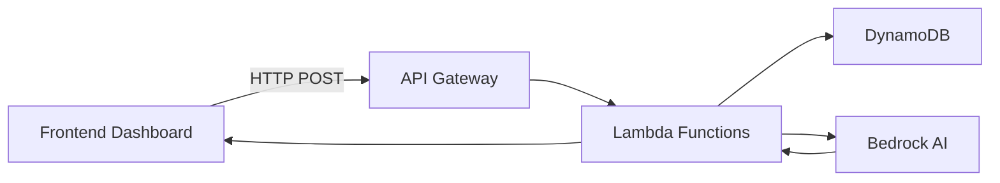

# BA Portal - Business Analytics Dashboard

A comprehensive financial analytics platform for property investment advisors, built with React, TypeScript, and AWS serverless architecture. The platform enables financial advisors to analyze investment portfolios, calculate borrowing capacities, and generate property recommendations using AI.

## Table of Contents

- [Purpose](#purpose)
- [Architecture](#architecture)
- [Features](#features)
- [Technology Stack](#technology-stack)
- [Project Structure](#project-structure)
- [Getting Started](#getting-started)
- [Configuration](#configuration)
- [API Reference](#api-reference)
- [Authentication](#authentication)
- [Deployment](#deployment)
- [Development](#development)
- [Troubleshooting](#troubleshooting)

---

## Purpose

The BA Portal is designed for **Buyer Agents** (property investment advisors) to:

1. **Manage Client Portfolios** - Track multiple investors and their property investments
2. **Analyze Financial Capacity** - Calculate borrowing power, DTI ratios, and accessible equity
3. **Visualize Projections** - Display 30-year financial forecasts with interactive charts
4. **AI-Powered Recommendations** - Generate property acquisition suggestions using AWS Bedrock
5. **Configure Parameters** - Adjust financial assumptions like CPI rates, borrowing multipliers

The platform uses a serverless AWS backend with DynamoDB for data storage and Lambda functions for business logic, while the frontend provides an intuitive dashboard interface.

---

## Architecture

### High-Level System Architecture

```
┌─────────────────────────────────────────────────────────────────────────────┐
│                           BA PORTAL SYSTEM                                  │
├─────────────────────────────────────────────────────────────────────────────┤
│                                                                             │
│  ┌──────────────────────┐      ┌──────────────────────────────────────┐   │
│  │   React Frontend     │      │         AWS Cloud Services            │   │
│  │   (Vite + TypeScript)│◄────►│                                       │   │
│  └──────────────────────┘      │  ┌─────────────────────────────────┐  │   │
│                                │  │      API Gateway                 │  │   │
│  ┌──────────────────────┐      │  │  (ba-portal-api-gateway)         │  │   │
│  │   Cognito            │      │  └────────────┬────────────────────┘  │   │
│  │   (Authentication)   │      │               │                       │   │
│  └──────────────────────┘      │  ┌────────────┴────────────────────┐  │   │
│                                │  │                                  │  │   │
│                                │  │  ┌──────────────┐ ┌───────────┐ │  │   │
│                                │  │  │ Update Table │ │ Read Table │ │  │   │
│                                │  │  │   Lambda     │ │  Lambda   │ │  │   │
│                                │  │  └──────────────┘ └───────────┘ │  │   │
│                                │  │                                  │  │   │
│                                │  │  ┌────────────────────────────┐ │  │   │
│                                │  │  │      BA Agent Lambda       │ │  │   │
│                                │  │  │  (AI Property Generation) │ │  │   │
│                                │  │  └────────────────────────────┘ │  │   │
│                                │  └──────────────────────────────────┘  │   │
│                                │               │                          │   │
│                                │  ┌────────────┴────────────────────┐    │   │
│                                │  │       DynamoDB                  │    │   │
│                                │  │  • BA-PORTAL-BASETABLE          │    │   │
│                                │  │  • ba-dashboard-users-table     │    │   │
│                                │  │  • ba-dashboard-verification-codes-table  │   │
│                                │  └─────────────────────────────────┘    │   │
│                                │                                           │   │
│                                │  ┌─────────────────────────────────┐    │   │
│                                │  │        Amazon Bedrock            │    │   │
│                                │  │  (Claude for AI Recommendations)│    │   │
│                                │  └─────────────────────────────────┘    │   │
│                                └──────────────────────────────────────────┘   │
│                                                                             │
└─────────────────────────────────────────────────────────────────────────────┘
```

### Data Flow



---

## Features

### Core Features

| Feature | Description |
|---------|-------------|
| **Dashboard Analytics** | Interactive charts showing 30-year financial projections |
| **Investor Management** | Add, edit, and manage multiple investors per portfolio |
| **Property Tracking** | Track property investments with purchase details, loans, and rental income |
| **Chart1 Calculations** | Automatic calculation of borrowing capacity, DTI, LVR, and cashflow projections |
| **AI Recommendations** | Generate property acquisition recommendations using AWS Bedrock |
| **Portfolio Optimization** | Optimize existing properties based on market benchmarks |
| **Configuration Parameters** | Adjust financial assumptions (CPI, borrowing multipliers, equity rates) |
| **Dark/Light Mode** | Toggle between dark and light themes |
| **Secure Authentication** | Passwordless login with email verification via AWS Cognito |

### API Endpoints

| Endpoint | Method | Description |
|----------|--------|-------------|
| `/update-table` | POST | Update DynamoDB items with automatic Chart1 calculation |
| `/read-table` | POST | Read active portfolio data including Chart1, investors, properties |
| `/ba-agent` | POST | AI-powered property recommendations via Bedrock |

### Adding Properties

The Right Sidebar panel in the dashboard provides an **"Add Property"** button that uses the BA Agent endpoint to generate AI-powered property recommendations.

#### How It Works

1. **Click "Add Property"** - The button triggers a call to the BA Agent Lambda
2. **AI Analysis** - The system reads the current portfolio's Chart1 data (DTI, borrowing capacity, accessible equity)
3. **Bedrock Processing** - AWS Bedrock (Claude) analyzes financial metrics and generates optimal property attributes
4. **Recommendation Returned** - The AI returns a recommended property with:
   - Optimal purchase year based on financial capacity
   - Loan amount within sustainable DTI limits
   - Property value within borrowing power + equity
   - Rental income estimates for positive cashflow
   - Appropriate LVR to avoid LMI
5. **User Review** - The recommended property is displayed for user approval
6. **Save to Portfolio** - User can modify and save the property to their portfolio

#### Property Fields

| Field | Description |
|-------|-------------|
| Name | Property identifier (e.g., "Property A") |
| Purchase Year | Year to acquire the property (1-30) |
| Initial Value | Starting property value |
| Loan Amount | Initial loan principal |
| Interest Rate | Annual interest rate (decimal, e.g., 0.06 for 6%) |
| Annual Rent | Rental income per year |
| Growth Rate | Annual appreciation rate (decimal) |
| Other Expenses | Annual expenses excluding interest |
| Annual Principal Change | Annual loan repayment amount |
| Investor Splits | Ownership percentages per investor |

---

## Technology Stack

### Frontend

| Technology | Version | Purpose |
|------------|---------|---------|
| [React](https://react.dev/) | 19.2.0 | UI framework |
| [TypeScript](https://www.typescriptlang.org/) | 5.9.x | Type-safe JavaScript |
| [Vite](https://vitejs.dev/) | 7.2.4 | Build tool and dev server |
| [Tailwind CSS](https://tailwindcss.com/) | 4.1.x | Utility-first CSS framework |
| [Recharts](https://recharts.org/) | 3.6.0 | Charting library |
| [ECharts](https://echarts.apache.org/) | 6.0.0 | Advanced charting |
| [Lucide React](https://lucide.dev/) | 0.562.0 | Icon library |
| [Axios](https://axios-http.com/) | 1.13.x | HTTP client |
| [AWS Amplify](https://aws.amazon.com/amplify/) | 6.19.x | AWS authentication |

### Backend (AWS)

| Service | Purpose |
|---------|---------|
| **API Gateway** | REST API endpoints |
| **Lambda (Python 3.13)** | Serverless compute |
| **DynamoDB** | NoSQL database |
| **Cognito** | User authentication |
| **Bedrock (Claude)** | AI-powered recommendations |
| **CloudWatch** | Logging and monitoring |

---

## Project Structure

```
app/ba-portal/
├── dashboard-frontend/          # React TypeScript frontend
│   ├── src/
│   │   ├── components/          # React components
│   │   │   ├── ChartSection.tsx     # Chart visualization
│   │   │   ├── Dashboard.tsx        # Main dashboard
│   │   │   ├── Footer.tsx           # Footer component
│   │   │   ├── Header.tsx           # Header with auth & config
│   │   │   ├── LeftSidebar.tsx      # Navigation sidebar
│   │   │   └── RightSidebar.tsx     # Details panel
│   │   ├── config/
│   │   │   └── cognitoConfig.ts     # Cognito configuration
│   │   ├── contexts/
│   │   │   └── AuthContext.tsx      # Authentication context
│   │   ├── hooks/
│   │   │   └── useFinancialData.ts  # Data fetching hook
│   │   ├── pages/
│   │   │   ├── Analytics.tsx        # Analytics page
│   │   │   ├── Reports.tsx           # Reports page
│   │   │   ├── Settings.tsx         # Settings page
│   │   │   └── Users.tsx            # Users page
│   │   └── services/
│   │       ├── authService.ts       # Authentication service
│   │       ├── dashboardService.ts  # Dashboard API service
│   │       └── financialApi.ts       # Financial data API
│   ├── package.json
│   ├── tsconfig.json
│   ├── vite.config.ts
│   └── tailwind.config.js
│
├── IaC/                         # Infrastructure as Code
│   ├── api-config.json         # API Gateway configuration
│   ├── deploy_api.py           # API deployment script
│   └── teardown_api.py        # API teardown script
│
└── lambda/                     # AWS Lambda functions
    ├── ba_agent/               # AI property generation
    │   ├── main.py             # Main handler
    │   ├── lib/
    │   │   └── bedrock_client.py
    │   └── README.md
    │
    ├── update_table/           # DynamoDB update with Chart1 calculation
    │   ├── update_table.py     # Main handler
    │   ├── libs/
    │   │   └── superchart1.py # Chart calculation library
    │   ├── deploy_lambda.py    # Deployment script
    │   └── README.md
    │
    ├── read_table/             # DynamoDB read operations
    │   ├── read_table.py
    │   ├── deploy_lambda.py
    │   └── README.md
    │
    └── insert_table/           # Insert new records
        ├── insert_table.py
        └── README.md
```

---

## Getting Started

### Prerequisites

Before setting up the project, ensure you have:

- **Node.js** 18+ and npm
- **Python** 3.13+
- **AWS CLI** configured with appropriate credentials
- **AWS Account** with access to DynamoDB, Lambda, API Gateway, Cognito, and Bedrock

### Environment Variables

Create a `.env` file in `app/ba-portal/dashboard-frontend/`:

```env
# Cognito Configuration
VITE_COGNITO_CLIENT_ID=your_client_id
VITE_COGNITO_DOMAIN=advicegenie-auth-baportal-001.auth.ap-southeast-2.amazoncognito.com
VITE_COGNITO_REDIRECT_URI=http://localhost:5173/
VITE_COGNITO_LOGOUT_URI=http://localhost:5173/
VITE_COGNITO_USER_POOL_ID=ap-southeast-2_XXXXXXXXX

# AWS Configuration
VITE_AWS_REGION=ap-southeast-2

# API Gateway
VITE_API_URL=https://YOUR_API_ID.execute-api.ap-southeast-2.amazonaws.com/prod
```

### Installation

1. **Install Frontend Dependencies**:
   ```bash
   cd app/ba-portal/dashboard-frontend
   npm install
   ```

2. **Configure Environment**:
   Copy `.env.example` to `.env` and update with your values.

3. **Start Development Server**:
   ```bash
   npm run dev
   ```

   The application will be available at `http://localhost:5173/`

### Building for Production

```bash
npm run build
```

Production files will be generated in the `dist/` directory.

---

## Configuration

### Cognito Setup

The application uses AWS Cognito for authentication with the following configuration:

| Setting | Value |
|---------|-------|
| User Pool | `ba-dashboard-user-pool` |
| App Client | `ba-dashboard-spa-client` |
| Region | `ap-southeast-2` |
| Auth Flow | Authorization Code Grant |
| Scopes | `openid`, `email`, `profile` |

### Dashboard Configuration Parameters

The following parameters can be configured in the dashboard header:

| Parameter | Default | Description |
|-----------|---------|-------------|
| Medicare Levy Rate | 0.02 (2%) | Australian Medicare levy percentage |
| CPI Rate | 0.03 (3%) | Consumer Price Index growth rate |
| Accessible Equity Rate | 0.80 (80%) | Percentage of equity accessible for new purchases |
| Borrowing Power Min | 3.5 | Minimum income multiple for borrowing capacity |
| Borrowing Power Base | 5.0 | Base income multiple for borrowing capacity |
| Dependant Reduction | 0.25 | Borrowing power reduction per dependant |
| Investment Years | 30 | Number of years to forecast |

---

## API Reference

### Update Table Endpoint

**POST** `/update-table`

Updates a DynamoDB item and automatically calculates Chart1 financial projections.

#### Request

```json
{
  "table_name": "BA-PORTAL-BASETABLE",
  "id": "B57153AB-B66E-4085-A4C1-929EC158FC3E",
  "attributes": {
    "status": "active",
    "adviser_name": "John Doe",
    "investors": [
      {
        "name": "Bob",
        "base_income": 120000,
        "annual_growth_rate": 0.03,
        "essential_expenditure": 30000,
        "nonessential_expenditure": 15000,
        "dependants": 0
      }
    ],
    "properties": [
      {
        "name": "Property A",
        "purchase_year": 1,
        "loan_amount": 600000,
        "annual_principal_change": 0,
        "rent": 30000,
        "interest_rate": 0.06,
        "other_expenses": 10000,
        "initial_value": 750000,
        "growth_rate": 0.06,
        "investor_splits": [
          {"name": "Bob", "percentage": 100}
        ]
      }
    ]
  },
  "region": "ap-southeast-2"
}
```

#### Response

```json
{
  "status": "success",
  "message": "Update successful",
  "item_id": "B57153AB-B66E-4085-A4C1-929EC158FC3E",
  "updated_attributes": ["status", "adviser_name", "investors", "properties", "chart1"],
  "result": {
    "id": "B57153AB-B66E-4085-A4C1-929EC158FC3E",
    "status": "active",
    "chart1": {
      "yearly_forecast": [
        {
          "year": 1,
          "investor_net_incomes": {"Bob": 85000},
          "combined_income": 85000,
          "investor_borrowing_capacities": {"Bob": 475000},
          "total_debt": 600000,
          "dti_ratio": 35.3,
          "accessible_equity": 150000,
          "household_surplus": 40000,
          "property_cashflow": 20000
        }
      ]
    }
  }
}
```

### Read Table Endpoint

**POST** `/read-table`

Reads active portfolio data from DynamoDB.

#### Request

```json
{
  "table_name": "BA-PORTAL-BASETABLE",
  "id": "B57153AB-B66E-4085-A4C1-929EC158FC3E",
  "region": "ap-southeast-2"
}
```

#### Response

```json
{
  "status": "success",
  "message": "Active item retrieval successful",
  "item_id": "B57153AB-B66E-4085-A4C1-929EC158FC3E",
  "result": {
    "id": "B57153AB-B66E-4085-A4C1-929EC158FC3E",
    "chart1": {...},
    "investors": [...],
    "properties": [...]
  }
}
```

### BA Agent Endpoint

**POST** `/ba-agent`

Generates AI-powered property recommendations using AWS Bedrock (Claude). This endpoint is called when users click the "Add Property" button in the Right Sidebar.

#### Request

```json
{
  "table_name": "BA-PORTAL-BASETABLE",
  "id": "B57153AB-B66E-4085-A4C1-929EC158FC3E",
  "property_action": "add"
}
```

#### Actions

| Action | Description |
|--------|-------------|
| `add` | Generate ONE new property recommendation based on current portfolio financial analysis |
| `optimize` | Analyze and optimize existing properties with market benchmarks |

#### Response for `add` Action

```json
{
  "status": "success",
  "action": "add",
  "property": {
    "name": "Property D",
    "purchase_year": 8,
    "loan_amount": 800000,
    "annual_principal_change": 0,
    "rent": 40000,
    "interest_rate": 5.5,
    "other_expenses": 10000,
    "property_value": 1000000,
    "initial_value": 950000,
    "growth_rate": 5,
    "investor_splits": [
      {"name": "Bob", "percentage": 50},
      {"name": "Alice", "percentage": 50}
    ]
  }
}
```

#### Response for `optimize` Action

```json
{
  "status": "success",
  "action": "optimize",
  "properties": [
    {
      "name": "Property A",
      "purchase_year": 1,
      "loan_amount": 1600000,
      "rent": 30000,
      "interest_rate": 5.5,
      ...
    }
  ],
  "analysis": {
    "recommended_changes": "Reduced interest rate from 6% to 5.5%, adjusted rent to market rate",
    "rationale": "Properties now more aligned with market benchmarks"
  }
}
```

#### AI Recommendation Logic

The BA Agent analyzes the following financial metrics from Chart1:

| Metric | Source | Description |
|--------|--------|-------------|
| Current DTI | `chart1[0].dti_ratio` | Latest year Debt-to-Income ratio |
| Min DTI | `min(chart1[].dti_ratio)` | Lowest DTI over timeline |
| Max Accessible Equity | `max(chart1[].accessible_equity)` | Peak accessible equity |
| Borrowing Capacity | `chart1[0].investor_borrowing_capacities` | Current borrowing power |
| Property Count | `len(properties)` | Number of existing properties |
| Total Property Values | Sum of `property_values` | Current portfolio value |
| Total Loan Balances | Sum of `property_loan_balances` | Current total debt |

The AI uses these metrics to recommend properties that:
- Keep DTI ≤ 30% for sustainable borrowing
- Maintain LVR ≤ 80% to avoid LMI
- Generate positive cashflow from rental income
- Align with purchase timing based on financial capacity

---

## Authentication

### Passwordless Login Flow

The BA Portal uses a secure passwordless authentication system:

1. **User enters email** on login page
2. **System generates 6-digit verification code** (valid for 5 minutes)
3. **Code sent to user's email** via DynamoDB
4. **User enters code** to complete login
5. **System issues JWT tokens** for session management

### DynamoDB Tables for Auth

| Table | Purpose |
|-------|---------|
| `ba-dashboard-users-table` | User profiles and adviser information |
| `ba-dashboard-verification-codes-table` | Temporary verification codes with TTL |
| `ba-dashboard-login-attempts-table` | Audit log of login attempts |

---

## Deployment

### Deploy API Gateway

```bash
cd app/ba-portal/IaC
python deploy_api.py
```

### Deploy Lambda Functions

```bash
# Update Table Lambda
cd app/ba-portal/lambda/update_table
python deploy_lambda.py

# Read Table Lambda
cd app/ba-portal/lambda/read_table
python deploy_lambda.py
```

### Deploy Frontend

Build and deploy the frontend to your hosting provider:

```bash
cd app/ba-portal/dashboard-frontend
npm run build
# Upload dist/ folder to S3, CloudFront, or other hosting
```

---

## Development

### Running Tests

```bash
# Frontend
cd app/ba-portal/dashboard-frontend
npm run lint

# Backend Lambda (if tests exist)
cd app/ba-portal/lambda/update_table
python test_update_table.py
```

### Adding New Features

1. **Frontend Components**: Add to `src/components/`
2. **API Endpoints**: Add Lambda function in `lambda/` and configure in `IaC/`
3. **Database Fields**: Update DynamoDB item structure and update_table Lambda

---

## Troubleshooting

### Common Issues

| Issue | Solution |
|-------|----------|
| CORS errors | Check API Gateway CORS configuration |
| Authentication failures | Verify Cognito client ID and domain |
| Lambda timeout | Increase timeout in deploy.config |
| Chart not rendering | Check Chart1 data structure in DynamoDB |
| Environment variables not loading | Ensure `.env` file is in correct location |

### Checking Logs

```bash
# CloudWatch Logs
aws logs tail /aws/lambda/ba-portal-update-table-lambda-function --follow
```

---

## License

This project is part of the BA Portal system. All rights reserved.

---

## Support

For issues and questions:
- Check the [Lambda README files](./lambda/) for backend documentation
- Review the [Plan Document](./PLAN-login-system.md) for architecture details
- Examine the [API Configuration](./IaC/api-config.json) for endpoint specifications
