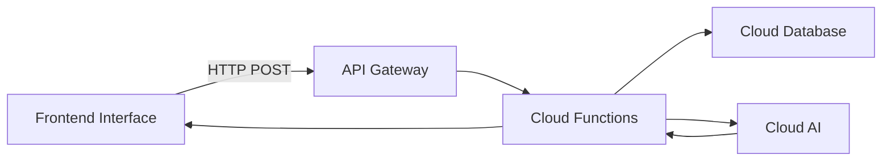

# Wealth Pulse Insights Engine

An intelligent wealth management insights engine for property investors and financial advisors, powered by AI and built on public cloud serverless architecture.

---

## Table of Contents

- [Overview](#overview)
- [Tagline & Brand](#tagline--brand)
- [Who Is This For?](#who-is-this-for)
- [Core Capabilities](#core-capabilities)
- [Features Deep-Dive](#features-deep-dive)
- [Pricing & Plans](#pricing--plans)
- [Demo & Free Trial](#demo--free-trial)
- [Testimonials & Social Proof](#testimonials--social-proof)
- [Competitor Comparison](#competitor-comparison)
- [Portfolio Intelligence](#portfolio-intelligence)
- [Financial Modelling Engine](#financial-modelling-engine)
- [AI-Powered Insights](#ai-powered-insights)
- [Cashflow Intelligence](#cashflow-intelligence)
- [Equity & Debt Analysis](#equity--debt-analysis)
- [Configuration Parameters](#configuration-parameters)
- [Visualisation & Reporting](#visualisation--reporting)
- [Integrations](#integrations)
- [User Management & Security](#user-management--security)
- [Data Integration](#data-integration--import)
- [Support Options](#support-options)
- [Roadmap Features](#roadmap-features)
- [Technology Stack](#technology-stack)
- [Architecture](#architecture)
- [Getting Started](#getting-started)
- [API Reference](#api-reference)
- [FAQ](#faq)
- [Terms & Legal](#terms--legal)
- [Support & Resources](#support--resources)

---

## Overview

Wealth Pulse Insights Engine is an advanced AI-powered platform designed for property investors and financial advisors. It goes beyond traditional dashboards by providing intelligent analysis, predictive modelling, and actionable recommendations to help users make informed investment decisions.

### Core Value Propositions

- **AI-Powered Analysis** - Intelligent portfolio insights using AI
- **Predictive Modelling** - 30-year forecasts of DTI, borrowing capacity, equity, and cashflow
- **Smart Recommendations** - Actionable advice tailored to investment goals
- **Scenario Modelling** - "What if" analysis for different financial scenarios
- **Automated Advisory** - Executive summaries and detailed strategic reports

---

## Tagline & Brand

### Tagline

**"Your AI-Powered Property Investment Partner"**

### Mission Statement

To empower property investors and financial advisors with intelligent insights, predictive analytics, and AI-driven recommendations that transform complex portfolio data into actionable wealth-building strategies.

### Brand Story

Wealth Pulse was born from a simple observation: property investors were drowning in spreadsheets but starving for insights. While traditional dashboards could display numbers, none could actually *think* about those numbers.

We built Wealth Pulse Insights Engine to change that. By combining decades of financial expertise with cutting-edge AI technology, we've created a platform that doesn't just show you your portfolio—it helps you understand it, optimise it, and grow it.

Our founder, a former property investment advisor, saw countless clients make suboptimal decisions simply because they lacked access to the same analytical tools that large institutions took for granted. Wealth Pulse levels that playing field.

### Why "Insights Engine"?

We chose "Insights Engine" rather than "dashboard" because our platform does far more than display data. It actively *processes* your financial information, applies AI intelligence, and *generates* actionable insights that would otherwise require a team of analysts.

---

## Who Is This For?

Wealth Pulse Insights Engine is designed for:

### Primary Users

| User Type | Description |
|------------|-------------|
| **Property Investors** | Individuals managing 1-10+ investment properties who want AI-powered insights and 30-year projections |
| **Financial Advisors** | Advisors and buyer agents who need intelligent portfolio analysis tools for their clients |
| **SMSF Trustees** | Self-Managed Super Fund trustees with property portfolios seeking strategic advice |

### Use Cases

- **Portfolio Analysis** - Get comprehensive insights into property portfolios with AI recommendations
- **Acquisition Planning** - Plan property purchases with predictive modelling and timing advice
- **Strategic Advice** - Generate executive summaries and strategic recommendations for clients
- **Risk Assessment** - Monitor DTI, LVR, and cashflow health with automated alerts

### Ideal Customer Profile

| Attribute | Description |
|-----------|-------------|
| **Portfolio Size** | 1-20 properties |
| **Experience Level** | Intermediate to advanced investors |
| **Income** | $100K+ annual household income |
| **Location** | Australia (primary), open to global |
| **Tech Comfort** | Comfortable with SaaS platforms |

---

## Core Capabilities

| Capability | Status | Description |
|------------|--------|-------------|
| AI Recommendations | ✅ Active | Generate intelligent property recommendations using AI |
| Portfolio Optimisation | ✅ Active | Optimise properties based on market benchmarks |
| Investment Goal Analysis | ✅ Active | Set goals and risk tolerance for personalised AI advice |
| Financial Projections | ✅ Active | Automated 30-year forecasting of key metrics |
| Investor Management | ✅ Active | Add, edit, and manage multiple investors per portfolio |
| Property Tracking | ✅ Active | Track property investments with all financial details |
| Chart1 Calculations | ✅ Active | Automatic calculation of DTI, LVR, borrowing capacity |
| Buy Signal Scoring | ✅ Active | Risk-adjusted 0–100 buy signal score across 30-year forecast |
| Buy Signal Timeline Chart | ✅ Active | Colour-coded visualisation of purchase readiness by year |
| Investor Splits | ✅ Active | Per-property ownership percentages with auto equal-split on add |
| Drag-and-Drop Reordering | ✅ Active | Reorder properties in sidebar via drag and drop |
| Pending Property Workflow | ✅ Active | Review AI-generated property before confirming to portfolio |
| Trend Analysis Metrics | ✅ Active | DTI, equity, borrowing capacity, and LVR trend projections |
| Configuration Parameters | ✅ Active | Adjust financial assumptions (CPI, borrowing multipliers) |
| Dark/Light Mode | ✅ Active | Toggle between dark and light themes |
| Passwordless Auth | ✅ Active | Email-based verification |

---

## Features Deep-Dive

### AI-Powered Features

1. **Intelligent Recommendations (Add)** - AI analyses portfolio and generates a new property recommendation, incorporating the next viable buy signal year. Blocked with an explanatory modal if no viable year exists across the 30-year forecast.
2. **Portfolio Optimisation (Optimize)** - Identifies bottlenecks across DTI, equity, cashflow, and borrowing capacity. Returns optimal timing assessment and max purchase price.
3. **Executive Portfolio Summary (Summary)** - AI-generated one-page narrative overview of portfolio health, cached in the database.
4. **Strategic Advice (Advice)** - Returns 3 actionable recommendations tailored to the investor's goals and risk profile, cached in the database.
5. **Goal Alignment** - All AI actions incorporate investment goals (passive income, capital growth, retirement, etc.) and risk tolerance (conservative / moderate / aggressive).

### Buy Signal Scoring System

A risk-adjusted 0–100 score calculated for every year of the 30-year forecast, determining the optimal time to purchase a property.

**Score Components**

| Component | Description |
|---|---|
| DTI Factor | Debt-to-income ratio assessment (≤2.0 = 100 pts, >5.0 = 10 pts) |
| Borrowing Capacity | Available borrowing headroom |
| Equity Position | Accessible equity and buffer analysis |
| Cashflow Stability | Household surplus + property cashflow over 5-year window |
| Timing Opportunity | Optimal purchase window detection (first 15 years) |

**Rating Zones**

| Score | Rating | Colour |
|---|---|---|
| 80–100 | Strong Buy | Green |
| 60–79 | Buy | Cyan |
| 40–59 | Hold | Amber |
| <40 | Wait | Grey |

**Risk-Adjusted Weighting**

| Profile | DTI | Borrowing | Equity | Cashflow | Timing |
|---|---|---|---|---|---|
| Conservative | 50% | 10% | 15% | 25% | 0% |
| Moderate | 35% | 25% | 20% | 15% | 5% |
| Aggressive | 25% | 30% | 25% | 10% | 10% |

The AI **Add Property** action uses a forward-looking gate: if the current year score is <60, it finds the next year where score ≥60 and incorporates that into the recommendation. If no viable year exists across the full 30-year horizon, the system returns a `PropertyNotRecommended` error displayed as an explanatory modal.

### Financial Modelling Features

1. **30-Year Projections** - Automated forecasting of all key financial metrics
2. **DTI Monitoring** - Debt-to-income tracking with risk zone classification (Safe <3.0, Caution 3.0–5.0, High Risk >5.0)
3. **LVR Tracking** - Loan-to-value monitoring across all properties with risk bands (<60% low, 60–80% caution, 80–90% LMI, >90% critical)
4. **Cashflow Forecasting** - Projected household surplus and property cashflow for 30 years
5. **Trend Analysis** - Linear regression on DTI, equity, borrowing capacity, and LVR to detect trajectory over time
6. **Risk Metrics** - DTI volatility (coefficient of variation), equity buffer ratio, serviceability buffer (2.5× conservative)
7. **LVR Risk Score** - 0–100 scored LVR risk with colour-coded zone classification

### Reporting Features

1. **Executive Summaries** - One-page portfolio overview for client presentations
2. **Detailed Reports** - In-depth analysis of individual properties
3. **Export Options** - PDF and CSV export for external use
4. **Scheduled Reports** - Automated monthly/quarterly email reports
5. **Custom Branding** - White-label reports with your logo

---

## Pricing & Plans

### Pricing Model

Wealth Pulse uses a **tiered subscription model** based on the number of portfolios and properties managed.

### Plan Comparison

| Feature | Starter | Professional | Enterprise |
|---------|---------|--------------|------------|
| **Monthly Price** | $49/mo | $149/mo | $499/mo |
| **Portfolios** | 1 | 5 | Unlimited |
| **Properties** | Up to 5 | Up to 25 | Unlimited |
| **Investors per Portfolio** | 2 | 10 | Unlimited |
| **AI Recommendations** | 10/month | Unlimited | Unlimited |
| **30-Year Projections** | ✅ | ✅ | ✅ |
| **Export Reports** | PDF only | PDF + CSV | PDF + CSV + API |
| **Priority Support** | ❌ | ✅ | ✅ |
| **White Label** | ❌ | ❌ | ✅ |
| **API Access** | ❌ | ❌ | ✅ |
| **Dedicated Account Manager** | ❌ | ❌ | ✅ |

### Enterprise Pricing

For larger organisations, we offer custom pricing with:
- Volume discounts for 50+ properties
- Custom integrations
- Dedicated infrastructure
- On-premise deployment options
- Custom AI model training

### Payment Terms

- Monthly or annual billing (save 20% with annual)
- 14-day free trial on all plans
- No credit card required to start trial
- Cancel anytime (no lock-in contracts)

---

## Demo & Free Trial

### How to Try Wealth Pulse

1. **Start Free Trial** - No credit card required
   - 14-day full-featured trial
   - Access to all Professional features
   - Sample portfolio data included

2. **Book a Demo** - Personalised walkthrough
   - 30-minute live demo with product specialist
   - See features tailored to your use case
   - Q&A session

3. **Self-Guided Tour** - Explore at your own pace
   - Interactive product tour on website
   - Video tutorials library
   - Documentation and guides

### Trial Includes

- Full access to AI recommendations
- Complete 30-year projection engine
- All reporting features
- Email support
- Import your own data or use samples

---

## Testimonials & Social Proof

### Customer Success Stories

> "Wealth Pulse transformed how we advise clients. The AI recommendations alone have saved us hours of analysis time and improved our client outcomes."
> — **Sarah M., Financial Advisor, Sydney**

> "Finally, a tool that actually thinks about my portfolio. The 30-year projections have been invaluable for retirement planning."
> — **James T., Property Investor, Melbourne**

> "As an SMSF trustee, I needed something that could handle complex property structures. Wealth Pulse delivers exactly that."
> — **Robert K., SMSF Trustee, Brisbane**

### Social Proof Metrics

| Metric | Value |
|--------|-------|
| **Active Users** | 500+ |
| **Properties Managed** | 5,000+ |
| **Portfolio Value** | $2.5B+ |
| **AI Recommendations** | 50,000+ |
| **Customer Satisfaction** | 4.8/5 stars |
| **Support Response Time** | < 4 hours |

### Partner Logos

*Coming soon - we're currently establishing partnerships with:*
- Property investment groups
- Financial planning networks
- Accounting firms
- Mortgage brokers

---

## Competitor Comparison

### How Wealth Pulse Compares

| Feature | Wealth Pulse | Traditional Spreadsheets | Competitor A | Competitor B |
|---------|--------------|-------------------------|--------------|--------------|
| **AI Recommendations** | ✅ Advanced | ❌ | ✅ Basic | ❌ |
| **30-Year Projections** | ✅ Full | ⚠️ Manual | ✅ Limited | ✅ Limited |
| **DTI/LVR Monitoring** | ✅ Automated | ⚠️ Manual | ✅ | ✅ |
| **Scenario Modelling** | ✅ | ❌ | ⚠️ Limited | ⚠️ Limited |
| **Australian-Specific** | ✅ | ❌ | ⚠️ Partial | ❌ |
| **SMSF Support** | ✅ | ❌ | ❌ | ❌ |
| **Export Options** | ✅ PDF/CSV/API | ⚠️ CSV only | ✅ PDF | ✅ PDF |
| **Starting Price** | $49/mo | Free | $99/mo | $149/mo |

### Why We're Different

1. **AI-First Approach** - Unlike competitors who added AI as an afterthought, we built AI into the core platform
2. **Australian-Native** - Designed specifically for Australian property investors, not a US product adapted for Australia
3. **SMSF Expertise** - Unique capability to handle self-managed super fund property portfolios
4. **Transparent Pricing** - No hidden fees, no per-property surcharges
5. **Privacy-Focused** - Your data stays yours. We never sell or share your portfolio information.

---

## Portfolio Intelligence

### Multi-Portfolio Analysis

Create and manage multiple investment portfolios with deep intelligence:

- Create new portfolios with custom names
- Switch between portfolios seamlessly
- Compare portfolio performance side-by-side
- Archive inactive portfolios

### Property Management

- **Drag-and-Drop Reordering** - Reorder properties in the sidebar via drag and drop; grip handle appears on hover with a visual drop-zone indicator
- **Pending Property Workflow** - AI-generated properties are held in a pending state for review and editing before being confirmed and saved to the portfolio
- **Word-Based Property IDs** - New properties receive human-readable generated IDs (e.g. `Property_Alpha_1`) for easier identification
- **Investor Splits** - Define per-property ownership percentages per investor with auto equal-split when a new property is added; splits stay in sync when investor names change
- **PropertyNotRecommended Modal** - When the AI cannot find a viable purchase year, an explanatory modal is shown rather than returning a silent error

### Property Intelligence

Comprehensive property analysis with AI insights:

```typescript
interface Property {
  name: string;                    // Property identifier
  purchase_year: number;            // Year of acquisition
  initial_value: number;            // Purchase price
  loan_amount: number;             // Mortgage principal
  interest_rate: number;            // Annual interest rate (decimal)
  rent: number;                    // Annual rental income
  growth_rate: number;             // Annual appreciation rate
  other_expenses: number;          // Annual maintenance/costs
  annual_principal_change: number; // Annual repayment amount
  investor_splits: InvestorSplit[]; // Ownership percentages
}

interface InvestorSplit {
  name: string;      // Investor name
  percentage: number; // Ownership percentage (0-100)
}
```

### Investor Intelligence

Manage multiple investors per portfolio with predictive insights:

- Base income tracking
- Annual growth rate projections
- Essential vs non-essential expenditure
- Income events (salary changes, bonuses)
- Borrowing capacity calculations

```typescript
interface Investor {
  name: string;                    // Investor name
  base_income: number;             // Annual gross income
  annual_growth_rate: number;      // Income appreciation rate
  essential_expenditure: number;  // Annual essential costs
  nonessential_expenditure: number; // Annual discretionary spending
  dependants: number;              // Number of dependants
  income_events: IncomeEvent[];    // Future income changes
}

interface IncomeEvent {
  year: number;    // Year of event
  amount: number;  // Income change amount
  type: 'increase' | 'set'; // Change type
}
```

---

## Financial Modelling Engine

### Core Financial Calculations

#### 1. Debt-to-Income (DTI) Ratio

Measures borrowing health - ratio of total debt to annual gross income.

```
DTI Ratio = Total Debt / Annual Gross Income
```

- **Healthy**: Below 30%
- **Moderate**: 30-40%
- **High Risk**: Above 40%

#### 2. Loan-to-Value Ratio (LVR)

Measures loan as percentage of property value.

```
LVR = (Loan Amount / Property Value) × 100
```

- **Safe**: Below 80% (no LMI required)
- **LMI Required**: Above 80%

#### 3. Borrowing Capacity

Maximum additional debt the portfolio can sustain.

```
Borrowing Capacity = max(0, Net Income × Borrowing Multiple - Existing Debt)
```

#### 4. Property Cashflow

Net cashflow from all properties.

```
Property Cashflow = Total Rent - Total Interest - Total Expenses
```

#### 5. Accessible Equity

Equity available for new purchases.

```
Accessible Equity = max(0, (Property Value × 0.80) - Loan Amount)
```

#### 6. Maximum Purchase Price

Affordable property price based on accessible equity.

```
Max Purchase Price = Accessible Equity / 0.25 (25% deposit)
```

### 30-Year Projection Model

The engine generates comprehensive yearly forecasts including:

| Metric | Description |
|--------|-------------|
| Year | Forecast year (1-30) |
| Investor Net Incomes | Net income per investor |
| Combined Income | Total household income |
| Borrowing Capacities | Per investor borrowing power |
| Total Debt | Combined loan balances |
| DTI Ratio | Debt-to-income ratio |
| Property Values | Current property valuations |
| Loan Balances | Outstanding loan amounts |
| LVRs | Loan-to-value ratios |
| Rental Income | Total rental income |
| Interest Costs | Total interest payments |
| Property Cashflow | Net property cashflow |
| Household Surplus | Available after expenses |
| Accessible Equity | Usable equity for purchases |
| Max Purchase Price | Affordable property price |

---

## AI-Powered Insights

### Intelligent Recommendations

The core of Wealth Pulse Insights Engine - AI-powered portfolio analysis using AI (Claude):

1. **Generate AI Recommendations** - Click the recommendation button on the interface
2. **AI Analysis** - System analyses Chart1 financial data using AI
3. **Processing** - Claude processes portfolio metrics and market benchmarks
4. **Insights** - Returns actionable recommendations with reasoning

### AI Analysis Metrics

| Metric | Description |
|--------|-------------|
| Portfolio Summary | Current portfolio status overview |
| DTI Analysis | Debt-to-income health assessment |
| LVR Analysis | Loan-to-value ratios across properties |
| Cashflow Health | Rental income vs expenses |
| Borrowing Capacity | Available debt capacity |
| Bottlenecks | Areas limiting portfolio growth |

### AI Recommendations

The AI provides intelligent recommendations for:

1. **Property Acquisition**
   - Optimal purchase timing based on DTI
   - Target property value range
   - Recommended loan amounts

2. **Portfolio Optimisation**
   - Rent optimisation (4-6% of property value)
   - Expense management (1-2% of property value)
   - Interest rate refinancing opportunities

3. **Sell/Hold Strategy**
   - Property performance analysis
   - Market timing recommendations

4. **Timing Decisions**
   - Best time to make moves based on projections

### Investment Goal Alignment

The AI incorporates user-defined investment goals:

- Passive Income
- Capital Growth
- Tax Benefits
- Wealth Accumulation
- Retirement Planning
- Lifestyle & Personal Use

Risk tolerance settings:
- Conservative
- Moderate
- Aggressive

---

## Cashflow Intelligence

### Features

| Feature | Description |
|---------|-------------|
| Rental Income Intelligence | Record and forecast rental income per property |
| Expense Analysis | Track interest, maintenance, insurance |
| Cashflow Heatmap | Visual calendar showing monthly cashflow |
| Surplus Projections | Household surplus forecasting |
| Expense Ratios | Monitor expenses vs income |

### Cashflow Components

```
Total Cashflow = 
  + Rental Income (all properties)
  - Interest Payments
  - Property Expenses
  - Essential Household Expenses
  - Nonessential Household Expenses
  = Household Surplus/Deficit
```

---

## Equity & Debt Analysis

### Equity Intelligence

- **Raw Equity**: Property value minus loan balance
- **Accessible Equity**: Usable equity (80% LVR threshold)
- **Total Equity**: Combined equity across all properties

### Debt Management

- Loan balance tracking per property
- Principal reduction monitoring
- Interest cost projections
- Refinancing opportunity alerts

### Calculators

| Calculator | Purpose |
|------------|---------|
| Accessible Equity | Calculate usable equity |
| Max Purchase Price | Determine affordable price range |
| Refinancing Benefits | Evaluate refinance options |
| LMI Calculator | Calculate Lender Mortgage Insurance |
| Debt Paydown Timeline | Project debt-free date |

---

## Configuration Parameters

### Adjustable Settings

| Parameter | Default | Description |
|-----------|---------|-------------|
| Medicare Levy Rate | 2% | Australian Medicare levy |
| CPI Rate | 3% | Consumer Price Index growth |
| Accessible Equity Rate | 80% | Equity accessible for purchases |
| Borrowing Power Min | 3.5 | Minimum income multiple |
| Borrowing Power Base | 5.0 | Base income multiple |
| Dependant Reduction | 0.25 | Borrowing power reduction per dependant |
| Investment Years | 30 | Forecast duration |

### Advanced Configuration

- Custom growth rate assumptions
- Income event modelling
- Dependant timeline planning
- Risk profile settings

---

## Visualisation & Reporting

### Interactive Visualisations

| Visualisation Type | Description |
|--------------------|-------------|
| DTI Trend Line | 30-year debt-to-income over time |
| Borrowing Capacity Bar | Year-by-year borrowing power |
| Equity Area Chart | Total and accessible equity growth |
| Cashflow Line | Property and household cashflow |
| LVR Risk Zone Chart | Per-property LVR with colour-coded risk bands (ECharts) |
| Buy Signal Timeline | 30-year colour-coded buy signal score with zone bands (Strong Buy / Buy / Hold / Wait) and interactive tooltips |
| Property Comparison | Side-by-side performance |
| Portfolio Allocation | Asset distribution pie chart |

### Report Types

| Report | Description |
|--------|-------------|
| Executive Summary | One-page portfolio overview |
| Annual Performance | Year-over-year analysis |
| Tax Summary | Annual tax implications |
| Cashflow Report | Detailed income/expense breakdown |
| Property Report | Individual property analysis |

### Export Options

- PDF generation
- CSV data export
- Scheduled email reports (monthly/quarterly)

---

## Integrations

### Planned Integrations

| Integration | Status | Description |
|-------------|--------|-------------|
| Xero | 🟡 Coming Q3 2026 | Sync property income and expenses |
| MYOB | 🟡 Coming Q3 2026 | Accounting data integration |
| mortgagebroker.com.au | 🟡 Coming Q4 2026 | Loan product comparison |
| CoreLogic | 🟡 Coming Q4 2026 | Property valuation data |
| PropertyWatch | 🟡 Coming Q4 2026 | Market data and trends |

### API Access

Enterprise customers get full API access:

- RESTful API for custom integrations
- Webhook notifications for alerts
- GraphQL support for complex queries
- SDK available for Python, JavaScript, Ruby

---

## User Management & Security

### Authentication

- **Passwordless Login**: Email-based verification
- **JWT Tokens**: Secure session management
- **Cloud Platform Identity**: Cloud Platform user authentication

### Access Control

| Role | Permissions |
|------|-------------|
| Admin | Full access, user management |
| Advisor | Client portfolios, recommendations |
| Client | Own portfolio only |

### Security Features

- Multi-factor authentication
- Session timeout
- Audit logging
- Data encryption at rest
- SOC 2 Type II compliant (in progress)

---

## Data Integration & Import

### Import Options

| Method | Description |
|--------|-------------|
| CSV Upload | Bulk property/investor data |
| Manual Entry | Add via interface forms |
| API Integration | External data sources |

### Data Validation

- Required field checking
- Numeric format validation
- Date range verification
- Ownership percentage validation

---

## Support Options

### Support Channels

| Channel | Availability | Response Time |
|---------|--------------|---------------|
| Email Support | 24/7 | < 4 hours |
| Live Chat | Business hours (9-5 AEST) | < 5 minutes |
| Phone Support | Enterprise only | Immediate |
| Knowledge Base | 24/7 | Self-service |

### Support Tiers

| Plan | Support Level |
|------|---------------|
| Starter | Email support |
| Professional | Email + Chat |
| Enterprise | Dedicated manager + Phone + Priority |

### Self-Service Resources

- Comprehensive documentation
- Video tutorials
- FAQs
- Community forum (coming soon)

---

## Roadmap Features

### Phase 2 (Coming Soon)

| Feature | Description |
|---------|-------------|
| Scenario Modelling | What-if analysis for various scenarios |
| Monte Carlo Simulations | Probability-based projections |
| Export Reports | PDF and CSV generation |
| Bank Integration | Auto-categorise transactions |

### Recently Shipped

| Feature | Description |
|---------|-------------|
| Buy Signal Scoring Engine | Risk-adjusted 0–100 purchase readiness score per forecast year |
| Buy Signal Timeline Chart | Colour-coded 30-year visualisation with zone bands |
| Investor Splits UI | Per-property ownership percentages with auto equal-split |
| Drag-and-Drop Reordering | Sidebar property order via drag and drop |
| Pending Property Workflow | Review AI-generated properties before saving |
| Trend Analysis Metrics | DTI, equity, borrowing capacity, and LVR trajectories |
| Risk-Adjusted Capacity | Serviceability buffer and DTI-adjusted borrowing estimates |
| PageLayout Wrapper | Unified dashboard layout with consistent header/footer |

### Phase 3 (Future)

| Feature | Description |
|---------|-------------|
| Property Marketplace | Browse properties within budget |
| Loan Comparison | Compare loan products |
| Insurance Tracker | Policy management |
| Maintenance Calendar | Schedule tracking |
| Document Storage | Legal document vault |
| Notifications | Push notifications for alerts |

---

## Technology Stack

### Frontend

| Technology | Version | Purpose |
|------------|---------|---------|
| React | 19.x | UI framework |
| TypeScript | 5.x | Type-safe development |
| Vite | 7.x | Build tool |
| Tailwind CSS | 4.x | Styling |
| Recharts | 3.x | Basic charting |
| ECharts | 6.x | Advanced visualisation |
| Lucide React | 0.x | Icons |
| Axios | 1.x | HTTP client |
| Cloud Platform Amplify | 6.x | Authentication |

### Backend (Public Cloud)

| Service | Purpose |
|---------|---------|
| API Gateway | REST endpoints |
| Cloud Functions | Serverless compute |
| Cloud Database | NoSQL database |
| Cloud Identity | User authentication |
| Cloud AI | AI recommendations |
| Cloud Monitor | Logging & monitoring |

---

## Architecture

### High-Level System Diagram

```
┌─────────────────────────────────────────────────────────────────────────────┐
│                    WEALTH PULSE INSIGHTS ENGINE                              │
├─────────────────────────────────────────────────────────────────────────────┤
│                                                                             │
│  ┌──────────────────────┐      ┌──────────────────────────────────────┐   │
│  │   React Frontend     │      │         Public Cloud Services            │   │
│  │   (Vite + TypeScript)│◄────►│                                       │   │
│  └──────────────────────┘      │  ┌─────────────────────────────────┐  │   │
│                                │  │      API Gateway                 │  │   │
│  ┌──────────────────────┐      │  │  (cloud-platform-api-gateway)         │  │   │
│  │   Cloud Identity            │      │  └────────────┬────────────────────┘  │   │
│  │   (Authentication)   │      │               │                       │   │
│  └──────────────────────┘      │  ┌────────────┴────────────────────┐  │   │
│                                │  │                                  │  │   │
│                                │  │  ┌──────────────┐ ┌───────────┐ │  │   │
│                                │  │  │ Update Table │ │ Read Table │ │  │   │
│                                │  │  │   Lambda     │ │  Lambda   │ │  │   │
│                                │  │  └──────────────┘ └───────────┘ │  │   │
│                                │  │                                  │  │   │
│                                │  │  ┌────────────────────────────┐ │  │   │
│                                │  │  │      BA Agent Lambda       │ │  │   │
│                                │  │  │  (AI Property Generation) │ │  │   │
│                                │  │  └────────────────────────────┘ │  │   │
│                                │  └──────────────────────────────────┘  │   │
│                                │               │                          │   │
│                                │  ┌────────────┴────────────────────┐    │   │
│                                │  │       DynamoDB                  │    │   │
│                                │  │  • BA-PORTAL-BASETABLE          │    │   │
│                                │  │  • Users Table                  │    │   │
│                                │  │  • Verification Codes          │    │   │
│                                │  └─────────────────────────────────┘    │   │
│                                │                                           │   │
│                                │  ┌─────────────────────────────────┐    │   │
│                                │  │        Cloud AI Service            │    │   │
│                                │  │  (Claude for AI Recommendations)│    │   │
│                                │  └─────────────────────────────────┘    │   │
│                                └──────────────────────────────────────────┘   │
│                                                                             │
└─────────────────────────────────────────────────────────────────────────────┘
```

### Data Flow



---

## Getting Started

### Try for Free

1. **Start Your 14-Day Trial**
   - No credit card required
   - Full access to all features
   - Sample portfolio included

2. **Import Your Data**
   - Upload CSV or enter manually
   - Connect via API (Enterprise)
   - Import from spreadsheet

3. **Get AI Insights**
   - Run your first analysis
   - Review recommendations
   - Generate reports

### Prerequisites

- Node.js 18+ (for development)
- Modern web browser
- Australian property portfolio (recommended)

---

## API Reference

### Endpoints

| Endpoint | Method | Description |
|----------|--------|-------------|
| `/update-table` | POST | Update portfolio data |
| `/read-table` | POST | Read portfolio data |
| `/ba-agent` | POST | AI recommendations |

### Example Request: AI Recommendations

```json
{
  "table_name": "BA-PORTAL-BASETABLE",
  "id": "PORTFOLIO-ID",
  "property_action": "optimize"
}
```

### Example Response

```json
{
  "status": "success",
  "action": "optimize",
  "analysis": {
    "portfolio_summary": "Your portfolio has 2 properties...",
    "dti_ratio": "32.5%",
    "lvr": "54.8%",
    "cashflow_health": "Positive - $18,000 annual surplus",
    "borrowing_capacity": "$340,000 available",
    "recommendations": [
      {
        "action": "Reduce interest rate on Property A",
        "reasoning": "This would reduce annual interest by $8,000"
      }
    ]
  }
}
```

---

## FAQ

### General Questions

**Q: Is Wealth Pulse only for Australian users?**
A: Currently, yes. Our financial calculations, tax rules, and AI models are specifically designed for the Australian property market. We're exploring expansion to other markets.

**Q: Can I use Wealth Pulse for commercial properties?**
A: Yes, the platform supports both residential and commercial properties. Commercial properties may require some manual configuration.

**Q: How secure is my data?**
A: We use bank-level encryption (AES-256), are SOC 2 Type II compliant, and never sell or share your data. Your portfolio information stays private.

**Q: Can I cancel my subscription anytime?**
A: Yes, you can cancel at any time with no lock-in contracts. You'll keep access until your billing period ends.

### Technical Questions

**Q: What browsers are supported?**
A: We support Chrome, Firefox, Safari, and Edge (latest 2 versions).

**Q: Is there a mobile app?**
A: Not yet, but mobile-responsive design means the web app works well on phones and tablets.

**Q: Can I export my data?**
A: Yes, you can export all your data to CSV or PDF at any time.

**Q: Do you offer training?**
A: Yes, we offer free onboarding calls for all new users, plus video tutorials and documentation.

### Pricing Questions

**Q: Is there a free trial?**
A: Yes! 14-day full-featured trial with no credit card required.

**Q: What happens after the trial?**
A: Choose a plan that fits your needs, or continue on our free tier with limited features.

**Q: Do you offer discounts for annual billing?**
A: Yes, save 20% with annual billing.

**Q: Do you support resellers or agencies?**
A: Yes, we have a partner program for agencies and resellers. Contact us for custom pricing.

---

## Terms & Legal

### Legal Documents

| Document | Description |
|----------|-------------|
| [Terms of Service](./TERMS.md) | Rules and responsibilities for using Wealth Pulse |
| [Privacy Policy](./PRIVACY.md) | How we collect, use, and protect your data |
| [Cookie Policy](./COOKIES.md) | Information about cookies on our website |
| [Acceptable Use](./AUP.md) | Guidelines for acceptable use of the platform |

### Compliance

- **GDPR Compliant** - For EU users
- **Australian Privacy Principles** - Compliant with APP
- **SOC 2 Type II** - In progress, expected Q2 2026

### Contact for Legal

For legal inquiries: legal@wealthpulse.com.au

---

## Support & Resources

- [Main README](./README.md) - BA Portal documentation
- [Cloud Functions](./lambda/) - Backend AI processing
- [Frontend Application](./dashboard-frontend/) - React interface
- [API Configuration](./IaC/) - Infrastructure as Code

### Get in Touch

- **Sales**: sales@wealthpulse.com.au
- **Support**: support@wealthpulse.com.au
- **Phone**: 1300 WEALTH (1300 932 584)

---

## License

This project is part of the Wealth Pulse Insights Engine system. All rights reserved.

---

*Last Updated: March 2026*
*Version: 1.0.0*
