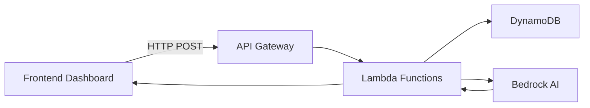

# Wealth Pulse - Comprehensive Feature Documentation

A comprehensive wealth management dashboard for property investors and financial advisors, built with React, TypeScript, and AWS serverless architecture.

---

## Table of Contents

- [Overview](#overview)
- [Core Features](#core-features)
- [Portfolio Management](#portfolio-management)
- [Financial Analytics](#financial-analytics--projections)
- [AI-Powered Insights](#ai-powered-insights)
- [Cashflow Management](#cashflow-management)
- [Equity \& Debt Management](#equity--debt-management)
- [Configuration Parameters](#configuration-parameters)
- [Visualization \& Reporting](#visualization--reporting)
- [User Management](#user-management--security)
- [Data Integration](#data-integration--import)
- [Roadmap Features](#roadmap-features)
- [Technology Stack](#technology-stack)
- [Architecture](#architecture)

---

## Overview

Wealth Pulse is an advanced wealth management dashboard designed for property investors and financial advisors. It provides comprehensive portfolio tracking, financial projections, AI-powered recommendations, and sophisticated analytics to help users make informed investment decisions.

### Key Value Propositions

- **Real-time Portfolio Monitoring** - Track properties, investors, and financial metrics in one place
- **30-Year Projections** - Automated forecasting of DTI, borrowing capacity, equity, and cashflow
- **AI-Powered Insights** - Intelligent recommendations using AWS Bedrock
- **Scenario Modelling** - "What if" analysis for different financial scenarios
- **Professional Reporting** - Generate executive summaries and detailed reports

---

## Core Features

| Feature | Status | Description |
|---------|--------|-------------|
| Dashboard Analytics | ✅ Active | Interactive charts showing 30-year financial projections |
| Investor Management | ✅ Active | Add, edit, and manage multiple investors per portfolio |
| Property Tracking | ✅ Active | Track property investments with all financial details |
| Chart1 Calculations | ✅ Active | Automatic calculation of DTI, LVR, borrowing capacity |
| AI Recommendations | ✅ Active | Generate property recommendations using Bedrock |
| Portfolio Optimization | ✅ Active | Optimize properties based on market benchmarks |
| Investment Goals | ✅ Active | Set goals and risk tolerance for personalized AI advice |
| Configuration Parameters | ✅ Active | Adjust financial assumptions (CPI, borrowing multipliers) |
| Dark/Light Mode | ✅ Active | Toggle between dark and light themes |
| Passwordless Auth | ✅ Active | Email-based verification via AWS Cognito |

---

## Portfolio Management

### Multi-Portfolio Support

Create and manage multiple investment portfolios:

- Create new portfolios with custom names
- Switch between portfolios seamlessly
- Compare portfolio performance side-by-side
- Archive inactive portfolios

### Property Tracking

Comprehensive property management:

```typescript
interface Property {
  name: string;                    // Property identifier
  purchase_year: number;            // Year of acquisition
  initial_value: number;            // Purchase price
  loan_amount: number;              // Mortgage principal
  interest_rate: number;            // Annual interest rate (decimal)
  rent: number;                     // Annual rental income
  growth_rate: number;              // Annual appreciation rate
  other_expenses: number;           // Annual maintenance/costs
  annual_principal_change: number; // Annual repayment amount
  investor_splits: InvestorSplit[];  // Ownership percentages
}

interface InvestorSplit {
  name: string;      // Investor name
  percentage: number; // Ownership percentage (0-100)
}
```

### Investor Management

Manage multiple investors per portfolio:

- Base income tracking
- Annual growth rate projections
- Essential vs non-essential expenditure
- Income events (salary changes, bonuses)
- Borrowing capacity calculations

```typescript
interface Investor {
  name: string;                    // Investor name
  base_income: number;             // Annual gross income
  annual_growth_rate: number;      // Income appreciation rate
  essential_expenditure: number;  // Annual essential costs
  nonessential_expenditure: number; // Annual discretionary spending
  dependants: number;              // Number of dependants
  income_events: IncomeEvent[];    // Future income changes
}

interface IncomeEvent {
  year: number;    // Year of event
  amount: number;  // Income change amount
  type: 'increase' | 'set'; // Change type
}
```

---

## Financial Analytics & Projections

### Core Financial Calculations

#### 1. Debt-to-Income (DTI) Ratio

Measures borrowing health - ratio of total debt to annual gross income.

```
DTI Ratio = Total Debt / Annual Gross Income
```

- **Healthy**: Below 30%
- **Moderate**: 30-40%
- **High Risk**: Above 40%

#### 2. Loan-to-Value Ratio (LVR)

Measures loan as percentage of property value.

```
LVR = (Loan Amount / Property Value) × 100
```

- **Safe**: Below 80% (no LMI required)
- **LMI Required**: Above 80%

#### 3. Borrowing Capacity

Maximum additional debt the portfolio can sustain.

```
Borrowing Capacity = max(0, Net Income × Borrowing Multiple - Existing Debt)
```

#### 4. Property Cashflow

Net cashflow from all properties.

```
Property Cashflow = Total Rent - Total Interest - Total Expenses
```

#### 5. Accessible Equity

Equity available for new purchases.

```
Accessible Equity = max(0, (Property Value × 0.80) - Loan Amount)
```

#### 6. Maximum Purchase Price

Affordable property price based on accessible equity.

```
Max Purchase Price = Accessible Equity / 0.25 (25% deposit)
```

### 30-Year Projection Model

The dashboard generates comprehensive yearly forecasts including:

| Metric | Description |
|--------|-------------|
| Year | Forecast year (1-30) |
| Investor Net Incomes | Net income per investor |
| Combined Income | Total household income |
| Borrowing Capacities | Per investor borrowing power |
| Total Debt | Combined loan balances |
| DTI Ratio | Debt-to-income ratio |
| Property Values | Current property valuations |
| Loan Balances | Outstanding loan amounts |
| LVRs | Loan-to-value ratios |
| Rental Income | Total rental income |
| Interest Costs | Total interest payments |
| Property Cashflow | Net property cashflow |
| Household Surplus | Available after expenses |
| Accessible Equity | Usable equity for purchases |
| Max Purchase Price | Affordable property price |

---

## AI-Powered Insights

### Generate AI Recommendations

Intelligent portfolio analysis using AWS Bedrock (Claude):

1. **Click "Generate AI Recommendations"** on the dashboard
2. System analyses Chart1 financial data
3. Bedrock processes portfolio metrics
4. Returns actionable recommendations

### AI Analysis Metrics

| Metric | Description |
|--------|-------------|
| Portfolio Summary | Current portfolio status overview |
| DTI Analysis | Debt-to-income health assessment |
| LVR Analysis | Loan-to-value ratios across properties |
| Cashflow Health | Rental income vs expenses |
| Borrowing Capacity | Available debt capacity |
| Bottlenecks | Areas limiting portfolio growth |

### AI Recommendations

The AI provides recommendations for:

1. **Property Acquisition**
   - Optimal purchase timing based on DTI
   - Target property value range
   - Recommended loan amounts

2. **Portfolio Optimization**
   - Rent optimization (4-6% of property value)
   - Expense management (1-2% of property value)
   - Interest rate refinancing opportunities

3. **Sell/Hold Strategy**
   - Property performance analysis
   - Market timing recommendations

4. **Timing Decisions**
   - Best time to make moves based on projections

### Investment Goal Alignment

The AI incorporates user-defined investment goals:

- Passive Income
- Capital Growth
- Tax Benefits
- Wealth Accumulation
- Retirement Planning
- Lifestyle & Personal Use

Risk tolerance settings:
- Conservative
- Moderate
- Aggressive

---

## Cashflow Management

### Features

| Feature | Description |
|---------|-------------|
| Rental Income Tracking | Record and forecast rental income per property |
| Expense Management | Track interest, maintenance, insurance |
| Cashflow Heatmap | Visual calendar showing monthly cashflow |
| Surplus Projections | Household surplus forecasting |
| Expense Ratios | Monitor expenses vs income |

### Cashflow Components

```
Total Cashflow = 
  + Rental Income (all properties)
  - Interest Payments
  - Property Expenses
  - Essential Household Expenses
  - Nonessential Household Expenses
  = Household Surplus/Deficit
```

---

## Equity & Debt Management

### Equity Tracking

- **Raw Equity**: Property value minus loan balance
- **Accessible Equity**: Usable equity (80% LVR threshold)
- **Total Equity**: Combined equity across all properties

### Debt Management

- Loan balance tracking per property
- Principal reduction monitoring
- Interest cost projections
- Refinancing opportunity alerts

### Calculators

| Calculator | Purpose |
|------------|---------|
| Accessible Equity | Calculate usable equity |
| Max Purchase Price | Determine affordable price range |
| Refinancing Benefits | Evaluate refinance options |
| LMI Calculator | Calculate Lender Mortgage Insurance |
| Debt Paydown Timeline | Project debt-free date |

---

## Configuration Parameters

### Adjustable Settings

| Parameter | Default | Description |
|-----------|---------|-------------|
| Medicare Levy Rate | 2% | Australian Medicare levy |
| CPI Rate | 3% | Consumer Price Index growth |
| Accessible Equity Rate | 80% | Equity accessible for purchases |
| Borrowing Power Min | 3.5 | Minimum income multiple |
| Borrowing Power Base | 5.0 | Base income multiple |
| Dependant Reduction | 0.25 | Borrowing power reduction per dependant |
| Investment Years | 30 | Forecast duration |

### Advanced Configuration

- Custom growth rate assumptions
- Income event modelling
- Dependant timeline planning
- Risk profile settings

---

## Visualization & Reporting

### Interactive Charts

| Chart Type | Visualization |
|------------|---------------|
| DTI Trend Line | 30-year debt-to-income over time |
| Borrowing Capacity Bar | Year-by-year borrowing power |
| Equity Area Chart | Total and accessible equity growth |
| Cashflow Line | Property and household cashflow |
| Property Comparison | Side-by-side performance |
| Portfolio Allocation | Asset distribution pie chart |

### Report Types

| Report | Description |
|--------|-------------|
| Executive Summary | One-page portfolio overview |
| Annual Performance | Year-over-year analysis |
| Tax Summary | Annual tax implications |
| Cashflow Report | Detailed income/expense breakdown |
| Property Report | Individual property analysis |

### Export Options

- PDF generation
- CSV data export
- Scheduled email reports (monthly/quarterly)

---

## User Management & Security

### Authentication

- **Passwordless Login**: Email-based verification
- **JWT Tokens**: Secure session management
- **Cognito Integration**: AWS user authentication

### Access Control

| Role | Permissions |
|------|-------------|
| Admin | Full access, user management |
| Advisor | Client portfolios, recommendations |
| Client | Own portfolio only |

### Security Features

- Multi-factor authentication
- Session timeout
- Audit logging
- Data encryption at rest

---

## Data Integration & Import

### Import Options

| Method | Description |
|--------|-------------|
| CSV Upload | Bulk property/investor data |
| Manual Entry | Add via dashboard forms |
| API Integration | External data sources |

### Data Validation

- Required field checking
- Numeric format validation
- Date range verification
- Ownership percentage validation

---

## Roadmap Features

### Phase 2 (Coming Soon)

| Feature | Description |
|---------|-------------|
| Scenario Modeling | What-if analysis for various scenarios |
| Monte Carlo Simulations | Probability-based projections |
| Export Reports | PDF and CSV generation |
| Bank Integration | Auto-categorize transactions |

### Phase 3 (Future)

| Feature | Description |
|---------|-------------|
| Property Marketplace | Browse properties within budget |
| Loan Comparison | Compare loan products |
| Insurance Tracker | Policy management |
| Maintenance Calendar | Schedule tracking |
| Document Storage | Legal document vault |
| Notifications | Push notifications for alerts |

---

## Technology Stack

### Frontend

| Technology | Version | Purpose |
|------------|---------|---------|
| React | 19.x | UI framework |
| TypeScript | 5.x | Type-safe development |
| Vite | 7.x | Build tool |
| Tailwind CSS | 4.x | Styling |
| Recharts | 3.x | Basic charting |
| ECharts | 6.x | Advanced visualization |
| Lucide React | 0.x | Icons |
| Axios | 1.x | HTTP client |
| AWS Amplify | 6.x | Authentication |

### Backend (AWS)

| Service | Purpose |
|---------|---------|
| API Gateway | REST endpoints |
| Lambda | Serverless compute |
| DynamoDB | NoSQL database |
| Cognito | User authentication |
| Bedrock | AI recommendations |
| CloudWatch | Logging & monitoring |

---

## Architecture

### High-Level System Diagram

```
┌─────────────────────────────────────────────────────────────────────────────┐
│                         WEALTH PULSE SYSTEM                                  │
├─────────────────────────────────────────────────────────────────────────────┤
│                                                                             │
│  ┌──────────────────────┐      ┌──────────────────────────────────────┐   │
│  │   React Frontend     │      │         AWS Cloud Services            │   │
│  │   (Vite + TypeScript)│◄────►│                                       │   │
│  └──────────────────────┘      │  ┌─────────────────────────────────┐  │   │
│                                │  │      API Gateway                 │  │   │
│  ┌──────────────────────┐      │  │  (ba-portal-api-gateway)         │  │   │
│  │   Cognito            │      │  └────────────┬────────────────────┘  │   │
│  │   (Authentication)   │      │               │                       │   │
│  └──────────────────────┘      │  ┌────────────┴────────────────────┐  │   │
│                                │  │                                  │  │   │
│                                │  │  ┌──────────────┐ ┌───────────┐ │  │   │
│                                │  │  │ Update Table │ │ Read Table │ │  │   │
│                                │  │  │   Lambda     │ │  Lambda   │ │  │   │
│                                │  │  └──────────────┘ └───────────┘ │  │   │
│                                │  │                                  │  │   │
│                                │  │  ┌────────────────────────────┐ │  │   │
│                                │  │  │      BA Agent Lambda       │ │  │   │
│                                │  │  │  (AI Property Generation) │ │  │   │
│                                │  │  └────────────────────────────┘ │  │   │
│                                │  └──────────────────────────────────┘  │   │
│                                │               │                          │   │
│                                │  ┌────────────┴────────────────────┐    │   │
│                                │  │       DynamoDB                  │    │   │
│                                │  │  • BA-PORTAL-BASETABLE          │    │   │
│                                │  │  • Users Table                  │    │   │
│                                │  │  • Verification Codes          │    │   │
│                                │  └─────────────────────────────────┘    │   │
│                                │                                           │   │
│                                │  ┌─────────────────────────────────┐    │   │
│                                │  │        Amazon Bedrock            │    │   │
│                                │  │  (Claude for AI Recommendations)│    │   │
│                                │  └─────────────────────────────────┘    │   │
│                                └──────────────────────────────────────────┘   │
│                                                                             │
└─────────────────────────────────────────────────────────────────────────────┘
```

### Data Flow



---

## Getting Started

### Prerequisites

- Node.js 18+
- Python 3.13+
- AWS Account with access to:
  - DynamoDB
  - Lambda
  - API Gateway
  - Cognito
  - Bedrock

### Quick Start

1. **Install Dependencies**
   ```bash
   cd app/ba-portal/dashboard-frontend
   npm install
   ```

2. **Configure Environment**
   ```bash
   cp .env.example .env
   # Update with your AWS credentials
   ```

3. **Start Development Server**
   ```bash
   npm run dev
   ```

4. **Access Dashboard**
   - Open http://localhost:3000
   - Login with your email

---

## API Reference

### Endpoints

| Endpoint | Method | Description |
|----------|--------|-------------|
| `/update-table` | POST | Update portfolio data |
| `/read-table` | POST | Read portfolio data |
| `/ba-agent` | POST | AI recommendations |

### Example Request: AI Recommendations

```json
{
  "table_name": "BA-PORTAL-BASETABLE",
  "id": "PORTFOLIO-ID",
  "property_action": "optimize"
}
```

### Example Response

```json
{
  "status": "success",
  "action": "optimize",
  "analysis": {
    "portfolio_summary": "Your portfolio has 2 properties...",
    "dti_ratio": "32.5%",
    "lvr": "54.8%",
    "cashflow_health": "Positive - $18,000 annual surplus",
    "borrowing_capacity": "$340,000 available",
    "recommendations": [
      {
        "action": "Reduce interest rate on Property A",
        "reasoning": "This would reduce annual interest by $8,000"
      }
    ]
  }
}
```

---

## Support & Resources

- [Main README](./README.md) - BA Portal documentation
- [Lambda Functions](./lambda/) - Backend implementation
- [Dashboard Frontend](./dashboard-frontend/) - React application
- [API Configuration](./IaC/) - Infrastructure as Code

---

## License

This project is part of the Wealth Pulse system. All rights reserved.

---

*Last Updated: March 2026*
*Version: 1.0.0*
