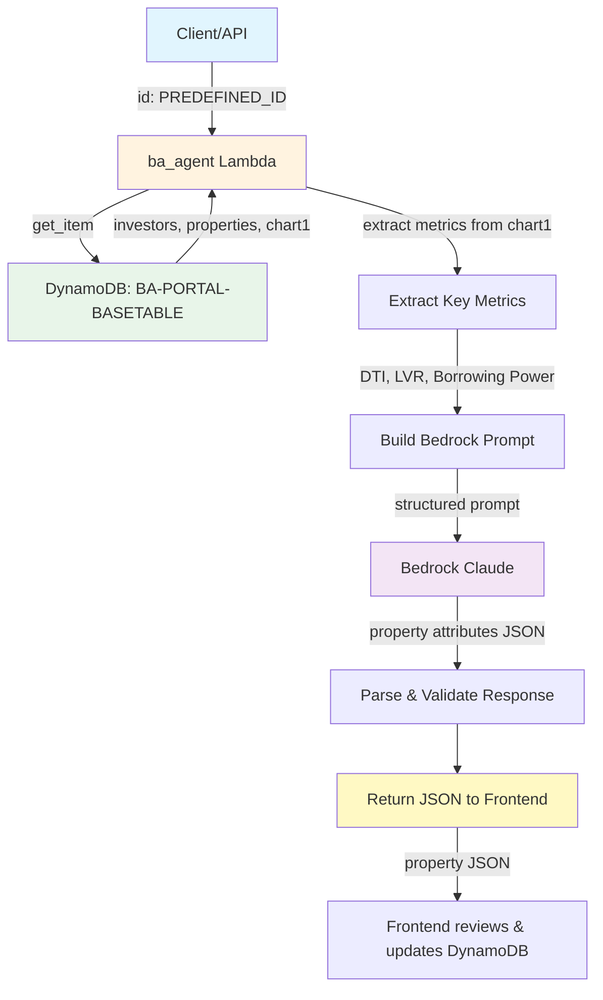

# BA-Agent Property Attribute Generation - Design Document

## 1. Executive Summary

This design document outlines the architecture and implementation details for the **Property Attribute Generation** feature in `ba_agent`. The agent reads pre-calculated chart1 financial data from DynamoDB (by predefined ID), passes it to AWS Bedrock to generate recommended property attributes, and returns the results to the frontend for user review and persistence.

### 1.1 Key Insight

**Chart1 data is already calculated and stored in DynamoDB** - No need to recalculate. The ba_agent:
1. Reads existing chart1 timeline data and investors from DynamoDB
2. Passes chart1 data to Bedrock for property attribute generation/optimization
3. **Returns property JSON to the frontend** for user review and DynamoDB persistence

### 1.2 Objectives

- **Primary**: Generate property attributes in a standardized format based on existing chart1 financial analysis
- **Secondary**: Leverage existing ba_agent infrastructure (DynamoDB read, Bedrock integration)
- **Outcome**: Provide actionable property recommendations as JSON to frontend

---

## 2. Complete Data Flow

### 2.1 High-Level Flow



> **Note**: Both `add` and `optimise` actions return property JSON to the frontend. The frontend handles all DynamoDB updates after user approval.

---

## 3. DynamoDB Data Structure

> **Note**: This section shows the DynamoDB format for reference. The Lambda reads this data and returns standard JSON to the frontend.

### 3.1 Properties Attribute Format (DynamoDB)

The `properties` attribute in DynamoDB is stored as a list of maps:

```json
{
  "L": [
    {
      "M": {
        "purchase_year": {"N": "1"},
        "initial_value": {"N": "2000000"},
        "growth_rate": {"N": "6"},
        "other_expenses": {"N": "10000"},
        "investor_splits": {
          "L": [
            {"M": {"name": {"S": "Bob"}, "percentage": {"N": "50"}}},
            {"M": {"name": {"S": "Alice"}, "percentage": {"N": "50"}}}
          ]
        },
        "annual_principal_change": {"N": "0"},
        "name": {"S": "Property A"},
        "interest_rate": {"N": "6"},
        "loan_amount": {"N": "1800000"},
        "property_value": {"N": "660000"},
        "rent": {"N": "26200"}
      }
    },
    {
      "M": {
        "purchase_year": {"N": "5"},
        "initial_value": {"N": "900000"},
        "growth_rate": {"N": "3"},
        "other_expenses": {"N": "3000"},
        "investor_splits": {
          "L": [
            {"M": {"name": {"S": "Bob"}, "percentage": {"N": "50"}}},
            {"M": {"name": {"S": "Alice"}, "percentage": {"N": "50"}}}
          ]
        },
        "annual_principal_change": {"N": "0"},
        "name": {"S": "Property B"},
        "interest_rate": {"N": "7"},
        "loan_amount": {"N": "800000"},
        "property_value": {"N": "550000"},
        "rent": {"N": "22000"}
      }
    },
    {
      "M": {
        "purchase_year": {"N": "10"},
        "initial_value": {"N": "2000000"},
        "growth_rate": {"N": "6"},
        "other_expenses": {"N": "10000"},
        "investor_splits": {
          "L": [
            {"M": {"name": {"S": "Bob"}, "percentage": {"N": "50"}}},
            {"M": {"name": {"S": "Alice"}, "percentage": {"N": "50"}}}
          ]
        },
        "annual_principal_change": {"N": "0"},
        "name": {"S": "Property 3"},
        "interest_rate": {"N": "6"},
        "loan_amount": {"N": "1828000"},
        "property_value": {"N": "660000"},
        "rent": {"N": "26200"}
      }
    }
  ]
}
```

### 3.2 Property Field Mapping

| Field | Type | Example |
|-------|------|---------|
| `name` | String | "Property A" |
| `purchase_year` | Number | 1 |
| `loan_amount` | Number | 1800000 |
| `annual_principal_change` | Number | 0 |
| `rent` | Number | 26200 |
| `interest_rate` | Number | 6 (percentage) |
| `other_expenses` | Number | 10000 |
| `property_value` | Number | 660000 |
| `initial_value` | Number | 2000000 |
| `growth_rate` | Number | 6 (percentage) |
| `investor_splits` | List | [{"name": "Bob", "percentage": 50}, ...] |

---

## 4. Chart1 Data Format (Pre-Calculated)

### 4.1 Chart1 Timeline Data

The chart1 data is stored in DynamoDB as a list of yearly forecast objects:

| Field | Type | Description |
|-------|------|-------------|
| `year` | number | Year number (1-30) |
| `total_debt` | number | Total debt across all properties |
| `total_rent` | number | Total rental income |
| `dti_ratio` | number | Debt-to-Income ratio (percentage) |
| `investor_borrowing_capacities` | map | Per-investor borrowing capacity |
| `investor_net_incomes` | map | Per-investor net income |
| `property_lvrs` | map | Per-property LVR percentage |
| `property_values` | map | Per-property current value |
| `property_loan_balances` | map | Per-property loan balance |
| `accessible_equity` | number | Total accessible equity |
| `household_surplus` | number | Annual household surplus |
| `property_cashflow` | number | Net property cashflow |
| `max_purchase_price` | number | Maximum purchase price based on equity |

---

## 5. Input Data from DynamoDB

### 5.1 Investors Structure

```json
[
  {
    "name": "Bob",
    "base_income": 120000,
    "annual_growth_rate": 0.03,
    "essential_expenditure": 30000,
    "nonessential_expenditure": 15000,
    "dependants": 0
  },
  {
    "name": "Alice",
    "base_income": 100000,
    "annual_growth_rate": 0.025,
    "essential_expenditure": 25000,
    "nonessential_expenditure": 12000,
    "dependants": 0
  }
]
```

---

## 6. Financial Metrics Extraction

### 6.1 Key Metrics from Chart1 Timeline

From the pre-calculated chart1 data, extract:

| Metric | Source | Description |
|--------|--------|-------------|
| **Current DTI** | `chart1[0].dti_ratio` | Latest year DTI percentage |
| **Min DTI** | `min(chart1[].dti_ratio)` | Lowest DTI over timeline |
| **Max Accessible Equity** | `max(chart1[].accessible_equity)` | Peak accessible equity |
| **Borrowing Capacity** | `chart1[0].investor_borrowing_capacities` | Current borrowing power |
| **Property Count** | `len(properties)` | Number of existing properties |
| **Total Property Values** | Sum of `property_values` | Current portfolio value |
| **Total Loan Balances** | Sum of `property_loan_balances` | Current total debt |

---

## 7. Output: Property Attribute Format

### 7.1 Property JSON Format

```json
{
  "name": "Property A",
  "purchase_year": 1,
  "loan_amount": 1800000,
  "annual_principal_change": 0,
  "rent": 26200,
  "interest_rate": 6,
  "other_expenses": 10000,
  "property_value": 660000,
  "initial_value": 2000000,
  "growth_rate": 6,
  "investor_splits": [
    {"name": "Bob", "percentage": 50},
    {"name": "Alice", "percentage": 50}
  ]
}
```

---

## 8. Bedrock Prompt Strategy

### 8.1 System Prompt

```
You are a professional Australian property investment analyst specializing in property acquisition strategy.
Your role is to analyze investor financial capacity and recommend optimal property attributes for investment.

Consider the following financial factors:
1. Debt-to-Income (DTI) Ratio: Target ≤ 30% for sustainable borrowing
2. Borrowing Power: Maximum loan amount based on income and existing debt
3. Loan-to-Value Ratio (LVR): Target ≤ 80% to avoid LMI
4. Cash Flow: Rental income should cover expenses with buffer
5. Equity Position: Accessible equity determines deposit capacity

Output ONLY valid JSON matching the specified schema. No additional text.
```

### 8.2 User Prompt Template

```
FINANCIAL ANALYSIS FOR PROPERTY ATTRIBUTE GENERATION:

EXISTING CHART1 TIMELINE DATA:
${chart1_timeline_json}

CURRENT PORTFOLIO STATUS:
- Property Count: ${property_count}
- Total Property Values: ${total_property_values}
- Total Loan Balances: ${total_loan_balances}
- Total Equity: ${total_equity}

CURRENT FINANCIAL METRICS (Year 1):
- DTI Ratio: ${dti_ratio}%
- Accessible Equity: ${accessible_equity}
- Household Surplus: ${household_surplus}
- Property Cashflow: ${property_cashflow}

PEAK FINANCIAL METRICS (Over Timeline):
- Max Accessible Equity: ${max_accessible_equity}
- Min DTI: ${min_dti}%

EXISTING PROPERTIES:
${existing_properties_summary}

INVESTOR DETAILS:
${investor_details}

Based on this financial analysis, recommend property attributes for the NEXT investment property.
Consider:
1. Optimal purchase year when financial capacity is sufficient
2. Loan amount that keeps DTI sustainable
3. Property value within borrowing capacity + accessible equity
4. Rental income that covers costs with positive cashflow
5. Appropriate LVR to avoid LMI

Respond with JSON array of recommended property attributes.
```

### 8.3 Optimise Prompt Template

```
FINANCIAL ANALYSIS FOR PORTFOLIO OPTIMIZATION:

EXISTING CHART1 TIMELINE DATA:
${chart1_timeline_json}

CURRENT PORTFOLIO STATUS:
- Property Count: ${property_count}
- Total Property Values: ${total_property_values}
- Total Loan Balances: ${total_loan_balances}
- Total Equity: ${total_equity}

CURRENT FINANCIAL METRICS (Year 1):
- DTI Ratio: ${dti_ratio}%
- Accessible Equity: ${accessible_equity}
- Household Surplus: ${household_surplus}
- Property Cashflow: ${property_cashflow}

EXISTING PROPERTIES:
${existing_properties_summary}

INVESTOR DETAILS:
${investor_details}

TASK: Analyze the existing properties and perform three key tasks:

1. **VALIDATE**: Review each property and check if numbers are realistic based on Australian market benchmarks:
   - Rent should be 4-6% of property value annually
   - Expenses should be 1-2% of property value annually
   - Growth rates should align with historical averages (3-7%)
   - Interest rates should reflect current market (5-7%)

2. **OPTIMIZE**: Adjust property numbers to be more realistic and sustainable:
   - Suggest realistic rent based on property value and location
   - Adjust expenses to appropriate levels
   - Align growth rates with market expectations
   - Update interest rates to current market rates

3. **RECOMMEND**: Determine if properties should be added or removed to maximize ROI:
   - Consider DTI, LVR, and cashflow constraints
   - Recommend purchase timing for new properties
   - Or recommend selling/holding strategy

Respond with JSON containing:
- "properties": array of optimized property objects
- "analysis": object with "recommended_changes" and "rationale"
```

---

## 9. Implementation Plan

### 9.1 New Functions Required

```python
def extract_metrics_from_chart1(chart1_data: list) -> dict:
    """Extract key financial metrics from pre-calculated chart1 timeline."""
    pass

def build_property_prompt(
    investors: list,
    chart1_metrics: dict,
    existing_properties: list,
    property_action: str
) -> tuple[str, str]:
    """Build system and user prompts for property generation or optimization."""
    pass

def parse_property_attributes(response: str) -> dict:
    """Parse Bedrock response into property attribute format."""
    pass

def validate_property_attributes(properties: dict) -> bool:
    """Validate property attributes meet business rules."""
    pass
```

### 9.2 Lambda Handler Flow

1. **Read from DynamoDB**: Get investors, properties, AND chart1 data
2. **Extract Metrics**: Parse chart1 timeline for key financial indicators
3. **Build Prompt**: Create Bedrock prompt based on `property_action`
4. **Invoke Bedrock**: Send prompt and get property attributes
5. **Parse Response**: Convert JSON response to property format
6. **Return Result**: Return property JSON to frontend

### 9.3 Response Generation

1. **Parse Response**: Convert Bedrock JSON response to standard property format
2. **Validate**: Ensure property attributes meet business rules
3. **Return**: Send JSON response to frontend for user review

### 9.4 API Request Format

```json
{
  "table_name": "BA-PORTAL-BASETABLE",
  "id": "B57153AB-B66E-4085-A4C1-929EC158FC3E",
  "property_action": "add"
}
```

Or for optimisation:

```json
{
  "table_name": "BA-PORTAL-BASETABLE",
  "id": "B57153AB-B66E-4085-A4C1-929EC158FC3E",
  "property_action": "optimise"
}
```

| Property Action | Description |
|-----------------|-------------|
| `add` | Generate and return ONE new property recommendation as a JSON block based on current portfolio financial analysis. The AI analyzes DTI, LVR, borrowing capacity, and equity to recommend optimal property attributes (purchase year, loan amount, property value, rent, etc.). **Does NOT update DynamoDB** - the frontend handles the persistence. Returns the property details in the response for the frontend to save. |
| `optimise` | Run comprehensive portfolio optimization that performs three key tasks: (1) Review current properties and validate if numbers are realistic based on market benchmarks, (2) Optimize existing property numbers (rent, expenses, growth rates, interest rates) to be more realistic and sustainable, (3) Recommend adding or removing properties to maximize ROI. **Returns the optimized properties as JSON** for the frontend to review and update DynamoDB. Does NOT auto-update DynamoDB - frontend handles persistence after user approval. |

> **Note**: Each `property_action` uses a different Bedrock prompt optimized for its specific task.

> **Note**: Region defaults to `ap-southeast-2` (Sydney) if not specified.

### 9.5 API Response Format

**For `property_action: "add"`** - Returns the new property recommendation as JSON:

```json
{
  "status": "success",
  "action": "add",
  "property": {
    "name": "Property D",
    "purchase_year": 8,
    "loan_amount": 800000,
    "annual_principal_change": 0,
    "rent": 40000,
    "interest_rate": 5.5,
    "other_expenses": 10000,
    "property_value": 1000000,
    "initial_value": 950000,
    "growth_rate": 5,
    "investor_splits": [
      {"name": "Bob", "percentage": 50},
      {"name": "Alice", "percentage": 50}
    ]
  }
}
```

**For `property_action: "optimise"`** - Returns the optimized portfolio as JSON:

```json
{
  "status": "success",
  "action": "optimise",
  "properties": [
    {
      "name": "Property A",
      "purchase_year": 1,
      "loan_amount": 1600000,
      "rent": 30000,
      "interest_rate": 5.5,
      ...
    }
  ],
  "analysis": {
    "recommended_changes": "Reduced interest rate from 6% to 5.5%, adjusted rent to market rate",
    "rationale": "Properties now more aligned with market benchmarks"
  }
}
```

> **Note**: Both actions return JSON to the frontend. The frontend handles all DynamoDB updates after user approval.

**Standard HTTP Status Codes:**

| Status Code | Description |
|-------------|-------------|
| 200 | Success |
| 400 | Bad request |
| 404 | Item not found |
| 500 | Internal server error |

---

## 10. Configuration & Constants

### 10.1 Default Values

| Parameter | Default | Description |
|-----------|---------|-------------|
| `interest_rate` | 5-7% | Current average variable rate |
| `growth_rate` | 3-6% | Historical property appreciation |
| `max_dti` | 30% | Maximum sustainable DTI |
| `target_lvr` | 80% | Target LVR to avoid LMI |
| `rent_to_value_ratio` | 5% | Annual rent as % of property value |
| `expense_to_value_ratio` | 1% | Annual expenses as % of property value |

### 10.2 Business Rules

1. **DTI Constraint**: Recommended loan amount must keep DTI ≤ 30%
2. **LVR Constraint**: Property value must support LVR ≤ 80%
3. **Cashflow Constraint**: Rental income must exceed interest + expenses
4. **Purchase Year**: Must be within investment_years range

---

## 11. Error Handling

| Error Condition | Handling |
|-----------------|----------|
| DynamoDB item not found | Return 404 with error message |
| DynamoDB status not 'active' | Return 403 with error message |
| Chart1 data missing | Return 400 with error message |
| Bedrock invocation fails | Return 500 with Bedrock error |
| JSON parsing fails | Return 400 with parsing error |
| Validation fails | Return 400 with validation errors |

---

## 12. IAM Permissions Required

| Permission | Resource | Description |
|------------|----------|-------------|
| dynamodb:GetItem | BA-PORTAL-BASETABLE | Read item by ID |

---

## 13. Existing Code Reference

- **Main Lambda**: `app/ba-portal/lambda/ba_agent/main.py`
- **Bedrock Client**: `app/ba-portal/lambda/ba_agent/lib/bedrock_client.py`
- **Superchart1 Library**: `app/ba-portal/lambda/update_table/libs/superchart1.py` (for reference only - not called)
- **Test Data**: `app/ba-portal/lambda/update_table/test_chart.py`