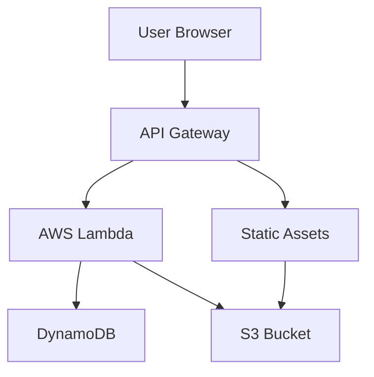

# HSC Agent

[](https://aws.amazon.com/)
[](https://www.python.org/)

## Overview

HSC Agent is a serverless educational quiz application designed for Higher School Certificate (HSC) students to practice vocabulary from George Orwell's classic novel "1984". The application features multi-stage quizzes that track user progress, provide instant feedback, and advance users to higher stages upon achieving 100% scores.

Built on AWS serverless architecture, HSC Agent leverages Lambda for backend logic, API Gateway for RESTful endpoints, DynamoDB for data persistence, and S3 for static assets and question storage.

## Features

- **Multi-Stage Quizzes**: Progressive difficulty levels with automatic advancement.
- **User Progress Tracking**: Tracks attempts and scores using DynamoDB.
- **Interactive Frontend**: Responsive web interface built with HTML, CSS, and JavaScript.
- **Real-Time Scoring**: Instant feedback on quiz submissions with detailed results.
- **CORS Enabled**: Supports web-based access from any origin.
- **Config-Driven Deployment**: Automated setup using JSON configurations and Python scripts.

## Architecture

The application follows a serverless microservices architecture:



- **API Gateway**: Handles HTTP requests and routes them to Lambda functions.
- **Lambda Function**: Processes quiz logic, validates submissions, and manages user sessions.
- **DynamoDB**: Stores quiz attempts and questions mapping for stages.
- **S3**: Hosts static files (HTML, CSS, JS) and quiz data (JSON).

## Tech Stack

- **Backend**: Python 3.9, AWS Lambda, AWS API Gateway
- **Database**: AWS DynamoDB
- **Storage**: AWS S3
- **Frontend**: HTML5, CSS3, JavaScript (ES6), Bootstrap 5.3
- **Deployment**: AWS CLI, boto3, Custom Python scripts

## Prerequisites

- AWS account with appropriate permissions (Lambda, API Gateway, DynamoDB, S3, IAM).
- Python 3.9 or higher.
- AWS CLI configured with credentials.
- `boto3` library (`pip install boto3`).

## Installation

1. Clone the repository:
   ```bash
   git clone <repository-url>
   cd hsc_agent
   ```

2. Install dependencies:
   ```bash
   pip install -r requirements.txt
   ```

3. Set up AWS credentials:
   ```bash
   aws configure
   ```

## Usage

1. **Local Development**:
   - Run the Lambda function locally using tools like `sam local`.
   - Serve static files using a local server (e.g., `python -m http.server`).

2. **Access the Application**:
   - Deploy to AWS and access via the API Gateway URL.
   - Open the frontend in a browser to start the quiz.

3. **Quiz Flow**:
   - Load questions from the API.
   - Select answers and submit.
   - View results and retry if needed.

## API Documentation

### Endpoints

- **GET /questions**: Retrieve quiz questions for the current stage.
  - Response: JSON with `title`, `questions`, `stage`.

- **POST /submit**: Submit quiz answers.
  - Body: `{"answers": {"1": "A", "2": "B", ...}}`
  - Response: JSON with `total`, `correct`, `percent`, `details`.

- **POST /sum**: Simple calculator endpoint (utility).
  - Body: `{"num1": 10, "num2": 5}`
  - Response: `{"sum": 15}`

- **GET /**: Serve static HTML page.

### Authentication

- No explicit authentication; uses source IP or query parameter `user_id` for tracking.

## Deployment

1. **Set Up DynamoDB**:
   ```bash
   python create_dynamodb_table_and_insert.py
   ```

2. **Deploy Lambda**:
   ```bash
   python deploy_lambda.py --config deploy.config
   ```

3. **Deploy API Gateway**:
   ```bash
   python deploy_api.py --config api-config.json --region ap-southeast-2
   ```

4. **Upload Static Assets**:
   - Upload `static/` contents to S3 bucket.

5. **Test**:
   ```bash
   python test_api.py <API_URL>
   ```

## Testing

- Use provided `test_api.py` script for endpoint testing.
- Manual testing via curl or browser.

## Contributing

1. Fork the repository.
2. Create a feature branch.
3. Make changes and test.
4. Submit a pull request.

## License

This project is licensed under the MIT License.

## Contact

For questions or support, contact [Your Name] at [email].