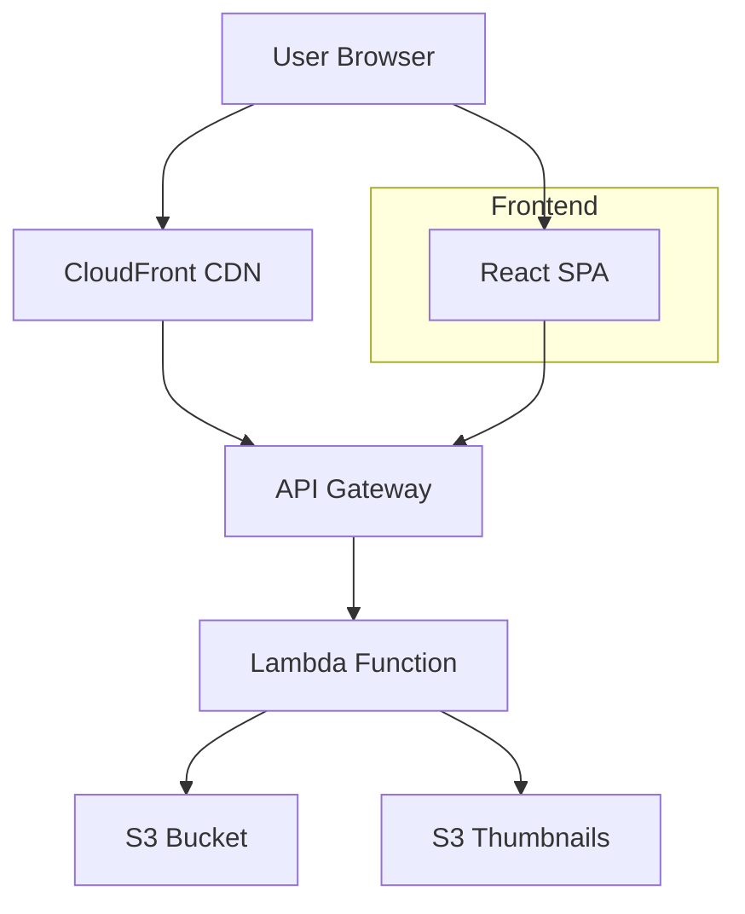

# Photo Gallery Web App - Architecture Plan

## Overview
A serverless web application to display photos and videos from an S3 bucket, organized by albums (folders).

## System Architecture



## Tech Stack
- **Frontend**: React + Vite + TypeScript
- **Backend**: Python AWS Lambda
- **Storage**: S3 (photos/videos) + S3 (thumbnails)
- **API**: API Gateway (REST)
- **Deployment**: AWS Serverless

## API Endpoints

| Method | Path | Description |
|--------|------|-------------|
| GET | /albums | List all albums (folders) |
| GET | /albums/{album_name} | List media in an album |
| GET | /media/{album_name}/{file_name}/url | Get presigned URL for viewing |
| GET | /media/{album_name}/{file_name}/thumbnail | Get thumbnail URL |

## S3 Bucket Structure
```
my-bucket/
├── Album1/
│   ├── photo1.cr2
│   ├── photo2.jpg
│   ├── video1.mov
│   └── _thumbnails/
│       ├── photo1.jpg
│       └── photo2.jpg
├── Album2/
│   └── ...
```

## Backend (Python Lambda)

### Functions Required
1. **list_albums** - Lists all folders in S3 bucket
2. **list_album_media** - Lists photos/videos in a specific folder
3. **get_presigned_url** - Generates temporary view URL for media
4. **generate_thumbnail** - Converts CR2 to JPG (using Pillow with rawpy or Lambda layer)

### Python Dependencies
- boto3 (AWS SDK)
- pillow (image processing)
- rawpy (optional - for CR2 processing)

## Frontend (React)

### Components
1. **AlbumGrid** - Displays album covers in a grid
2. **MediaGrid** - Shows photos/videos in an album
3. **MediaViewer** - Lightbox for viewing photos
4. **VideoPlayer** - Video playback for MOV files
5. **AlbumCover** - Album thumbnail with name

### UI Features
- Grid layout for albums and media
- Lightbox for photo viewing
- Video player for MOV files
- Lazy loading for performance
- Responsive design

## Deployment Structure
```
app/photo-gallery/
├── config.yaml              # Configuration
├── lambda/                  # Backend
│   ├── main.py             # Lambda handler
│   ├── requirements.txt    # Python dependencies
│   └── deploy_lambda.py    # Deployment script
├── frontend/               # React frontend
│   ├── src/
│   │   ├── components/
│   │   ├── services/
│   │   └── App.tsx
│   └── package.json
├── IaC/                    # Infrastructure
│   ├── api-config.json
│   └── deploy_api.py
└── PLAN.md                 # This file
```

## Security Considerations
- No authentication (as requested)
- S3 bucket should be public read for media OR use presigned URLs
- Consider CloudFront for better performance
- CORS configuration for API Gateway

## Next Steps
1. Update config.yaml with actual S3 bucket name
2. Create Lambda function code
3. Build React frontend
4. Deploy to AWS
