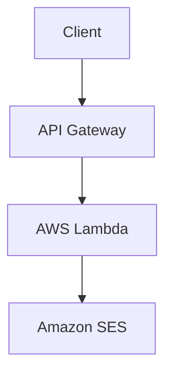

# Send Email Lambda

[](https://aws.amazon.com/)
[](https://www.python.org/)

## Overview

Send Email Lambda is a serverless email sending service built on AWS Lambda and API Gateway. It provides a simple REST API endpoint to send emails via Amazon SES.

Built on AWS serverless architecture, Send Email leverages Lambda for email processing and API Gateway for RESTful endpoints.

## Features

- **Simple Email Sending**: Send emails via Amazon SES with a single API call.
- **JSON API**: Accepts email parameters in JSON format via POST requests.
- **CORS Enabled**: Supports web-based access from any origin.
- **Config-Driven Deployment**: Automated setup using JSON configurations and Python scripts.

## Architecture

The application follows a serverless microservices architecture:



- **API Gateway**: Handles HTTP requests and routes them to Lambda functions.
- **Lambda Function**: Processes email requests and sends via SES.
- **Amazon SES**: Handles email delivery.

## Tech Stack

- **Backend**: Python 3.13, AWS Lambda, AWS API Gateway
- **Email Service**: AWS SES
- **Deployment**: AWS CLI, boto3, Custom Python scripts

## Prerequisites

- AWS account with appropriate permissions (Lambda, API Gateway, SES, IAM).
- Python 3.13 or higher.
- AWS CLI configured with credentials.
- `boto3` library (`pip install boto3`).

## Installation

1. Clone the repository:
   ```bash
   git clone <repository-url>
   cd app/send-email
   ```

2. Install dependencies:
   ```bash
   pip install -r requirements.txt
   ```

3. Set up AWS credentials:
   ```bash
   aws configure
   ```

## Usage

1. **Access the Application**:
   - Deploy to AWS and access via the API Gateway URL.
   - Send POST requests to the API endpoint with email parameters.

2. **API Endpoint**:
   - **POST /send-email**: Send an email.
     - Body: `{"sender": "from@example.com", "recipient": "to@example.com", "subject": "Subject", "body": "Message", "is_html": false}`

## API Documentation

### Endpoints

- **POST /send-email**: Send an email.
  - Body: JSON with sender, recipient, subject, body, is_html (optional)
  - Response: JSON with statusCode, messageId or error

### Authentication

- No explicit authentication; ensure proper AWS permissions.

## Deployment

1. **Deploy Lambda**:
   ```bash
   python deploy_lambda.py --config deploy.config
   ```

2. **Deploy API Gateway**:
   ```bash
   python deploy_api.py --config api-config.json --region us-east-1
   ```

3. **Test**:
   ```bash
   curl -X POST https://your-api-url/send-email \
     -H "Content-Type: application/json" \
     -d '{"sender":"test@example.com","recipient":"recipient@example.com","subject":"Test","body":"Hello","is_html":false}'
   ```

## Testing

- Manual testing via curl or Postman.
- Check CloudWatch logs for Lambda execution details.

## Contributing

1. Fork the repository.
2. Create a feature branch.
3. Make changes and test.
4. Submit a pull request.

## License

This project is licensed under the MIT License.

## Contact

For questions or support, contact [Your Name] at [email].